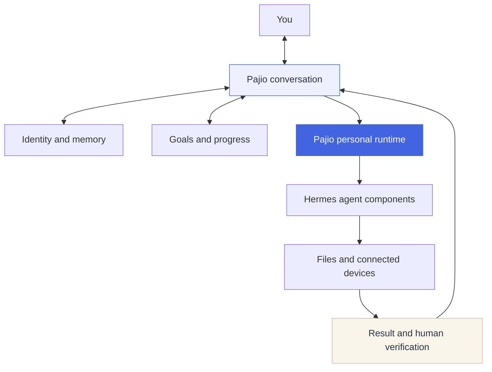

<p align="center"><strong>English</strong> · <a href="README.zh-CN.md">简体中文</a></p>
<p align="center"><a href="docs/getting-started.md">Get started</a> · <a href="docs/progress.md">Current progress</a> · <a href="design/brand/pajio/README.md">Brand and character</a></p>

# A personal agent you can keep working with

Pajio is being built around an ongoing relationship with one person. Conversations retain their context, goals carry their progress forward, and the agent can work with connected files and devices within the access you provide.

You can return to a conversation, correct a remembered preference, or continue a goal you have already discussed. Separate identities keep their own conversations and file spaces. When a task returns a result, you can review the evidence before marking it verified.

The current release is a **0.2 local development build**. A cloud service with a separate runtime for each person is under development.

## What stays with you

| Capability | In the current build |
| --- | --- |
| Conversation | Original messages, shared multi-turn sessions, and recovery after a page refresh. |
| Memory | Inspectable preferences and memory entries, with correction and retrieval of past conversations. |
| Daily tools | Built-in calendar, grouped todos and short notes; direct editing and the agent share the same identity-scoped records, with recoverable removal and revision checks. |
| Goals | Saved scope and progress, bounded continuation, follow-up discussion, pause, and human review. |
| Identity | Separate conversations and file spaces for each identity. |
| Action | File access, local Mac control, and Android connections, with device-specific acceptance records. |

## How Pajio works



Pajio owns the product identity, personal context, goal lifecycle, and interface. Its personal runtime reuses selected Hermes components. The upstream engine is installed separately at a pinned revision, with its license retained.

## Run locally

Python 3.11+ and uv are required.

```bash
git clone https://github.com/LuvElixir/wearing.git
cd wearing
uv sync --extra dev
uv run wearing serve
```

Open **http://127.0.0.1:8765**. Follow the connection panel to install the local engine and configure a model. You can also use the CLI.

```bash
uv run wearing engine install
uv run wearing engine model
```

Messages can be saved before a model is connected. Real agent responses and execution require a working engine and model connection. Local state is stored in the private `.wearing/` directory and is excluded from Git.

## Development status

Local Mac behavior and selected Android flows have been exercised on real devices. Windows support still needs device acceptance. The local service listens on loopback.

The SaaS foundation includes tenant workers, OIDC routing, and PostgreSQL isolation. Production identity-provider integration, TLS, per-user VM provisioning, and remote device transport are still being connected. See the [progress record](docs/progress.md) for the verified scope of each capability.

| Start here | What it covers |
| --- | --- |
| [Getting started](docs/getting-started.md) | Engine, model, computer, and phone setup. |
| [Personal continuity](docs/personal-continuity.md) | Goals, continuation, and review. |
| [Personal memory](docs/personal-memory.md) | Preferences, memory, and conversation search. |
| [Daily tools](docs/life-tools.md) | Calendar, todos, notes, shared agent access and current native-input boundaries. |
| [Native clients](docs/native-clients.md) | Mac desktop preview, shared records and mobile implementation boundaries. |
| [Mobile client](docs/mobile-client.md) | React Native / Expo capture, offline outbox and device acceptance boundaries. |
| [Engine productization](docs/engine-productization.md) | Pajio's runtime and upstream boundaries. |
| [SaaS architecture](docs/saas-architecture-2026-10-03.md) | Tenant isolation and implementation sequence. |
| [Technical reference](README.reference.md) | Detailed setup and acceptance links. |

Run `uv run pytest -q` for the Python suite. Tests requiring an installed engine or a disposable PostgreSQL test cluster are conditional. The [third-party notices](THIRD_PARTY_NOTICES.md) record upstream components. [SOURCE-SNAPSHOT.json](SOURCE-SNAPSHOT.json) preserves the initial October 3 source inventory; the current source is identified by its Git commit.

<p align="center">Built at <a href="https://luckyloading.com/">Luckyloading</a></p>
