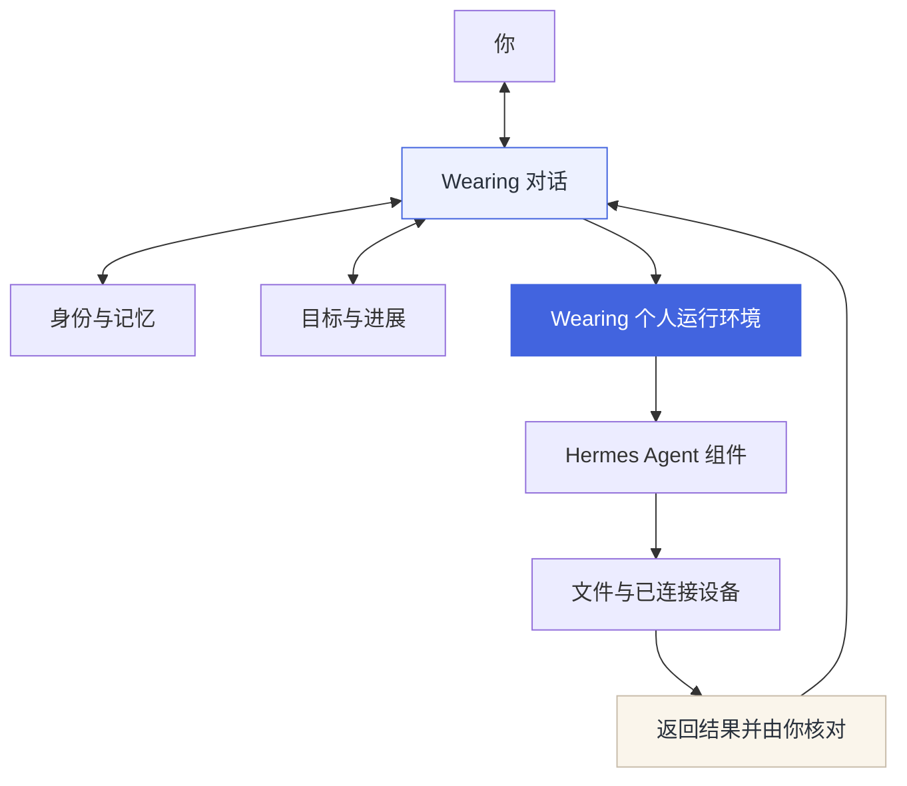

<p align="center"><a href="README.md">English</a> · <strong>简体中文</strong></p>
<p align="center"><a href="docs/getting-started.md">开始使用</a> · <a href="docs/progress.md">当前进度</a> · <a href="design/vi/README.md">品牌与角色</a></p>

# 与你持续协作的个人 Agent

Wearing 围绕一个人的长期使用而设计。它保留对话背景，记录目标的进展，并在获得相应权限后，通过文件、电脑和手机参与具体工作。

你可以接着上次的对话继续讨论，纠正它记住的偏好，或推进已经约定的目标。不同身份拥有各自的会话和文件空间。任务返回结果后，你可以核对实际证据，再将结果标记为已确认。

当前交付为 **0.2 本地开发版**。面向个人的云端服务正在开发，每位用户拥有独立运行环境。

## 持续协作所需的能力

| 能力 | 当前实现 |
| --- | --- |
| 连续对话 | 保存原始消息，复用多轮会话，刷新页面后恢复记录。 |
| 个人记忆 | 查看和纠正已保存的偏好，检索过去的对话。 |
| 日常工具 | 内置日历、待办清单与短笔记；用户和 Agent 读写同身份的同一份记录，移除可恢复，过期编辑不覆盖新版本。 |
| 长期目标 | 记录范围与阶段进展，在约定轮次内继续执行，支持补充讨论、暂停和人工核对。 |
| 身份空间 | 不同身份分别保存会话与文件。 |
| 实际操作 | 接入文件、本机 Mac 和 Android 手机，按设备记录验收范围。 |

## 从对话到行动



Wearing 负责产品身份、个人上下文、目标管理和交互界面，个人运行环境复用 Hermes 的部分组件。上游引擎按固定版本独立安装，并保留原有许可证。

## 本地运行

准备 Python 3.11+ 与 uv 后执行以下命令。

```bash
git clone https://github.com/LuvElixir/wearing.git
cd wearing
uv sync --extra dev
uv run wearing serve
```

打开 **http://127.0.0.1:8765**，按连接面板的提示安装本地引擎并配置模型，也可以使用命令行。

```bash
uv run wearing engine install
uv run wearing engine model
```

模型接通前可以保存消息，真实回应与任务执行需要可用的引擎和模型连接。个人数据保存在私有的 `.wearing/` 目录中，不纳入 Git。

## 开发进度

本机 Mac 操作与部分 Android 流程已经过真实设备验证，Windows 仍待实机验收。本地服务只监听回环地址。

SaaS 基础包含独立租户 Worker、OIDC 路由和 PostgreSQL 数据隔离。生产身份服务、TLS、用户专属虚拟机和远程设备转发正在逐项接通。各项能力的实际验证范围见[进度记录](docs/progress.md)。

| 文档 | 内容 |
| --- | --- |
| [接入指南](docs/getting-started.md) | 引擎、模型、电脑和手机的配置。 |
| [持续目标](docs/personal-continuity.md) | 目标推进、后续讨论与结果核对。 |
| [个人记忆](docs/personal-memory.md) | 偏好、记忆和旧对话检索。 |
| [生活工具](docs/life-tools.md) | 日历、清单、笔记、Agent 共享记录及原生输入边界。 |
| [原生客户端](docs/native-clients.md) | Mac 桌面预览、共享记录与手机接入边界。 |
| [手机客户端](docs/mobile-client.md) | React Native / Expo 随手输入、离线队列和真机验收边界。 |
| [引擎产品化](docs/engine-productization.md) | Wearing 运行方式与上游组件的边界。 |
| [SaaS 架构](docs/saas-architecture-2026-10-03.md) | 租户隔离与实施顺序。 |
| [技术参考](README.reference.md) | 完整配置说明和验收资料。 |

运行 `uv run pytest -q` 可执行 Python 测试。依赖已安装引擎或专用 PostgreSQL 测试集群的检查按环境条件执行。[第三方说明](THIRD_PARTY_NOTICES.md)记录上游组件，[源码快照](SOURCE-SNAPSHOT.json)记录本次私有仓库上传的范围。

<p align="center">由 <a href="https://luckyloading.com/">Luckyloading</a> 开发</p>
