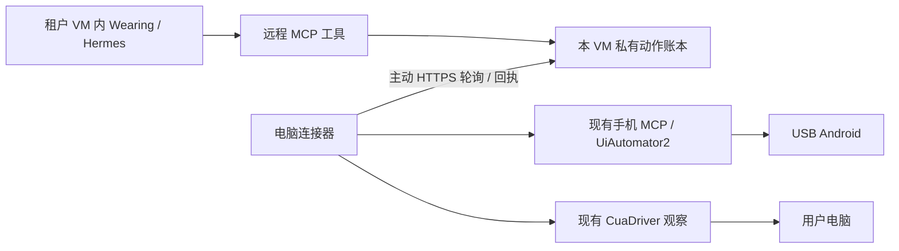

# 云端设备连接器

2026-10-03，S2 首轮。云端 Agent 在独立租户 VM 内运行；Mac/Windows 与 USB Android 仍是用户设备。这一层复用现有 Mobile MCP、UiAutomator2、Hermes/CuaDriver，没有新增 Agent 循环或开放本地设备端口。

## 已运行的链路



手机开放现有十项工具，包括观察、截图、按键、App 启动、坐标点击/滑动和输入；远程真机验收覆盖 HOME、设置启动、界面元素和截图。点击/输入在本地曾验收，不能把本次结果扩大为所有远程 App 的业务闭环。电脑当前仅开放状态、应用/窗口列表及观察；没有在远程层关闭或绕过原生输入审批。

租户 Worker 的网页和模型接口仍只监听回环，要求实例凭据及固定 tenant。独立 HTTPS relay 只提供 `/v1/pair`、`connect`、`poll`、`claim`、`result`，没有用户网页、模型、管理或任意 shell 接口。ADB/CuaDriver 不公开。平台控制面不保存设备画面；命令、截图和回执保存在该租户 VM 的私有卷里。

## 一次性配对

两个环境需要安装 `wearing[connector]`。连接器使用官方 MCP SDK 1.x；现有 Hermes 管理环境固定 SDK 2.0.0。MCP stdio 仍走标准协议，仅 callback 注册用小型兼容适配。云端远程 MCP 程序运行在 Wearing 自己的解释器，避免混入 Hermes 的依赖环境。

先在用户电脑准备现有设备驱动、登记 Android 和电脑，再导出清单；清单不含 ADB 序列号或模型凭据。

```sh
wearing connector inventory --data-dir /private/wearing-local --output /private/device-inventory.json
```

把清单通过加密管理通道送入对应租户 VM。操作者在 VM 内建立该身份的固定资源和方法授权，再创建十分钟配对文件。首轮只支持已有 `daily` 身份；不是切换 App 账户或获得海外身份。

```sh
wearing tenant pair-device --root /var/lib/wearing/instance \
  --endpoint https://devices.example.com --ca /private/cloud-ca.pem \
  --inventory /private/device-inventory.json --output /private/device-pairing.json
```

将配对文件私有传给用户电脑，然后：

```sh
wearing connector pair --root /private/connector \
  --bundle /private/device-pairing.json --data-dir /private/wearing-local
wearing connector run --root /private/connector
wearing connector status --root /private/connector
```

配对码只以散列保存在服务端；连接器在发请求前私有保存随机凭据，丢失配对响应时可用同一凭据恢复。同一配对码不能签发第二份凭据，两份待用配对码也不能抢占同一个已配对资源。连接器不会在轮询中自报新授权。凭据为本设备专用，不传模型 Key 或云管理 Key。

试验部署使用自行签发、IP SAN 匹配的 30 天 TLS 证书，通过加密管理通道固定到配对文件。客户端正常验证证书、地址与有效期；没有 `verify=False`。这是私有试验配置，生产仍需正常证书管理、设备密钥/轮换与 mTLS。证书过期后不会降级为明文；要更新可信证书及配对。

HTTPS 服务模板见 [wearing-device-relay.service](../deploy/tenant/wearing-device-relay.service)：独立低权限服务，只增加绑定 443 的 capability；证书/密钥归 wearing 用户私有所有。实例网页服务继续使用原 [wearing-tenant.service](../deploy/tenant/wearing-tenant.service)。

## 交接、断线与不重复执行

命令绑定 tenant、identity、connector、connection、resource、策略版本、配对版本和 lease epoch。服务器在 SQLite 事务中取得设备租约、落盘再派发；连接器也先持久写入动作编号，才向服务器取得执行许可，并重新校验本地配对授权。最后仍由原生手机锁/电脑接管租约控制实际调用。

- 同一编号只能执行一次；重复投递回传原回执。相同编号的不同参数拒绝。
- 云端许可响应丢失、本地进程崩溃、连接代际变化或动作过期，都不会自动重放。已开始且没有完整回执的动作标成 `unknown`。
- 结果不明或驱动返回错误时，新编号也不能继续同设备的写操作；可以重新观察，但观察本身不会清除阻塞。操作者核对后使用 `tenant review-device --command-id ...` 记录解除，原指令不会重跑。
- 每项动作最长授权 60 秒，本机驱动等待最多 45 秒。连接器一秒级轮询，错误退避最多 15 秒；90 秒无心跳后在线状态过期。在线表示最近一次报告，不保证下一次操作一定成功。
- 本地暂停、手机原绑定的暂停、电脑原生接管优先。暂停时不接新动作；接管期间的观察内容被丢弃。云端撤销阻止后续准入，已经准入的原生操作可能完成，不能承诺撤销已经发生的点击。
- 取消远程 MCP 请求会撤掉排队许可，已准入动作进入待核对状态；不能用取消动作来撤回现实效果。引擎突然退出时，剩余许可仍受 60 秒上限约束。

```sh
wearing connector pause --root /private/connector --resource-id phone_example
wearing connector resume --root /private/connector --resource-id phone_example
wearing tenant revoke-device --root /var/lib/wearing/instance --connector-id connector_example
```

暂停/恢复连接器不会替用户解除原生电脑接管或手机绑定的暂停。关闭连接器不删除动作账本。

本机试验连接器已作为 `com.wearing.connector.tencent-first` LaunchAgent 常驻，工作目录使用用户 Home，私有日志在 `~/Library/Logs/Wearing/`。已迁入 Wearing 的 `connector service install|status|stop|start|uninstall` 管理；停止等待现有动作与回执，沿用配对和账本再启动。Mac 停止/恢复及云端离线/上线已实测，未重启整台 Mac 来验证登录后的自启动。Windows 任务计划程序目前只有代码与契约测试；签名安装包和自动更新仍待实现。见[常驻说明](connector-service.md)。

## 当前边界

只有一个租户 VM、一台 Mac 和一部 Android 9 小米 6X 完成真实远程试验。数据卷级独立仍沿用 S1；没有第二租户物理隔离的新证明。首轮设备动作拥有独立的 `device_task` 编号，还没有完整串联到 Wearing goal/task 的审计视图。设备授权目前只有 daily，暂无跨身份资源分配界面。

后续需接公开登录/网页云端路由、设备配对和接管界面、电脑输入审批、正式 Mac/Windows 安装与更新、设备凭据轮换、回执/画面的保留策略和跨天故障恢复。Windows/iPhone、其他 Android 品牌及大量设备没有因此变成已验收。电话、邮箱、支付/收款资源也仍未取得或接通。

验收记录见 [S2 真实设备证据](evidence/remote-device-2026-10-03.md)。

## 2026-10-10：首次接入后的工具发现

合法私有云实例在引擎启动时即连接设备 MCP。尚无 `remote-devices.json`、配置禁用/损坏/权限不安全时，工具列表为空，缓存的工具调用也拒绝；配对本身不会越过这个独立开关。每次列工具和调用都会重新读取私有授权文件。

首次启用、增加电脑或手机种类、权限变化会通过 `tools/list_changed` 更新同一个 Hermes 进程的注册表。下一轮模型调用使用当前工具目录；默认工具搜索模式可能把设备函数收进 `tool_search` / `tool_describe` / `tool_call`，不会因此丢失设备能力。现有任务不因配对被重启。每条动作仍经 relay 的身份、资源、方法和接管状态校验。

`test_remote_mcp_engine.py` 使用真正安装的固定 Hermes 解释器，覆盖无授权启动、启用、电脑与手机先后加入、禁用/重启用，在同一 MCP 连接中核对模型工具搜索和描述结果；`test_engine_integration.py` 另验真实引擎 HTTP 能力目录随之更新。这些测试不调用模型、不触碰真实设备，实际模型和设备回执仍须单独验收。
