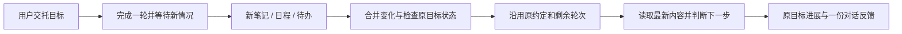

# 目标接续与 App 页面保留验收

日期：2026-10-06。工程增量包括长期目标接入现有生活记录事件，以及 App 普通标签切换时保留对话。真实模型使用隔离测试笔记与已配置凭据，没有接触外部账户、手机 App 或支付。未操作云端虚拟机。

## 交付的操作链

- 变化安排的 `goal_id` 必须属于当前身份且尚未结束；每目标最多一项未取消的变化安排。只读 `goal_list` 供模型发现真实 ID，不启动/修改目标。
- 同一事务预占 occurrence、goal step、task 与既有轮次；目标正在执行时保留变化批次，不另建并发运行。旧任务仍使用原 run 回执，未重置额度。
- 暂停、结束、待用户或待核对状态不会被记录变化重新启动。暂停/修订/恢复清除旧批次，从新变化开始。关联观察仍由原目标控制，暂停中断一轮后恢复目标无需再恢复第二份安排。
- 有有效观察安排时允许 `wait_seconds=0` 等变化；原目标报告与进展机制负责反馈，安排不重复插入消息。后台目标不能自行扩充安排。
- App 保留一个已访问的同连接/身份对话实例；普通标签切换隐藏它，进入后台停止轮询与视频。固定单向 presentation 信号不开放原生功能；身份/连接改变销毁旧实例。

## 自动检查

| 验证 | 结果 |
| --- | --- |
| 目标、安排、记录事件与进展测试 | 85 passed，含 12 个新用例；并发占用、重启、额度、暂停/恢复、错误身份、重复安排、原目标单次投递 |
| profile、生活记录、任务生命周期、身份、拍写回归 | 65 passed |
| 可见性、头像、结果与观察依据前端测试 | 10 passed，其中新增可见性测试 3 项 |
| mobile TypeScript / 源码 ESLint | 通过 |
| mobile 同步、身份及导航等核心测试 | 17 passed |
| Android / iOS 资源导出 | 成功；5.7 MB / 5.4 MB，不是签名安装包 |
| JS 语法与 diff whitespace | 通过 |

## 真实模型与持久记录

隔离目录：`.wearing/qa/goal-event-continuity-20261006/`。

使用真实 Hermes 和本机已配置模型，profile v18，仅测试记录读取与目标延续：

1. 初始笔记为“目的地还没定，先预计两天”。第一轮真实调用 `life_records`，返回 `wait + wait_seconds=0`，目标状态 waiting，无时间唤醒。
2. 新笔记为“新计划：去泉州，待四天，慢慢走走”。事件合并期后第二轮读取最新原件，将旧估计与新计划区分，归纳“泉州、四天”。
3. 第二轮返回 review，目标进入 needs_review。持久账本为 2 goal steps、used_steps=2、1 event occurrence；原对话中恰好 2 条目标反馈，不多插入安排消息。

原始回执 `live-check.json` 与 SQLite 已核对。验收脚本最初在完成所有模型断言后的 client 清理引用了不存在的 `service.engine`，已改为 `service.hermes.close()`；外层 finally 正常停止隔离引擎。随后只读复核原账本，无活动任务，没有为清理笔误重复消耗模型调用。此证据证明两轮有限测试，不证明跨天无人值守或完整旅游规划成功。

## 浏览器与本地更新

QA 8789 实际创建“先记下”的测试目标，再保存“记录有变化时”的关联安排，验证：

- 下拉列表能选择当前身份目标。
- 成功反馈明确“目标当前未在推进”，没有擅自启动。
- 详情显示目标标题、剩余 3 轮和未在推进状态。
- 关闭侧栏可回原对话。

本地 8765 更新前确认引擎未运行、没有活动任务，并做私有 SQLite 备份。更新后原 4 条用户对话的完整 JSON 摘要相同，主引擎仍未运行；profile v18 在下一次启动时应用。QA 与本地服务分别更新，开发安排仅在 QA 保存。旧对话、记忆和模型配置保留。

## 明确未完成

- 原生 App 对话页面保留、软键盘、Android 返回、iOS 手势和后台恢复尚未真机验收。记录上下文变化仍重新创建页面；系统回收进程后的草稿恢复未实现。
- 记录种类筛选先于模型；语义是否相关在本轮判断，不相关的变化也可能消耗一轮。轮次不是金额硬上限。
- 外部邮箱/账单/第三方 App 事件、系统推送、金额预算、电话和支付/收款未因本轮改动而接通。
- 目标本身仍需用户交托与启动；已有安排不会自动延长额度。生成成果仍需按内容核对，不以模型完成状态替代真实业务结果。
