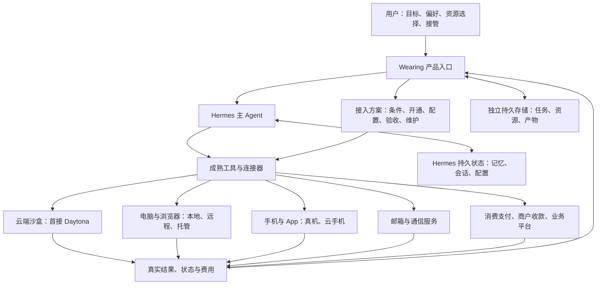

# Wearing：整合落地总方案 v0.4

> 2026-10-03：本文保留为本地原型阶段的历史方案。**最新部署和开发顺序以 [SaaS 实施基线](saas-architecture-2026-10-03.md) 为准**：Agent 核心在云端、每用户默认个人租户、设备通过连接器接入。当前本地版已到 0.2，模型、Mac 和 Android 已有局部实测；下文“待连接/尚待验收”和“不能插卡”是旧时点记录，不能作为当前状态。用户最新已接受国内 SIM，号码尚未实际接入。

更新：2026-10-02。当前实施基线：**Hermes 主 Agent + 用户的 Mac/Windows 与手机作为主要资源 + Daytona 云端沙盒按需辅助 + Wearing 的任务与接入体验**。0.1 本地工作台已实现并启动；真实模型、执行设备和业务结果尚待验收。见[运行指南](getting-started.md)和[验收记录](evidence/alpha-acceptance-2026-10-02.md)。

产品方向和职责分工已足够明确。邮箱、号码、支付与具体设备的取得流程继续同步验证，不作为所有软件开发的前置条件。OpenAgentCore 保留研究位置，不纳入首版必需依赖。

## 1. 产品、接入方案与首轮环境

| 层次 | 当前定义 |
| --- | --- |
| 用户得到的产品 | 一个理解自己、能使用实际资源持续办事、可查看结果和接管的 Wearing |
| 我们交付的能力 | 成熟 Agent 集成、资源连接器、经过实测的开通/配置/验收/维护流程 |
| 我们首先用的环境 | 闲置 MacBook Air（另一台电脑）与 USB 连接的 Android 9 小米 6X；主流 Windows/macOS 与其他手机按连接器条件扩展；沙盒按需辅助 |

产品支持多种资源路线。验证结果只适用于记录过的设备、版本、地区、服务和任务。首版选择 Hermes 集成，已有的模型调用、记忆、Skills、工具循环和事件入口优先复用；遇到实际缺口再补。

## 2. 整体架构

Agent 运行在哪里、动作在哪里执行、使用哪个账号，是三个分别记录的选择。一个在本地 Mac 上运行的 Agent，可以调用本地设备，也可以调用远程资源。连接器报告其能力、环境和账号绑定，供任务选择。

用户选择一种已经验证适用的方案；产品明确其条件和不支持的任务。适配层不承诺不同资源拥有相同能力。

### 2.1 云端沙盒作为首批执行资源

沙盒负责代码、文件、资料处理、浏览器和适用的桌面任务。持久云桌面也可以承担长期电脑的角色。Mac/Windows 与手机承载主要应用、设备与账号环境；各资源按实际任务组合。

首接 Daytona 托管服务，先复用官方 MCP / SDK；官方 MCP 已列出沙盒、文件、进程和 Computer Use 工具。Hermes 的 Daytona terminal backend 也可复用，但当前 Bot Screen 文档没有为该后端接通云桌面，不能把配置一个终端选项当成完整桌面接入。详见[沙盒选型与证据](sandbox-selection-2026-10-02.md)。

首轮同时覆盖三种寿命：

| 内容 | 保存与运行方式 |
| --- | --- |
| 人格、记忆、任务、账号和资源档案、凭据引用、已交付文件 | 控制侧持久保存与备份，独立于临时沙盒 |
| 安装环境、工作文件、专用浏览器资料 | 选用持久沙盒；停机后的文件、登录与进程分别检查 |
| 临时实验、一次性处理 | 产物导出后释放；不把永久资料只保存在临时盘 |

控制服务负责接收对话、事件和唤醒请求。初期可在指定开发机运行；持续在线阶段再部署到适合常驻的主机。沙盒空闲时停止，外部控制服务按需启动它。沙盒停止时内部任务不会继续推进。

一般计算工作可使用 Linux；面向具体账号和 App 的执行环境按实际兼容性选择。云区域、操作系统、网络地址和账号资格分别记录。

### 2.2 首版复用与自建边界

| 部分 | 首版处理 |
| --- | --- |
| Agent 理解、规划、工具循环、记忆、Skills、定时与渠道入口 | 复用 Hermes，按所固定版本验证 |
| 云端环境、进程、文件、桌面控制、远程画面 | 复用 Daytona 官方能力，先验证 MCP，再按缺口接 SDK |
| 电脑、浏览器、手机驱动 | 使用成熟控制方案；按任务验证兼容性，不自己写远程桌面或手机控制引擎 |
| Wearing 用户界面 | 对话、任务进展与成果、我的资源、接管入口；首轮可借 Hermes 现成入口验收 |
| Wearing 集成代码 | 必要的资源关联、业务结果记录、配置与诊断、预算/占用/接管的跨工具衔接 |
| 资源取得与维护 | 适用条件、获取路线、办理步骤、验收、续期、恢复；稳定部分再自动化 |

自建代码优先使用 Python，便于连接 Hermes 与现有 SDK。首轮 Wearing 特有记录使用 SQLite 与文件存储；Hermes 自己维护的状态继续由 Hermes 管理。0.1 界面使用原生 HTML/CSS/JavaScript，减少额外构建依赖。此处是默认工程选择，实施时只为实际需要增加服务。

同一资源只有一个生命周期管理者；同一事务只有一份 Wearing 结果记录。`resource_id` 与 `task_id` 稳定保存，Hermes 的 session/run 和提供商 sandbox_id 作为执行引用。不会用模型生成“完成”代替外部结果核验。

## 3. 连接器与完整接入方案一起交付

连接器让 Agent 使用已经接通的资源。完整接入方案还需要解决资源从哪里来、用户是否适用、如何持续使用。

每条路线记录：

1. **用途和适用条件：** 解决什么任务，支持的设备/系统/地区/身份材料，费用及依赖。
2. **获得资源：** 自带、第三方申请、租用或未来由 Wearing 提供；明确账号与数据归属。
3. **开通与人工步骤：** 申请顺序、材料、本人验证、必要确认、失败或资格不适用的处理。
4. **连接与配置：** 授权、安装、配对、凭据引用、设备绑定；可自动化的步骤使用现有工具。
5. **真实验收：** 资源连通后完成代表任务，核对外部结果，而非仅看工具调用成功。
6. **长期维护：** 余额、到期、权限失效、断线、登录找回、系统升级、备份与恢复。
7. **退出与迁移：** 撤销授权、导出资料、取消订阅、释放资源和清理残留。
8. **版本与证据：** 核查日期、软件/设备版本、适用人群、人工步骤、失败原因和复现记录。

状态按证据递进：资料已核实 → 开通完成 → 连接完成 → 业务验收通过 → 持续运行通过 → 他人复现。任何阶段遇到实际不适用条件均明确标记；不能用“找到教程”替代开通结果。

## 4. 首批能力范围

| 能力 | 可选资源路线 | 必须走通的结果 |
| --- | --- | --- |
| Agent 核心 | 首版 Hermes；其他核心按实际缺口研究 | 接收任务、调用工具、保存必要状态、取消与恢复 |
| 云端沙盒 | 首接 Daytona；E2B Desktop 替换候选；OpenSandbox 自托管候选 | 创建/连接、代码与桌面执行、产物取回、停止与重启、计费、接管 |
| 电脑 | 本地 Mac/Windows、第三方远程电脑、未来托管电脑 | 持久工作环境、真实操作、重启/失联恢复、独立接管 |
| 浏览器 | 本地持久浏览器、远程浏览器 | 指定账号和执行地点、登录态保留、任务结果核对 |
| 手机 | 无卡真机、云手机、托管真机 | 目标 App 安装、操作、重连、权限与接管 |
| 邮箱 | 用户已有邮箱、适用的新邮箱服务 | 授权、收信、在明确范围内发信、找回、失效恢复 |
| 电话/短信 | 适用的可编程通信服务；具备条件的独占运营商号码或托管路线 | 号码获得、保号、所需收发功能、指定用途兼容性 |
| 消费支付 | 符合条件的银行卡或 U 卡等工具 | 资格、开通、资金进入、商户支付、账单、续费与退款 |
| 商户收款 | 适用主体的收单与结算服务 | 订单付款、退款、结算、提现和对账 |
| 业务账号 | 订阅、店铺、广告、投资机构 | 账号资格、权限、计费与真实业务动作 |

消费支付、商户收款和投资账户有各自的资源条件。账号验证、通信联系和 App 操作也分别验收。避免把多个用途笼统合并成“有一个手机号/有一张卡”。

## 5. 当前用户条件

已知：有闲置 MacBook Air；没有已确认可用的海外手机号、海外银行卡、U 卡或境外居留；手机不能插实体卡。eSIM 能力与套餐条件未确认，当前不作为前提。

MacBook Air 是现有验证资源。接入时检测具体芯片、系统、休眠、权限、磁盘与远程恢复能力。Hermes 当前平台文档列有 macOS 路径，并区分 Apple Silicon 与 Intel 的安装方式；不能仅凭“MacBook Air”确定具体安装包。[Hermes 平台支持](https://hermes-agent.nousresearch.com/docs/getting-started/platform-support)

无卡手机可以先验证通过网络运行 App 和设备操作。电话/短信通过单独资源路线研究，不能假定手机连接成功就完成号码接入。详见[手机与通信方案](phone-node-plan.md)。

## 6. 将“海外身份”拆成可落地的条件

在产品规划中，海外数字工作环境包括：

| 条件 | 解决的问题 | 与本地 Mac 的关系 |
| --- | --- | --- |
| 真实个人/经营主体资料 | 某项服务接受哪些身份、地址、居住地或经营主体 | 机器的品牌和位置不能替代所需资格 |
| 持续账号与联系渠道 | 邮箱、电话、找回路径和账号历史 | 可以由本地运行的 Wearing 统一管理授权关系 |
| 支付与结算工具 | 消费、收款、账单与资金使用 | 分别核实具体机构、卡种和用途 |
| 业务执行环境 | 浏览器/手机在哪里操作，实际网络、时区及所需环境 | 可使用本地资源，也可接独立远程资源；记录真实环境 |
| 持续维护 | 续费、失效、找回、异常和业务记录 | 由对应接入方案持续处理 |

本地 Mac 可以承担控制与部分任务；需要特定远程环境的业务可以通过连接器选择该环境。是否适用于目标服务，仍需核查其具体账号和使用条件。

当前应按一项具体业务确定需要哪些资源，而不是提前把所有用户装配成同一套“海外环境”。产品保留每条已经验证的组合及其适用范围。

## 7. 手机、号码和 Root

手机提供 App 执行环境，通信服务提供号码及收发能力，账号平台决定可接受的验证方式。它们可以分别连接到同一个 Wearing。

例如，可编程短信服务可把收到的消息通过 webhook 交给应用，不要求消息落在用户本地手机的实体 SIM 上。服务的开户资格、号码类型和目标网站接受情况仍需验证。[Twilio 消息 Webhook](https://www.twilio.com/docs/usage/webhooks/messaging-webhooks)

Root 可作为特定设备接入方案的可选步骤研究。只有在明确机型、系统与任务需求后，才比较其收益和代价，并准备备份、恢复和重新验收。Google Play Integrity 可将 Root 等系统状态反映在设备完整性结果中，因此不能假定 Root 后目标 App 一定更好用。[Android 设备完整性](https://developer.android.com/google/play/integrity/verdicts)

经过验证的路线可做自动检测、安装、配对、配置和诊断程序；设备解锁、数据清除、本人验证等实际步骤仍需清楚呈现，不能把未验证的破坏性操作包装成通用“一键接入”。

## 8. 如何把整合做成产品

实施按实际使用结果推进：

1. **先完成通用执行闭环。** 用户给出一个研究或文件目标，Hermes 在指定电脑环境完成操作、返回产物，能停止和继续、能查看与接管。并行调查设备与社会资源的取得路线。
2. **逐环节亲自验证。** 记录所需材料、操作、等待、费用、失败与找回过程。缺资源就推进资源调查；不适用的路线标明原因。
3. **沉淀成接入包。** 一个经过验证的流程说明，加可复用连接器、配置脚本、健康检查、验收与恢复方法。
4. **做第二次独立复现。** 在另一套设备或另一位条件适用的用户上测试，记录哪些步骤仍需人工、耗时是否下降。
5. **整合进 Wearing。** 用户说明目标和已有条件，选择适用方案；界面呈现缺失资源、配置进度、实际能力和接管入口。
6. **连接真实业务。** 订阅、网店、广告和策略执行复用已通过的基础能力，按资源条件依次实测；整体保留完整能力地图。

第一条业务通过不代表每个资源类别都完成。首批能力台账分别记录覆盖程度；后续接入包逐条验收，使“能做哪些事”可核对。

## 9. 未来托管资源的角色

用户可选择三种交付方式：自带设备与账号；按 Wearing 的流程接入第三方服务；租用 Wearing 未来提供的专用执行环境。它们使用相同的资源能力接口，交付与运维责任不同。

自建小机房应在自用与独立复现后评估：资源独占/隔离、远程救援、重启恢复、设备重置、用户迁移、网络供给、单位成本和维护时间。租用设备不自动包含第三方实名账号、手机号或金融账户，需逐项明确供给条件和归属。

首轮接入设计保留这些扩展点，具体机房采购和运营尚未启动。

## 10. 首版开发顺序与完成条件

| 阶段 | 要做的工作 | 完成条件 |
| --- | --- | --- |
| M0 接入核验 | 本地控制台与协议适配；固定 Hermes、模型、目标电脑和工具版本；检测 Mac/Windows 与手机 | 0.1 软件已实现；真实 Hermes 模型调用及执行主机确认待通过 |
| M1 电脑与手机闭环 | 用户目标 → Hermes → 指定电脑/USB 手机 → 真实产物；补停止和接管 | 下列适用验收通过；分别记录平台与机型证据 |
| M2 沙盒与多资源协作 | 按需接入 Daytona，给工具显式绑定资源；补 Windows、其他 Android 与 iPhone 的兼容路线 | 实际跨设备任务、断线接管、沙盒计费和资源回收通过 |
| M3 可复现资源流程 | 邮箱先走通；号码、消费支付与收款逐项核实取得路径；串入适用业务 | 每项资源有办理、操作、维护和退出证据，另一套环境可按说明复现 |

资源取得工作从 M0 同步开始，不等待 M2 或 M3。遇到未知资格时，记录要核实的机构、材料、证据和替代路线。MacBook Air 芯片/系统待检测，小米 6X / Android 9 待连接，海外号码/支付仍待取得与核验。当前开发电脑不能代表目标执行设备。

M1 的六项验收：

1. **真实任务：** 完成公开资料研究并交付一份可下载文件；另完成一个测试网页的桌面操作，独立检查结果。
2. **位置一致：** 截图、鼠标键盘、进程、文件和人工画面都能核对到指定资源；失败时不转到未指定设备。
3. **持久恢复：** 停止与重新启动后文件一致，Agent 能找到原任务；浏览器失效和进程消失有明确处理。
4. **停止与接管：** 暂停所有可操作该资源的执行路径并确认在途动作停止，再交给人；交还后重新观察。旧动作不会迟到执行。
5. **费用与回收：** 任务有用量和成本记录；空闲、超时和失败后能确认资源已进入预期计费状态；产物先保存再回收。
6. **真实状态：** 任务完成须有结果证据；未核实、需用户、失联、失败与结果不明分别呈现；不明外部动作先查询后重试。

为确保接管有效，不能只禁用点击工具而继续允许其他命令操作同一桌面。优先复用现成的取消、占用和远程查看能力，再补跨工具遗漏。

第一轮开发交付配置、接入代码、真实运行记录和少量必要界面。界面的第一批内容是“它在做什么、做出了什么、有哪些资源、何时需要我”；完整品牌资产随这些真实状态落地。

当前完成 M0 的本地软件部分：工作台、SQLite 任务记录、Hermes HTTP 适配、设备报告和协议测试。M0 真实接入及 M1–M3 尚未验收；未创建云资源或改动目标设备。

## 11. 现有研究的使用方式

- [产品定义](product-definition.md)：当前产品价值与用户体验。
- [手机与通信接入](phone-node-plan.md)：当前无实体 SIM 条件下的分工。
- [资源研究](windows-payment-vi-research-2026-09-30.md)：保留供应商与费用调查，具体办理前重新核实。
- [运行时工程研究](runtime-integration-research-2026-09-30.md)：先前整理的任务恢复、预算、业务 API 与验收细节，按接入缺口采用。
- [手机控制研究](phone-control-research-2026-09-30.md)：工具与设备测试材料，按具体路线采用。
- [OpenAgentCore 研究（2026-10-01）](openagentcore-review-2026-10-01.md)：原生电脑接入、会话与环境管理的候选方案；内置引擎尚不包含 Hermes，实际部署与设备验证待完成，未改变当前选型。
- [Pro 回复与解读](pro-response-review-2026-10-01.md)：主 Agent 与执行资源的分工依据。
- [云端沙盒选型（2026-10-02）](sandbox-selection-2026-10-02.md)：Daytona 优先接入、官方 MCP、桌面边界、成本与替换条件。

本文作为首版开发的统一入口。后续实验更新实际通过的能力与已发现的缺口，不把候选提供商列表当成需要全部接入的开发清单。
