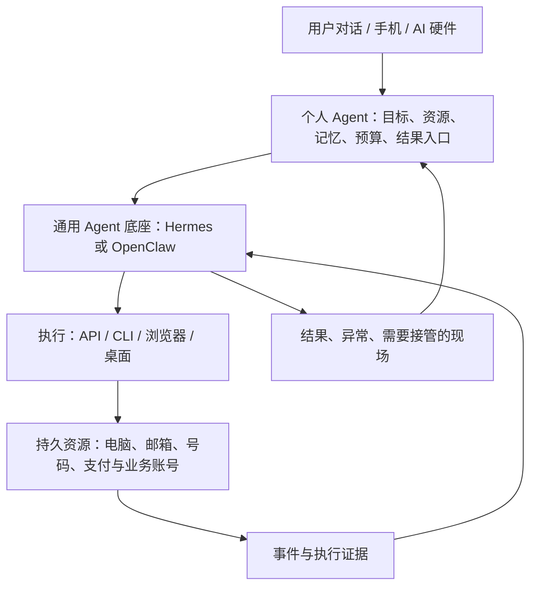

# Personal Agent：整合方案与资源可行性草案

核查日期：2026-09-30。本文件保留早期候选资源和部署调查，文中的设备偏好属于当时研究设想。当前产品以多种资源连接器与完整接入流程为主线，见[整合落地总方案](implementation-blueprint.md)。尚未安装、开通、付费或实测。服务资格、库存和价格需要在实际办理时重新核实。

产品依据：[Wearing 产品定义](product-definition.md)。本文件保留前期选型与资源核查；当前工程决策、开发顺序和验收以[落地总方案](implementation-blueprint.md)为准。

## 已有需求与实现设想

- 为用户建设可长期使用的 Personal Agent，现阶段优先自用。
- 核心关系：属于用户的行动者，同时也是用户向外延伸的另一个自己。实现上将用户意图、偏好、目标、账号、资源、任务状态和活动记录持续关联。
- 用户通过对话、手机或未来的 AI 硬件提供上下文。随口的想法可以触发预算有限的初步研究，再形成结果反馈。
- 长期经营由用户决定方向，Agent 负责日常推进；投资场景按用户确定的策略执行。
- 电脑主要由 Agent 使用，保留人类远程接管。用户认为 89 美元/月的 Mac 偏贵，首轮改为优先验证约 15–19 美元/月的 Windows；macOS 保留为有明确收益时的选项。
- 优先整合成熟项目；按成功完成任务的总成本选择工具和模型。
- 用户目前没有海外手机号、U 卡、海外银行卡或境外居留。资源筛选暂按大陆常住、从零搭建的情况进行；具体开户资格尚未核实。

## 建议的整体结构

初期使用一个主底座与一台持久电脑，当前建议先验证 Hermes。模型可以替换；业务能力通过 Skill、MCP 或工具适配扩展。先尽量让 Agent 与浏览器在同一台电脑上运行，后续有明确可用性需求时再拆分控制服务。新增核查确认 Hermes 已有 Windows 10/11 原生文档；Windows Server 与持续 GUI 运行仍需本项目实测，详见落地总方案。

主动执行链路：上下文进入 → 判断是否值得处理 → 按既定预算形成任务 → 执行并核对结果 → 反馈、记录。无行动价值的输入可以只保存或忽略。任务来源、重启恢复、重复动作处理和结果证据应在底座试验中验证。

## 优先复用的部分

| 部分 | 官方资料中已有的能力 | 首轮建议 |
| --- | --- | --- |
| Hermes Agent | 记忆、技能、会话存储、调度、消息入口、模型接入、浏览器、MCP 和桌面操作 | 作为第一轮原型候选 |
| OpenClaw | Gateway、设备 Nodes、消息与事件连接、macOS 客户端、浏览器和桌面控制 | 用相同任务作对照，重点考察设备接入与远程控制 |
| 浏览器执行 | 两个底座均有浏览器工具及现有浏览器后端接入路径 | 沿用底座接口，按任务接入所需后端 |
| 桌面执行 | Hermes 的 computer_use 对接 cua-driver；OpenClaw macOS 提供 Peekaboo，并有 CUA 路径 | 重新核对 Windows 支持，在所租电脑验证驱动、登录会话、后台运行和接管 |
| 模型 | 底座已有模型连接能力 | 保留可替换模型，不在产品层绑定唯一厂商 |

Hermes 和 OpenClaw 的官方仓库均采用 MIT License；整合或派生时保留原有许可与版权声明。优先插件、配置与小型适配层，需要时再维护 fork。

资料：[Hermes 架构](https://hermes-agent.nousresearch.com/docs/developer-guide/architecture/)、[Hermes 浏览器](https://hermes-agent.nousresearch.com/docs/user-guide/features/browser/)、[Hermes 桌面操作](https://hermes-agent.nousresearch.com/docs/user-guide/features/computer-use)、[Hermes 许可](https://github.com/NousResearch/hermes-agent/blob/main/LICENSE)、[OpenClaw 架构](https://docs.openclaw.ai/concepts/architecture)、[OpenClaw 浏览器](https://docs.openclaw.ai/tools/browser)、[OpenClaw 桌面操作](https://docs.openclaw.ai/nodes/computer-use)、[OpenClaw 许可](https://github.com/openclaw/openclaw/blob/main/LICENSE)。这些是文档能力，尚无本项目实测胜负。

## 需要补齐的整合能力

1. **事务与资源关联。** 每项事务需要哪些邮箱、号码、浏览器资料、电脑、支付及业务账号；清楚区分共享资源和业务专用资源。
2. **记忆与凭据的范围。** 复用底座存储，区分个人偏好与各项业务背景，并明确共享规则。凭据通过现有安全存储与工具获取，避免作为普通聊天记忆保存。
3. **上下文入口与任务判断。** 手机、硬件和外部事件统一进入底座，补充值得研究、预算内执行、只记录等产品规则。
4. **预算与授权落到执行。** 复用工具钩子，关联用户确定的日常经营范围、研究预算和投资策略；记录消费、业务动作和执行证据。
5. **结果与接管体验。** 用户能看到完成了什么、依据是什么、卡在哪里；接管时暂停自动输入，交还后恢复任务。远程入口应能独立于 Agent 使用。

具体缺口需要试装后确认，不预设上述每一项都要另造服务。例如 Hermes profiles 已能隔离配置、记忆、会话等，但其文档说明工具进程默认仍可能使用真实操作系统 HOME；配置范围隔离不能直接当作操作系统与凭据隔离。见 [Hermes profiles](https://hermes-agent.nousresearch.com/docs/user-guide/profiles/)。

## 电脑操作：按完成任务的成本选路

| 路径 | 适合的操作 | 选用原则 |
| --- | --- | --- |
| 官方 API / CLI | 查询、更新结构化数据、批量业务操作 | 在权限与能力足够时优先试用 |
| 浏览器 DOM / 可访问性树 | 表单、列表、后台网页 | 优先复用底座浏览器工具 |
| 桌面可访问性接口 | 原生应用、系统弹窗、文件选择器 | 在真实桌面环境验证稳定性 |
| 截图与视觉 Computer Use | 难以结构化的界面、视觉判断、复杂跨应用操作 | 用强模型解决实际难点，根据实测决定是否直接作为默认路径 |

上述顺序是初始路由假设，不是强制每次逐级失败后才升级。若强模型更少出错，直接使用可能更省。总成本包含模型费用、重试、电脑租金分摊和人的介入时间。

OpenAI 的 Responses Computer Use 由集成方提供运行环境并执行动作；Agents API 文档另有 OpenAI 托管浏览器。两者需区分，托管浏览器不等于一台永久托管 Mac 或 Windows。见 [自管 Computer Use](https://developers.openai.com/api/docs/guides/tools-computer-use)、[托管浏览器](https://developers.openai.com/api/docs/guides/agents-api/tools/computer-use)。Claude 也提供由应用执行的桌面工具协议，见 [Claude Computer Use](https://platform.claude.com/docs/en/agents-and-tools/tool-use/computer-use-tool)。

首轮统一比较：有证据的任务成功率、每件成功任务的费用、耗时、人工介入次数，以及中断后继续执行的能力。测试应覆盖网页表单、原生弹窗、长任务与人工接管。涉及付款、开户、广告发布或交易的真实动作另按实际授权开展。

## 电脑资源：Windows 优先试验，macOS 按收益再选择

2026-09-30 在 VPS Mart 页面将付款周期切换为 **1mo** 后核实：Express Plus 为 **14.99 美元/月（3 核、6 GB 内存、100 GB SSD）**；Basic 为 **18.99 美元/月（4 核、8 GB 内存、140 GB SSD）**。两者标明包含 Windows Server 授权和一个独立 IP。页面默认展示长期付款价格，不能当作按月付款价格。

建议先评估 Basic 8 GB：相对 89 美元/月的 Mac，主机标价减少 70.01 美元/月。该建议尚未经过性能实测；租金之外仍有模型费用及可能的税费。系统是 Windows Server 图形桌面，并非 Windows 11；机房 IP 的性质也不会因 Windows 而改变。来源：[VPS Mart Windows VPS](https://www.vps-mart.com/Windows-VPS)。

首轮必须验证人类断开远程桌面后，Agent 是否仍能截屏、点击、输入、持续使用浏览器，以及重启恢复和人工接管。更完整的报价与资格证据见 [本轮选型记录](windows-payment-vi-research-2026-09-30.md)。

以下 macOS 报价保留作成本对照：

MacinCloud 的 Dedicated 方案提供专用 macOS 实例及管理员权限，适合列入首轮候选。核查到的标价如下，页面配置包含 RDP 附加项：

| 配置 | 当前页面月价 | 本项目考虑 |
| --- | --- | --- |
| M1 / 8 GB / 250 GB | 89 美元 | 单任务、少量标签页的成本候选，性能待测 |
| M2 / 8 GB / 250 GB | 114 美元 | 需和 M1 的实际收益比较 |
| M4 / 16 GB / 250 GB | 164 美元 | 多标签页与多任务的候选，尚未证明有必要升级 |

来源：[MacinCloud Dedicated](https://www.macincloud.com/pages/dedicated.html)。最终税费、地域、库存和附加项以订单为准；该专用方案页面注明不提供试用。此处未作购买决定。

macOS、网络出口和账号资格分别验证。机房中的 Mac 仍可能使用数据中心 IP；只改变操作系统不能保证目标平台放行。网站还会参考网络与行为等信号，见 [Cloudflare 对代理流量与机器人识别的说明](https://blog.cloudflare.com/residential-proxy-bot-detection-using-machine-learning/)。

租用前优先核查：管理员权限、真实图形登录会话、Accessibility 与 Screen Recording 权限、重启后恢复、浏览器登录态持久化、远程接管和目标服务支持范围。先租一台，不因多个身份的设想提前购买多台电脑。

## 海外号码：通信接口与账号验证分别验收

| 需求 | 候选 | 已确认内容 | 尚未确认内容 |
| --- | --- | --- | --- |
| Agent 收发短信、接打电话 | Telnyx；Twilio 作为替代 | Telnyx 号码标价 1 美元/月起，另有 0.10 美元/月 SMS/MMS 能力费用及使用费用；消息可通过 webhook 接入 | 用户开户资格、所需材料、完整通信费用、目标网站是否接受该号码 |
| 长期账号验证与找回 | 真实移动运营商 SIM / eSIM | Ultra Mobile PayGo 标价 3 美元/月，提供移动通信；中国漫游接收短信标价 0.10 美元/条 | 用户从大陆购买、首次激活与长期使用的完整路径；各网站验证码实际到达情况 |
| Tello eSIM | 暂不作为大陆远程开通的默认方案 | 当前官方帮助写明首次激活需在美国连接美国蜂窝网络 | 满足激活条件后的使用安排 |

资料：[Telnyx 号码定价](https://telnyx.com/pricing/numbers)、[Telnyx 消息 webhook](https://support.telnyx.com/en/articles/8219294-messaging-in-mission-control)、[Twilio 消息 webhook](https://www.twilio.com/docs/usage/webhooks/messaging-webhooks)、[Ultra PayGo](https://www.ultramobile.com/paygo/)、[Ultra 漫游价格](https://www.ultramobile.com/paygo/international-roaming/)、[Tello 境外激活说明](https://tello.com/help_center/activate-port-in/can-i-activate-my-esim-outside-the-us)。

能接入短信 API 不等于能接收所有商户的验证短信。移动 SIM 接入 Agent 还需要设备桥接或运营商提供的接口，其稳定性需要单独测试。首期不必同时购买通信号和验证号，按实际开户与业务需求选择。

## U 卡：按具体卡种核实大陆用户资格

这里按可通过 USDT / USDC 等加密资产充值的支付卡理解 U 卡。

本轮新增首要核实候选：**UPay Premier，卡 BIN 446614**（upay.com，区别于 UUPAY）。官方限制页对 Premier 的国籍名单没有列中国，而 Platinum 493875 明确列中国；这使 Premier 值得进一步核查，但不足以证明接受大陆常住地址。费用表列开卡 10 USDT、充值 2%、无月费/年费。大陆地址、具体证件类型、+86 手机号，以及目标商户实际扣款仍未完成验证。来源：[按卡种的地区限制](https://support.upay.com/hc/en-us/articles/26613460878620-Restricted-Prohibited-Countries-List)、[费用表](https://support.upay.com/hc/en-us/articles/14954332664732-Virtual-Card-Fee-Structure)。

后续优先确认上述完整条件，再考虑付费。官方申请教程将付款放在提交持卡人资料之前，因此不能把付费开卡当作零成本资格探测。WasabiCard、Infini 的资料差异及其候选状态见 [本轮选型记录](windows-payment-vi-research-2026-09-30.md)。

| 服务 | 当前官方信息 | 对从零搭建的影响 |
| --- | --- | --- |
| RedotPay | 发卡限制明确包含中国大陆居民，涵盖虚拟卡和实体卡 | 不作为当前默认开卡渠道 |
| Bitget Wallet Card | 帮助中心有中国大陆暂停新用户申请的公告，现有用户不受影响；介绍页仍有支持大陆的文字 | 资料冲突，优先按暂停公告处理，不依据旧介绍页承诺可开卡 |
| KAST / Tria 等其他候选 | 本轮未取得足够明确的官方证据，证明适用于用户当前情况 | 保持待核实，暂不建议付费或充值验证资格 |

来源：[RedotPay 发卡限制](https://helpcenter.redotpay.com/en/articles/14254838-card-issuance-restrictions)、[Bitget 大陆暂停新用户申请](https://web3.bitget.com/zh/helpCenter/802)、[Bitget 仍列大陆的介绍页](https://web3.bitget.com/zh/card)、[KAST 地区说明](https://concierge.kast.xyz/hc/en-us/articles/13929112288271-Why-Can-t-I-Use-KAST-In-My-Country)、[Tria 身份验证说明](https://help.tria.so/en/articles/14034407-kyc-know-your-customer)。

符合资格后的典型路径是：官方申请与真实资料验证 → 获取支付卡 → 按该产品支持的资产和网络充值或兑换 → 商户按普通卡支付 → 处理必要的验证 → 核对订阅状态、扣款和退款。不同服务的兑换时点、费用和资金保管方式不同，需逐一核实。

开出卡、能刷某个商户、能够持续自动续费，是三个独立的验收结果。海外电脑和号码不改变开户人的身份、居住地或目标服务资格。

另外三个直接影响架构的事实：

- **广告支付：** Google Ads 官方说明预付卡不能用于自动付款；实际支付方式还取决于账单地区、币种等。U 卡需核实具体卡类型，不能默认通用。见 [Google Ads 支付方式](https://support.google.com/google-ads/answer/2375433?hl=en)。
- **订阅支付：** OpenAI 说明支付还涉及支持地区、发卡地区及验证要求。能开 U 卡不等于能订阅。见 [OpenAI 拒付说明](https://help.openai.com/en/articles/7232916-why-was-my-credit-card-declined)。
- **网店收款：** 店铺经营需要收款与结算能力；支付卡本身不能证明具备店铺结算账户。例如 Shopify Payments 对结算银行账户另有要求。见 [Shopify 结算账户要求](https://help.shopify.com/en/manual/payments/shopify-payments/onboarding/bank-account-requirements)。

因此资源结构需要分别表示消费支付、商户收款、投资账户。它们可由不同服务提供，不能统一假设一张 U 卡覆盖所有业务。

## 建议的推进顺序

1. **锁定产品边界。** 个人 Agent 管理持久资源；通用底座负责 Agent 能力；业务流程以可替换的技能与工具接入。
2. **验证底座。** 在现有可用环境完成 Hermes / OpenClaw 的同任务比较，优先验证浏览器、桌面、事件、任务恢复与接管，减少先租机再发现不合适的成本。
3. **并行核实资源资格。** 找到用户可以实际申请的号码与支付路径，并核对订阅、店铺、广告等目标业务的账号条件。
4. **试用一台月付 Windows。** 优先按 8 GB、18.99 美元/月评估，在具备管理员权限的持久环境验证真实使用条件，然后按需要扩容；Mac 根据实测收益再决定。
5. **形成一个完整闭环。** 从真实上下文输入开始，到任务执行、结果核对、反馈与必要接管；随后再接入具备资源条件的业务场景。

当前已有 Agent 底座、Windows 月付电脑及 UPay Premier 支付卡的具体候选；U 卡候选资格尚未得到大陆常住条件下的完整确认。海外号码的激活与验证用途、店铺收款账户和投资账户仍需落实。产品关系见[产品定义](product-definition.md)，实施顺序见[落地总方案](implementation-blueprint.md)。以上为整合草案，不代表已完成端到端可用性验证。
