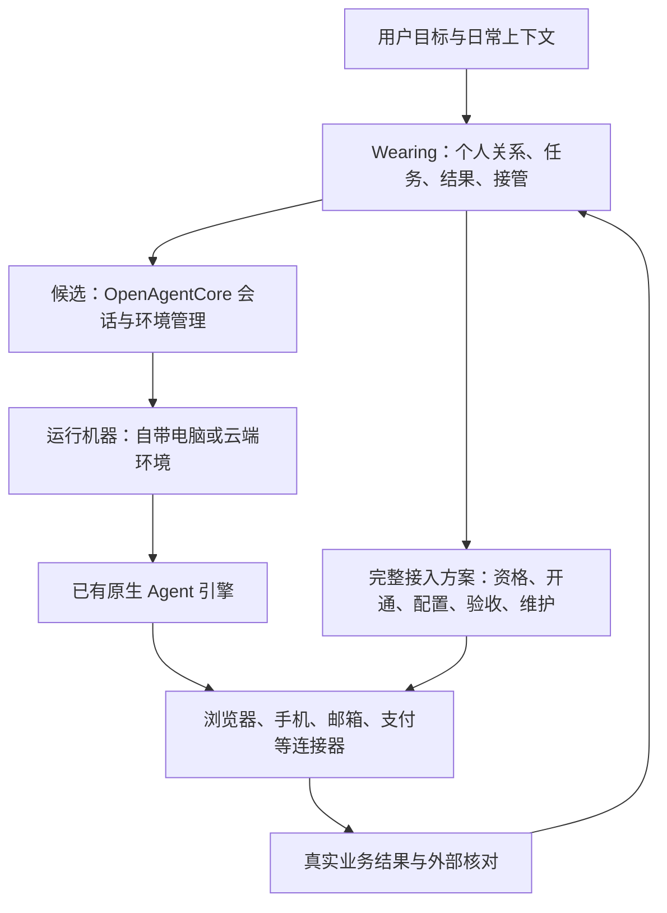

# OpenAgentCore 对 Wearing 的适用性研究

研究日期：2026-10-01。结论：**列为优先验证的执行与环境管理候选，尚未采用。** 它与“用户自带电脑、第三方计算环境、未来托管资源”有直接交集，可以减少一部分底层集成工作。Wearing 的重点仍是把真实资源从获得、接入到长期使用的完整流程跑通。

## 1. 研究范围与证据

- 仓库：[MiniMax-AI/OpenAgentCore](https://github.com/MiniMax-AI/OpenAgentCore)。MIT 许可证；复用时保留许可证和版权声明，打包的上游组件另行检查。
- 本次检查 main 提交：`13f6550399f988b742907d3839a98e1a4991b0aa`，提交时间 2026-10-01 03:41（北京时间）。
- GitHub 元数据：仓库创建于 2026-09-21；查询时最新稳定发布为 [v0.0.2](https://github.com/MiniMax-AI/OpenAgentCore/releases/tag/v0.0.2)，发布于 2026-09-30。以下代码结论对应检查的 main 提交，不能全部视为 v0.0.2 的发布能力。
- 已阅读架构、原生机器安装、平台矩阵、权限边界、能力矩阵、新执行引擎适配合同、Parsar 示例，以及引擎注册、连接界面、安装包目录生成等源码。
- 在临时克隆运行 `node --test scripts/build-native-catalog.test.mjs`：1 项通过。覆盖三个平台安装包目录生成、大清单处理、摘要一致性及不匹配版本拒绝。它使用合成安装包，不证明真实安装成功。
- 未启动 Core、未接入实际 Mac、未调用真实模型，未验证电脑/手机操作。上游文档的 Verified 是上游验收声明，与本次实测分开记录。

## 2. 它负责什么

OpenAgentCore 把应用、计算环境和原生 Agent 引擎分开：Core 保存会话和执行状态，运行守护程序连接执行机器，原生引擎负责模型与工具循环。它提供自托管的 Agents API 兼容接口；支持范围由自身能力矩阵决定。

| 组件 | 已有职责 | Wearing 可以复用的内容 |
| --- | --- | --- |
| Core 服务 | API、Project 隔离、配置快照、轮次调度、取消、交互与持久状态 | 任务执行记录和基础生命周期管理 |
| Runtime 守护程序 | 准备工作目录、安装能力、启动引擎、报告事件和执行回执 | 用户电脑连接、运行准备、会话恢复路径 |
| 原生引擎适配器 | 调用 Codex、Claude Code、MiniMax Code 的原生执行接口 | 先使用已有引擎开展小范围验证 |
| Sandbox Provider | Docker、E2B、microsandbox 计算资源的创建、观察和回收 | 未来云端执行环境的一部分基础设施 |
| Skills / Plugins / MCP | 为会话配置工具和能力 | 接入 Wearing 已验证的连接器 |
| Parsar 示例 | 模型、Agent、会话、文件和机器连接界面 | 接入流程和交互逻辑参考 |

守护程序主动向 Core 发起经过认证的 WebSocket 连接。因此，个人电脑不需要作为公网入站服务暴露；仍需能访问 Core 与必要的下载和模型服务。[架构与代码责任](https://github.com/MiniMax-AI/OpenAgentCore/blob/13f6550399f988b742907d3839a98e1a4991b0aa/docs/architecture.md)

## 3. 对我们最有价值的三个部分

### 用户电脑接入

应用创建一个使用用户机器的会话，得到临时安装命令。用户在目标机器运行后，安装器下载匹配版本的 Runtime 和引擎，检查安装、启动连接、展示状态。它还处理下载重试、磁盘检查、锁、断点后重试，以及凭据轮换/撤销的配套流程。

这很接近 Wearing 需要交付的电脑接入包。其界面明确区分“安装完成”“机器连接”“首次模型调用成功”，值得沿用这种验收分段。[自带机器接入](https://github.com/MiniMax-AI/OpenAgentCore/blob/13f6550399f988b742907d3839a98e1a4991b0aa/docs/getting-started/self-hosted.md)

但当前原生接入以 Session/Environment 为中心，每个会话有独立安装目录和凭据。Parsar 的 runtime 配置只是放置配置，并不是长期在线设备登记。Wearing 需要的“我的 Mac”“我的手机”、跨任务选择设备、占用协调、独立接管与远程救援仍须设计和验证。不能把一次会话安装直接包装成完整设备平台。

### 执行过程与结果保留

它对取消、重复请求、原生执行回执、会话继续、配置快照、文件和产物做了明确分工。这能帮助 Wearing 呈现任务进展并处理连接中断。

这些机制不保证外部业务动作只发生一次。支付、广告提交、订单处理等连接器还必须自己核对商户或平台结果；发生结果不明时先查询再决定是否重试。[执行引擎生命周期合同](https://github.com/MiniMax-AI/OpenAgentCore/blob/13f6550399f988b742907d3839a98e1a4991b0aa/contracts/agents-api/harness-onboarding.md)

### 可运行的应用示例

`example/parsar` 已有中文“连接用户机器”界面、能力组合限制提示、流式输出、取消、历史、上传文件、产物下载和请求结果不明后的恢复逻辑。它适合用来验证产品流程。

它明确是本地单用户示例：没有产品用户权限体系和后台任务层；自带机器路径还有额外限制，比如 HTTP MCP 需通过本地 Plugin 配置，未暴露完整的 MiniMax Code 配置。应根据流程需要复用，不直接作为 Wearing 成品。[Parsar 示例说明](https://github.com/MiniMax-AI/OpenAgentCore/blob/13f6550399f988b742907d3839a98e1a4991b0aa/example/parsar/README.md)

## 4. 与当前计划有关的边界

| 关注点 | 检查结果 | 对 Wearing 的影响 |
| --- | --- | --- |
| MacBook Air | 原生安装包列有 macOS arm64，未列 Intel Mac | 先检测闲置设备芯片；不能根据产品名推断适配 |
| Windows | amd64 支持 Codex、Claude Code；不支持 MiniMax Code | 各接入包保留实际能力差异 |
| Core 部署 | 官方一键路线为 Linux amd64 + Docker Compose + PostgreSQL | “Mac 执行端可安装”与“整个平台在 Mac 一键部署”分开；运维成本需实测 |
| Hermes | 注册代码只有 Codex、Claude SDK、MiniMax Code，未发现 Hermes 适配 | 不是填地址即可接入；要实现执行、取消、回执、恢复、配置和验收合同 |
| 电脑操作 | 已有工作目录、命令、文件和工具接入；未发现现成的桌面操作闭环 | 需另接浏览器/桌面控制工具，并验证截图、点击、登录态和接管 |
| 手机与号码 | 未发现 Android/iOS 设备接入、号码申请和通信生命周期实现 | 沿用 Wearing 的设备与通信分开接入路线 |
| 邮箱与支付 | 未发现开户资格、授权、支付/收款和维护的现成完整方案 | 这些仍是 Wearing 要亲自走通并产品化的核心内容 |
| 持续主动做事 | Core 管理会话轮次；未发现完整的个人长期记忆、上下文触发及经营策略层 | 由选定 Agent 能力和 Wearing 场景层共同承担，避免另造重复调度层 |
| 多用户与托管 | 有 Project 资源隔离；没有产品用户、成员、角色、只读密钥 | 未来面向用户提供托管时，应用身份、计费、设备隔离仍需补齐 |

设备的工具以启动守护程序的账号权限执行，Runtime 本身不提供操作系统或网络隔离。Project API 隔离与同一宿主机文件隔离是不同边界；多用户托管需要外部隔离环境。[资源与权限模型](https://github.com/MiniMax-AI/OpenAgentCore/blob/13f6550399f988b742907d3839a98e1a4991b0aa/docs/concepts.md)

Core 使用 Linux 控制服务器，不代表业务网站必须从 Linux 访问。实际浏览器和业务工具在哪台机器执行，需要按连接器配置单独核实；机器位置也不替代服务所要求的身份资格。

## 5. 能力矩阵不能略过

同一个 API 下，不同引擎、运行位置及功能组合的支持程度不同：

- 上游 self-hosted 的实模型验收运行在 Linux，hosted 验收运行在 Docker。Mac/Windows 的平台声明不等于我们已经取得相同验收结果；E2B/microsandbox 对应格子按文档仍只是 Admitted。
- 内联 PNG/JPEG 公共输入支持 Codex/Claude，MiniMax Code 拒绝。不能据此断言所有原生或 MCP 图像路径都不可用，但截图操作必须验证具体链路。
- 公共 function tools 在 MiniMax Code 路径拒绝；HTTP MCP 有自己的支持路径与限制。
- Subagents 与 functions 或 HTTP MCP 的组合目前拒绝；不能假定多 Agent 分工与所有业务连接器可以任意组合。
- Claude 的结构化输出不能同时使用 Skills、Plugins、MCP 等若干能力。
- 内置启用 web search 的公共参数目前拒绝。这不等于不能另外接搜索工具。
- 公共 token usage：Codex 返回测量值，Claude/MiniMax 返回 null。Wearing 的实际费用和预算控制不能只依赖这一个接口，也不能把 null 记成 0。

来源：[逐项能力与组合限制](https://github.com/MiniMax-AI/OpenAgentCore/blob/13f6550399f988b742907d3839a98e1a4991b0aa/contracts/agents-api/harness-capabilities.md)。实际采用时以选定版本重新核验。

## 6. 建议放在哪里

以下是候选集成位置，不代表已采用；现有产品架构和 Hermes 候选状态不变。

需要分别决定“采用哪个 Agent 引擎”和“是否采用 OpenAgentCore 管理运行环境”。若 Hermes 最符合产品需求，可以先直接集成 Hermes，并借鉴 OpenAgentCore 已完成的接入流程；若 OpenAgentCore 的现成引擎已足够，则可先以其为运行底座验证 Wearing。暂不投入完整 Hermes 适配，先证明这一层为我们节省的工作大于新增服务和适配负担。

## 7. 下一次验证的具体标准

建议限定为“接上一台现有电脑，完成一项带工具的任务，并可继续和恢复”，先用已有引擎，优先比较 Codex/Claude 的工具链。

1. **确认部署与设备条件。** 检测目标 Mac 芯片/系统；明确 Core 放置、网络、模型凭据及独立工作目录。记录安装耗时、下载量、运行占用和人工步骤。
2. **跑通完整接入。** 从应用生成安装命令，到电脑显示已连接，再到真实模型完成首次任务。至少验证一种所需的 MCP/Plugin 配置，而不只发送纯文本。
3. **验收真实操作。** 用浏览器测试页或明确授权的只读网页任务验证控制工具，生成本地报告/产物，核对实际文件与界面结果。避免把命令行可用当成电脑控制已通过。
4. **验证继续、取消与恢复。** 同会话跨轮次使用文件；关闭前端后查看运行结果；测试断线重连、守护程序重启、取消长任务和凭据撤销。分别记录可恢复状态与仍需人工的故障。
5. **判断长期资源适配。** 验证同一电脑承接后续任务需要多少重复安装/配置，是否能维护浏览器状态与独立接管；检验个人数据是否按预期持续存在。
6. **比较实际收益。** 使用相同任务与直接运行选定 Agent 的路线比较配置步骤、成功率、恢复耗时、模型费用与额外运维负担。没有数据前不承诺省钱、性能或成熟度。

通过以上验证，再决定整体采用、局部复用或仅借鉴。浏览器闭环之后接邮箱真实流程；手机、号码、支付保留各自验收，不能用底座连通替代。

## 8. 采用建议

**优先验证；以使用上游接口为主，尽量减少修改其内核。** 它最可能替 Wearing 省下的是原生电脑安装、执行环境准备、会话生命周期与状态管理。它对未来云端资源也有价值，但云计算 Provider 距离托管 Mac/手机机房仍有明显差距。

项目发布早、接口演进快，且适配固定版本的上游引擎。需要固定验证版本，记录升级和回退步骤。目前只能评价架构契合度和已检查代码，尚不能评价长期稳定性或实际单位任务成本。

Wearing 的独特交付继续落在：让用户根据真实条件选对资源，把每一步走通，减少重复配置和人工维护，并持续拿到业务结果。
