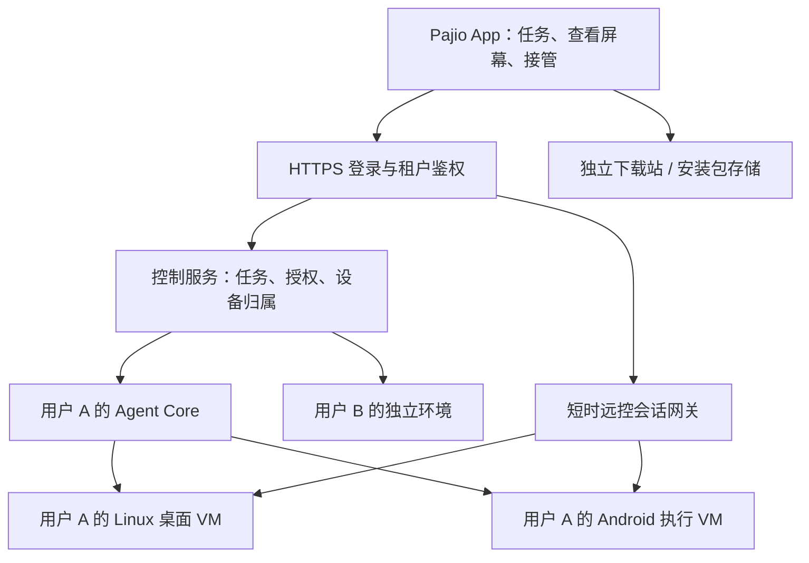

# Pajio 专属电脑、云手机与安装包分发方案

> 这是 2026-10-09 的设计快照。2026-10-10 已实际部署 Linux 和 Android，最新完成状态、顺序与验收见 [持续交付清单](plans/pajio-personal-compute-delivery-2026-10-10.md)。下文“未创建”等表述仅指当时。

日期：2026-10-09。状态：可行性与分阶段实施设计；本轮未创建桌面/Android 实例，未迁移既有网站。现有核心服务状态另见 [真实部署证据](evidence/pajio-public-readiness-20261009/core-service-deployment.md)。

## 决策

每位用户可以拥有持续保存数据、账号登录状态和设置的专属电脑及手机环境。默认电脑采用标准 Linux 的轻量桌面，手机优先验证 Android；按任务启动执行环境，完成后可休眠。用户从 Pajio 查看屏幕、接管登录、交还控制，Agent 使用同一环境继续工作。

“专属”首先意味着数据与身份不混用，不等于每个用户全年同时占用两台运行中的 VM。不能将一个已登录用户账号的系统镜像克隆给其他用户。

自有服务器用于核心与执行算力；安装包分发使用独立静态入口与文件存储。下载流量不经过 Agent 任务和办公上行链路。

## 本轮实查

| 项目 | 2026-10-09 实查结果 | 含义 |
| --- | --- | --- |
| 公司服务器 | i7-12700F，12 核/20 线程，VT-x；31,922 MiB 内存；953.9 GiB NVMe；RTX 3060 | 能运行 Linux/Windows VM；不能把 20 线程等同于 20 个满负荷用户 |
| 内存快照 | 已用 13,359 MiB，available 18,562 MiB，swap 未使用 | 有空间做一套新增试验；不据此承诺并发容量 |
| 现有 VM | 1100 控制层、1101/1102 两个租户，各 4 GiB；恢复校验 VM 与模板关闭 | 新桌面/手机试验独立建实例，不在生产控制 VM 上安装桌面或特权 Android 容器 |
| 核心服务复查 | 两租户各 3 次 HTTPS 状态查询全部 200，Hermes reachable；控制层/租户单元 active、enabled | 核心仍在线，不证明新增桌面或云手机已接通 |
| 当前公共入口 | 腾讯云元数据返回 ap-guangzhou，入口通过 WireGuard+mTLS 连接公司控制 VM | 公网入口与执行算力已分离；尚不等于备案接入关系已核验 |
| 新加坡资源 | 当前 CLI 账号下无 CVM；一台运行中的 Lighthouse，Elixir-Capital-SG，2C4G/60 GB、30 Mbps、每期 1536 GiB 流量 | 项目运维文档表明它承载 Elixir；不是已确认闲置机器，未改动它 |
| 新加坡费用/期限 | 套餐 API 列价 42 元/月；到期 2026-10-22 12:10 北京时间，手动续费；当前周期已用约 8.25 GiB | 列价不是完整账单或新购报价；未续费、未购买。复用前还须测实际负载与下载速度 |
| 公司域名 | 官网当前页脚展示“粤ICP备2026036908号-3” | 只是页面内容，不是工信部当前状态、接入商或 Pajio 服务范围已核验 |

另外，SSH 中历史 openframe-sg 别名本轮连接超时；不据此认定该资源已销毁，也不把当前账号下的实例列表当作所有公司账号的资产清单。

## 系统选择

| 系统 | 判断 | 首轮做法 |
| --- | --- | --- |
| Linux 轻量桌面 | 浏览器、文件、网页办公、代码工具等适合，许可证与运维负担相对低 | 标准 Ubuntu/Debian，轻量桌面、浏览器、中文字体与输入；按任务安装应用，不采用来源不明的精简系统 |
| Windows | 技术上可以创建，但 Windows 桌面授权、对外托管使用权及应用授权要分别确认 | 有明确 Windows 专用任务时加选；不能把原 PC 的一份 OEM 授权视为所有租户 VM 授权 |
| macOS | 当前非 Apple 硬件不属于 Apple 标准 macOS 授权部署路径 | 不作为此 PC 上的产品路线；有真实需求时另选 Apple 硬件及相应托管许可方案 |
| Android | 可虚拟化或容器化，远控有成熟基础；国内 App 实用性待逐个实测 | 先比较隔离 VM 内的 redroid 与 Cuttlefish；不承诺所有应用都能运行 |
| iOS 云手机 | 不纳入通用手机执行环境 | 手机端是 iPhone 不妨碍其 Agent 使用 Android；需要 iOS 专有能力时另走真机能力接入 |

Apple 标准条款限制非 Apple 硬件与虚拟化使用范围；微软的桌面托管许可与普通本机激活不同。参考 [Apple macOS 许可](https://www.apple.com/legal/sla/docs/macOSTahoe.pdf)、[Microsoft 桌面托管架构及许可边界](https://learn.microsoft.com/en-us/windows-server/remote/remote-desktop-services/desktop-hosting-reference-architecture)。具体采购许可按部署方式确认。

## 推荐结构与远程接管

初期将 Agent Core 与执行环境分开，浏览器和 App 的攻击面不直接落在保存模型凭据和任务控制信息的进程中。后续只有实测收益明显时才考虑合并同一用户的部分 VM；跨用户不合并特权 Android 容器的宿主隔离边界。

- Linux：Agent 使用浏览器结构化操作、文件工具和必要的桌面截图/输入适配；用户通过鉴权后的远程桌面流查看与接管。[Apache Guacamole](https://guacamole.apache.org/) 提供浏览器端 VNC/RDP/SSH 基础；它本身不等于 Pajio 的租户授权与控制权机制。
- Android：Agent 通过受限 ADB/UI 自动化适配；用户通过鉴权屏幕流触控。[Cuttlefish WebRTC](https://source.android.com/docs/devices/cuttlefish/webrtc) 已支持浏览器远控；[redroid](https://github.com/remote-android/redroid-doc) 支持远程 Android 与 scrcpy，但其文档的 WebRTC 部分仍是计划，不能标为已交付能力。
- 入口只持有短时、绑定用户/设备/用途的会话许可；ADB、VNC、RDP、Proxmox 管理口不直接开放给公网。
- 接管动作使 Agent 输入许可立即失效，并终止或排空已接纳输入；敏感登录模式还要暂停模型截图、界面文本与输入日志采集。屏幕停留在旧帧时不得继续点击。
- 用户点击“交给 Pajio”后重取页面状态，再恢复任务。断线、会话到期、撤权默认停控，不自动把人类控制权交还 Agent。
- 用户密码、验证码不进入模型消息；已登录会话本身仍是高权限资产，不能因为模型看不到密码就宣称账号完全安全。对第三方页面/系统能否隐藏所有敏感信息需单独验收。
- 复用现有设备归属、租约、task grant、输入审批与回执；新增 Linux 驱动和屏幕流通道。仓库 `connectors/remote/service.py` 当前常驻安装只支持 macOS/Windows，不能把现有 Mac 控制验收当成 Linux 已完成。

## Android 的关键不确定性

这台主机是 x86。Android 能开机，不代表 ARM 原生库、视频解码、推送、设备完整性检查、验证码或账号登录都可用。redroid 提供 ARM 翻译方向，但发行镜像中的第三方组件授权和兼容性仍需核对。[Waydroid VM 文档](https://docs.waydro.id/faq/get-waydroid-to-work-through-a-vm) 也明确涉及 GPU/软件渲染选择；现有一张 RTX 3060 不能直接当成所有租户已拥有 GPU 加速。

Cuttlefish 在 VM 内运行通常需要嵌套 KVM；先核查嵌套虚拟化配置和图形性能。redroid 要求的内核与特权容器运行在独立执行 VM 内，不直接加载到 Proxmox 主机或公司共用控制服务器。

优先验收飞书、B站、小红书、抖音、微信：官方渠道安装 → 用户亲自登录 → 浏览/收藏等明确授权功能 → 重启后会话 → 长时间后台 → 人工接管 → 网断恢复。先从只读任务做起，不用个人主账号做未经验证的批量试验。平台限制以测试结果记录，不提供规避风控或伪装设备的产品承诺。

微信等若不支持所选虚拟环境，则保留用户连接自有真机、专属托管真机或后续合规 ARM 云手机服务的选项。云手机不是虚拟 SIM 卡；手机号、短信、人脸/相机等验证可能仍需用户参与。暂停手机会影响实时消息和后台推送，不能一边休眠一边承诺始终在线。

## 容量与成本假设

以下仅为试验资源预算，不是容量基准：

| 组件 | 初始预算 | 使用方式 |
| --- | --- | --- |
| 控制层 | 现有 4 GiB | 常驻 |
| 每用户 Agent Core | 现有 4 GiB，后续实测是否可减 | 常驻任务调度或按任务唤醒；模型走 API |
| 每用户 Linux 桌面 | 2 vCPU / 4 GiB / 32–40 GiB 卷 | 活跃任务时运行 |
| 每用户 Android 执行 VM | 2 vCPU / 3–4 GiB / 24–32 GiB 卷 | 活跃任务/接管时运行 |
| 宿主与余量 | 至少预留 4–6 GiB，压测后调整 | 禁止以 swap 维持超售体验 |

保留现有三台运行 VM，新增一台桌面和一台手机，分配总内存约 19–20 GiB，再留宿主及峰值空间。先做一套完整环境；不要直接为十几个用户同时创建常驻双机。第二套能否同时活跃，以峰值 RAM、CPU、图形编码、任务耗时和网络实测决定。

更多注册用户可以保留独立持久卷、排队唤醒计算；必须显示“正在唤醒/排队”，不能假装已在执行。仅无活跃任务、无人工控制、无即将到期调度时才能进入休眠。持久卷仍持续占硬盘，系统更新和备份也消耗资源。

成本应分别记：模型输入/缓存/输出 Token、工具服务、活跃 VM 分钟、屏幕流量、持久存储与备份、电费/宽带、系统授权。自有服务器减少租赁计算支出，不会自动消除模型 API 费用。Agent 未执行时不循环截图调用模型；远程屏幕流只在需要观看/接管时启用。

## 安装包下载站

目标是下载页、版本信息和安装包，不需要另跑一整套业务后端。公司服务器保留构建产物副本；发布时将审核后的签名安装包复制到独立文件存储或现有云服务器静态目录。不要把下载请求实时代理回办公室。

先核验已有广州腾讯云接入备案是否覆盖拟用子域名和网站内容；符合时优先复用国内静态入口，面向国内下载体验更合理。新加坡是可选下载源，当前资源运行中且已有业务，须先测负载、磁盘和国内下载速度。仅放海外静态文件通常不需要中国大陆网站 ICP 接入备案，但不能据此免除 Pajio App 本身的备案要求。

公司自建主机作为国内网站源站，应向实际网络接入服务商核实备案受理与宽带可提供服务范围。通过广州/海外反向代理不自动消除源站及业务的备案责任。本轮没有正式备案查询成功证据；不将官网页脚号码作为核验结果。

发布约定：

1. Android 只发布发行签名 APK：版本号、最低系统版本、文件大小、SHA-256、签名证书摘要与更新说明齐全；真机验签和安装后再开放链接。
2. iPhone 下载按钮指向有效 TestFlight/App Store 渠道。普通网页放 IPA 不等于普通外部用户能安装；开发者资质和分发仍单独验收。[Apple TestFlight](https://developer.apple.com/testflight/)
3. 文件使用不可变版本路径；支持 Range 断点续传、正确 Content-Type、长度与 ETag。发布索引原子更新；旧版本保留回滚。
4. 包体带宽和并发与 API 隔离；以 200 MiB 包为例，1000 次完整下载约 195 GiB，30 Mbps 总出口的单连接理想下载时间约 56 秒，实际需计共享流量和网络损耗。这是计算示例，不是现有包体大小或速度实测。

备案参考：[腾讯云是否需要备案](https://cloud.tencent.com/document/product/243/19630)、[备案场景](https://cloud.tencent.com/document/product/243/18910)、[接入备案](https://cloud.tencent.com/document/api/243/37403)、[工信部 APP 备案通知](https://www.miit.gov.cn/jgsj/xgj/wjfb/art/2023/art_dd783a581c9644a4aee10afa582811db.html)。公开文档中“仅 IP 测试”表述存在差异，本方案不采用 IP/端口作为规避备案的方法。

## 实施顺序与通过标准

1. **一个用户的 Linux 电脑。**独立 VM、中文桌面、浏览器与持久文件；补 Linux 常驻连接器；Agent 完成真实网页/文件任务，用户手机能查看、接管、交还；Mac 断开仍可执行。
2. **同一用户的 Android。**固定版本镜像，记录镜像散列；选型运行后测试目标 App 安装/登录/收藏浏览及重启持久性；完成手机端触控和 Agent 控制互斥。失败应用如实列出，不先放“已连接”入口。
3. **第二个用户与故障验证。**隔离账号、文件、剪贴板、屏幕流、设备票据、下载和网络；旧票据重放、撤权、网断、抢占、重启都不能控制错误设备。身份镜像仅在首次启动生成，不共享 cookie、Android 用户数据或 connector key。
4. **资源调度与连续运行。**先做 48 小时试运行和有限并发，记录 P95 操作延迟、峰值资源、登录保持与费用。通过后才决定扩内存/ARM 手机节点/新的云资源，不预先承诺用户规模。
5. **公开分发。**备案接入、App 分发资格、备份自动化、告警、恢复演练和安装包校验完成后再开放对应入口。

界面上保持“我的电脑”“我的手机”“我来接管”“交给 Pajio”的简单操作；创建系统、网络配置和远控协议都由平台处理。两个设备之间传递产物走归属明确的文件服务，不开放整个宿主文件系统或跨租户共享目录。
