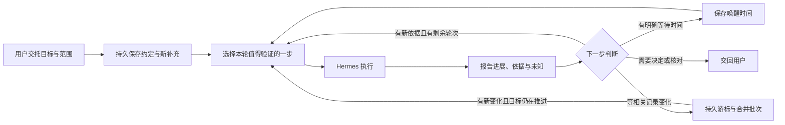

# Wearing 的持续目标

2026-10-06 补充：生活记录变化安排可以关联当前身份的已有目标，沿用同一个 TaskService/Hermes 执行链路、原约定和总轮次。目标等待新信息时可保持等待状态；相关笔记、日程或待办变化后继续原目标，进展只交付一次。见 [主动性与定时安排](personal-proactivity.md)和[本轮验收](evidence/goal-event-continuity-2026-10-06.md)。外部事件连接器仍未接入。

更新于 2026-10-04。当前实现围绕已接通的 Hermes runs API，增加用户交托的目标、记录与后续调度；Agent 执行循环、会话、工具和模型调用继续复用 Hermes。

2026-10-06 额度更新：默认从 3 轮提高到 100 轮，范围上限从 10 提高到 1000。只要有新依据和可执行的下一步，就优先完成已交托的任务；完成、卡点或重复空转时停下来，不为凑轮次继续调用。既有目标保持原额度和状态。

## 怎么用

可直接在「现在」说清长期目标和允许范围，Agent 会整理目标、阶段验收和轮次，实际保存后回告。明确交托持续推进时，当前对话结束后开始；只要求先记下则保存为暂停。路径不明可先验证关键未知，不必先写出完整执行计划。用户无需重复填表；后台任务不能自行创建更多目标，同一次委托的重试不会复活已经暂停的目标。已有目标的暂停、修订和核对仍用对应操作，不把这次创建能力说成所有控制都已支持自然语言。

也可以在「更多」→「目标与定时任务」→「记下一个目标」。写下想做成的事情、这次先做到哪里、怎样算有进展，选择 10 / 100 / 300 / 1000 轮推进空间，默认 100 轮。路径尚不明确时，可以把验收写成“验证最关键的未知，给出可核对的阶段结论”。

- 「先记下」只保存，不启动。
- 「交给 Wearing 推进」明确启动。每轮结果回到原身份的对话，也保存在目标的进展中。
- 新情况通过「补充新的情况」保存。它会使旧计划失效，并请求停止仍在运行的旧步骤；后续按新记录判断。
- 目标上的「一起聊聊」回到主对话，带上原目标、约定、补充和最近进展；讨论不改变目标的安排。「在对话里补充」则把本次原话和修订一起保存，再由 Wearing 回应。发送补充后自动回到讨论模式。
- 当前有运行时，关联目标的新消息明确排队，等原运行确认结束后送出；可以选择「这条先不发」。较早未送出的消息仍需先处理。取消回应不撤销已经保存的新情况，也不删除原话。
- 已获得回应的普通对话可以「把这件事记成目标」；原对话和来源关联保留，用户确认目标与约定后才保存，不会自动启动。
- 在「到时我来」选“记录有变化时”并选择“接着推进哪件事”，即可关联原目标。关联本身不启动目标；同一目标只保留一项未结束的变化安排。暂停、修订或恢复目标从新的变化开始，不补做旧批次。
- 「先停一下」阻止后续步骤并请求停止当前运行。停止请求不等于远端操作已停止，实际状态仍显示在对话中。
- 模型提出完成时停在「等你核对结果」。用户填写核对依据后，才能记录目标达成。用完轮次后，可明确补充最多 100 轮，累计上限为 1000；到上限后先复盘已有结果。

网页可以关闭，执行仍需要 Wearing 服务保持运行。腾讯云试验 VM 当前按用户要求停机，18865 私人云端入口暂停；当前 8765 本地入口依赖本机持续运行，电脑休眠会暂停执行。关闭网页期间，每轮新的反馈会持久保存；回来后在对话上方和「一起记着的」显示，服务重启后仍保留。当前反馈只在 Wearing 网页内，尚无系统推送、邮件或短信投递。见 [持续反馈](goal-feedback.md)。

## 这次实现的机制

`GoalBook` 保存目标、用户原话、修订号、轮次、唤醒时间和每轮任务关联。`GoalCoordinator` 处理到期、收取报告与暂停。每轮使用现有 `TaskService`，保留原 `run_id`、审批与恢复逻辑。任务完成仍为 `completed_unverified`，模型列出的来源仍是模型陈述。

每次派发前原子预占轮次和任务；派发失败前的离线可以重试同一份草稿，提交结果不明确时只核对原运行，不自动再提交。用户有未发送的对话时优先等待处理。正常下一轮至少间隔 30 秒，离线前置检查退避 60 秒。报告无效、没有新依据、连续重复结论、外部条件不明确时停下来复盘。重复结论检查目前仅检测完全相同的摘要，并非语义级停滞检测。

普通对话带入本身份最近更新的最多 8 个目标；明确关联的目标另带入最近 20 条补充与 4 份报告，目标执行使用相同历史并带入来源对话。完整历史仍保留在数据库中。这是第一层承诺和进展记忆；已接回 Hermes 的偏好/经验记忆与关键词会话检索（本地源码 profile v19，下次引擎启动应用；云端试验机仍暂停），详见 [个人记忆](personal-memory.md)。全量语义检索、跨库冲突归并、彻底遗忘和后台记忆整理仍未实现。聊天中的补充需要用户明确选择补充模式；任意自由聊天不会自动改目标记录。暂停、继续、增轮、核对和完成仍使用目标上的明确操作。

## 边界与后续

- 轮次限制是执行次数限制，不是金额或 token 硬预算；一轮可以包含多个模型和工具调用。消费限额与计量属于后续工作。
- 目标讨论沿用普通对话调用，不计入自动推进轮次，仍产生模型费用。排队和补充的持久化不表示回应已送到模型。
- 目标范围通过指令传给模型，工具能力继续由连接器配置限制；尚无基于目标的动作级权限网关。自动跟进不扩大已连接工具的权限。
- 支持明确时间等待，以及显式关联安排后的 Wearing 记录变化等待；邮箱、应用推送等外部事件尚未接入。记录种类先决定是否唤醒，语义相关性仍由本轮模型判断，因此不相关的变化也可能消耗一轮；这不是免费语义筛选或金额预算。
- 目标按现有身份分区，身份仍不构成租户安全边界。每租户独立 VM/microVM 的 SaaS 基线不变。
- 当前本地数据库调度面向单实例服务。数据库会阻止任务重复占用，但不宣称已具备云端分布式协调、设备独占或跨系统 exactly-once 保证。
- 云端单轮目标、整 VM 重启和本地多轮/修订已分别验证。下一步验证跨天多轮目标与设备断线恢复，再接入外部事件与费用计量。网页内持续反馈已接通，外部通知仍待接入。

接口定义见 [持续目标契约](contracts/personal-goals-v1.md)，实际验证范围见 [持续推进验收](evidence/personal-continuity-2026-10-03.md) 与 [输入及对话衔接验收](evidence/goal-conversation-2026-10-03.md)。
