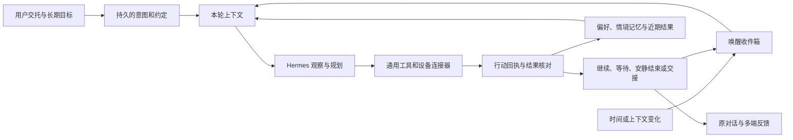

# Wearing：让个人 Agent 持续照顾事情

更新：2026-10-05。例子是能力验收场景，不是已接通的业务功能，也不构成真实下单授权。

## 产品判断

Wearing 记住用户想要的生活结果，持续观察相关变化，在已经交托的范围内主动推进，把有意义的结果或当前真正需要决定的一步交回来。主动性不能用消息数量、定时频率或模型工作时长衡量。

不要按外卖、旅行、账单各写一套固定流程。需要稳定的是授权、资源和执行记录，需要灵活的是判断、计划和工具选择。一次成功操作可以沉淀为可检索的经验；它不是下一次必须照抄的脚本。

例如“工作日午饭帮我照顾一下”：11 点只是唤醒来源；每次还需判断当天是否上班、在哪里、是否有聚餐、是否已有订单、口味和预算是否变化。具备可靠条件后推进到用户约定的交接点，条件不足就问当前必要的一件事。不能把过去的配送地址和成功点击当作当前事实。

## 同一套能力，三种持续事项

| 用户交托 | 持续状态 | 唤醒方式 |
|---|---|---|
| 周五看看这一周的花销 | 周期安排：意图、条件、时间、最近结果 | 约定时间 |
| 帮我找人少又漂亮的假期去处 | 长期目标：未知、候选、证据、决定、剩余工作 | 下一步准备就绪、资料变化、适当复查 |
| 关注价格，有合适的再告诉我 | 持续关注：基准、阈值、已通知内容 | 来源事件，或低频检查 |

三者复用同一个执行引擎、个人记忆、资源连接器和行动记录。时间安排不等于日历事件，日历里的会议也不自动授权 Agent 操作外部账户。

## 通用 harness

工程控制保证资源归属、有效时间、重复派发防护、预算计量、关键动作交接与恢复。模型决定查什么、用什么工具、如何比较、是否调整路径，以及下一步是否值得做。页面、账单、邮件等外部内容要保留来源；资料不能自动升级成用户的新授权。

每轮按事项检索稳定偏好、最近相关事实、未解决问题、当前资源状态和已有结果。失效时间、用户纠正和来源应成为记忆的一部分。更大的提示词不等于更好的长期记忆。

## 本轮接通的第一层

- `ScheduleBook` / `ScheduleCoordinator` 保存身份范围内的意图、单次/周期规则、时区、有效时间与运行记录。
- `croniter` 计算重复时间，Wearing 把唤醒交给现有 `TaskService` → Hermes `/v1/runs`。没有另起模型循环，也没有外卖/旅行专用步骤。
- 聊天中的 `schedule_list/create/change` 与网页“一起记着的 → 到时我来”使用同一份数据。关闭网页后由运行中的服务执行；本机休眠或服务停止时不运行。
- 每次唤醒使用新运行会话，并注入意图、当前时间和最近三次记录；引擎继续使用已有记忆与真实工具。
- 数据库事务同时记录 occurrence 和 task，唯一键是安排、版本、计划时间。结果不明沿用原运行核对，不自动重发；这不等于外部业务副作用 exactly-once。
- 离线时只重试尚未送出的同一 task，超过有效期跳过；错过多次周期合并处理，不补做一串历史动作。用户未送出的对话优先。
- 修改和暂停让未送出的旧版本失效；已经送出的动作保持原运行记录。界面明确“暂停后续”，本轮停止仍在对话中操作。
- 结果回原身份对话；严格的 `[SILENT]` 输出只留历史。失败后暂停后续以便检查，不自动反复产生模型调用。
- 定时运行不能通过安排工具自行增加/扩大周期工作；可以暂停或结束自己的安排。该约束依赖目前每租户单活动运行的 TaskService。

当前边界：单实例 SQLite 调度；无独立调度进程、分布式租约、系统推送、金额硬上限或外部事件连接器。身份划分仍不是租户隔离。外部支付是否可执行不能靠提示词保证，后续须落实到每种连接器的动作边界。原生 App 尚未新增独立的安排管理页。

## 记录变化唤醒（2026-10-05 第二层）

同一项安排现在可选择 `kind=life_change`：笔记、待办、日程有变化时唤醒。网页仍使用“一起记着的 → 到时我来”，聊天仍使用原有三项 schedule 工具。意图和条件保留为自由描述，由 Hermes 重新观察并决定如何推进；没有新增生活业务 workflow。

- 来源是既有 `life_changes` 事务日志，事件标识为 `life:<sequence>`，身份范围由运行实例绑定。创建、编辑、恢复安排都从当前日志位置开始；不遍历旧历史，不补做暂停期间的变化。
- 手动保存、拍写入口的初始记录，以及当前用户对话代记的内容可以触发。当前对话来源根据可信任务表与 messages 关联判断，模型不能通过参数声称来源。后台安排、目标运行和媒体整理写回不会再唤醒自己。未修改内容的保存不增加记录版本或事件。
- 连续变化默认合并 60 秒，持续编辑最多延后到第一条变化后的三倍合并时间。默认两轮预留至少间隔 15 分钟、滚动 24 小时最多 12 轮；限制按安排历史计数，修改或暂停/恢复不清零。单次模型费用与 token 尚无硬上限，这不是金额预算。
- 每批最多带 50 条不同记录的引用；重复编辑同一记录只携带最后引用，保留变化数量和完整序列范围。超出的记录保留在持久游标后，按后续轮次处理，不截断丢弃。每次扫描最多 500 条日志，避免无限读取。
- 游标与待处理批次在同一 SQLite 事务更新；批次与任务在同一次 occurrence 事务冻结。重启继续原游标与任务；已送出的批次不被后续编辑覆盖，新变化进入下一批。语义去重仍需模型核对已有业务结果。
- 拍照/录音仍在整理时，最多等 10 分钟再读取当前状态；超过后仍要报告真实整理状态，不能猜测内容。已处理后的媒体整理结果不会自动引发第二轮，后续需显式再次交托或新的用户修改。
- 运行上下文只有变化来源、记录引用、时间和先前回执，不把笔记内容提升为授权。引擎使用 `life_records` 读最新内容，包括删除/完成状态。无相关变化返回 `[SILENT]`，只留历史；有用结果回原身份对话。
- 单实例 TaskService 的用户对话优先、结果不明不重发、暂停不冒充停止在途动作，以及失败暂停的规则沿用。有效期从排队计划时间计算；超时批次跳过，不声称已处理。

当前接通的是 Wearing 自己的记录事件，尚无微信/支付宝账单、邮箱或第三方 App 事件源；GoalBook 已于 2026-10-06 接上显式关联的记录变化安排（下节）。新能力默认不替真实用户建立任何后台安排。实测证据见 [记录变化验收](evidence/event-intentions-2026-10-05.md)。

## 变化接着推进原目标（2026-10-06 第三层）

记录变化安排增加可选 `goal_id`，网页选择“接着推进哪件事”；对话先用只读 `goal_list` 取得当前身份真实目标 ID。关联必须是同身份未结束目标，同一目标最多一项未取消的变化安排，避免用户无意重复交托。目标的启动、范围、暂停和增轮仍由原目标控制，关联不扩大它们。

事件批次与原 `goal_steps` 在同一事务预占任务及轮次，时间唤醒和事件唤醒不会并发占用同一个目标。有未收取报告时保留事件批次；目标未在推进、需核对、已用完轮次时不启动。暂停/修订/恢复清除旧批次并从当前游标开始；暂停中的变化不在恢复后补做。目标中断由目标状态控制，不要求用户额外恢复关联的观察安排。

已有有效关联时，模型可用目标报告的 `wait + wait_seconds=0` 等变化；事件运行继续报告同一目标的进展、依据与未知，沿用原反馈路径，安排不再重复插入一条消息。完成仍停在等用户核对。后台目标运行不能自行新建或扩大安排。

这是通用的目标与事件衔接：没有旅行、外卖或账单的固定步骤。当前按照记录种类分流，语义相关性在模型执行中判断；不相关内容仍可能消耗一轮。金额硬预算、外部事件、长期无人值守验收、系统推送仍待完成。真实模型两轮、并发/重启/暂停回归与浏览器证据见 [验收记录](evidence/goal-event-continuity-2026-10-06.md)。

## 吸收 Hermes / OpenClaw 哪些机制

来源核对：本地 Hermes 固定版本 `367441274c48a03d12ee9f8d3d9ccd9bc1585392`，以及 2026-10-05 的官方文档。线上最新机制不等于本项目已集成。

| 能力 | 当前 Wearing | 产品化处理 |
|---|---|---|
| 模型调用、工具循环、会话、运行恢复 | 复用 Hermes API adapter | 继续沿用，避免第二套执行引擎 |
| 个人记忆、历史搜索 | 已接，记忆在“一起记着的”可看 | 补来源、时间、失效及用户纠错关系 |
| 定时任务 | 上游 ticker 未启动；本轮接 Wearing 调度适配 | 可对话建立、可见下次时间与历史 |
| 信息获取 | 已接原生 web、手机 App 观察与截图视觉；专用浏览器/终端未普遍开放 | 按人的找资料方式选择来源，记录实际阅读范围；连续视频仍待接 |
| skills 与经验复用 | v13 已接回 skills 检索/加载/管理；检索加载已实测，管理写入未验收 | 按需加载，验证成功再沉淀，不固化为业务流程 |
| 计划与视觉理解 | v13 已接原生 todo_list 与 vision_analyze，并做真实模型验收 | 手机截图可交给视觉；单帧不代表完整视频 |
| 多 Agent 委派 | 当前产品未接 | 等任务隔离、预算归属和结果合并成熟再启用 |
| 心跳/事件驱动的持续关注 | 有限目标延续；时间与本地记录事件已接，无外部事件源 | 统一唤醒收件箱，合并相近事件，有变化才报告 |
| 跨渠道反馈 | 当前原身份对话持久保存 | 建立结果收件箱，再接 App/桌面推送与送达回执 |

Hermes 原生 cron 与 Gateway、profile 内任务存储和投递路径相连；当前 Wearing 使用收窄的 API adapter。直接另启 ticker 会绕开现有任务队列和产品回执。本轮复用同类日历库，并借鉴 occurrence、过期跳过、安静反馈等机制，在 Wearing 入口适配执行；没有声称“已启用 Hermes 原生 cron”。后续引擎升级应检查可复用边界，避免并行运行两份调度表。

参考：[Hermes 定时任务](https://hermes-agent.nousresearch.com/docs/user-guide/features/cron/)、[Hermes 工具集](https://hermes-agent.nousresearch.com/docs/user-guide/features/tools/)、[OpenClaw Automation](https://docs.openclaw.ai/automation)、[croniter](https://github.com/pallets-eco/croniter)。借鉴重点是持久唤醒、每次重新判断、运行历史及安静反馈。

## 用生活场景检验泛化能力

| 场景 | 应交付的结果 | 缺少或需强化的通用能力 |
|---|---|---|
| 午饭、买菜、日用品补货 | 按当天情境选好，交接具体订单和金额 | 当前地点/日程/家庭偏好、订单核对、账户接入、支付交接 |
| 微信/支付宝花销复盘 | 有来源的分类、退款和转账去重、异常变化、可行省钱建议 | 用户导入账单或授权读取；文件解析、跨来源对账、金额准确计算；不是假定已有账单 API |
| 假期旅行 | 路线、交通住宿候选、实时可订状态及付款前交接 | 模糊偏好澄清、App/网页来源选择与比较、视频信息、实时价格证据、行程对象、订单有效期 |
| 快递、退货、售后 | 关注进展，在截止前准备好当前一步 | 状态事件、时限、附件整理、商家沟通交接 |
| 订阅、通信套餐与家庭支出 | 找到无用订阅、重复服务和适合复查的变化 | 跨来源实体识别、费用周期、到期触发、可解释建议 |
| 预约、出门准备、家庭协同 | 合适的时段和准备材料，变化时自动重排 | 日历冲突、多人约束、场景记忆、预约状态核验 |

这些是验收场景，不是导航上的六个业务应用，也不硬编码商户、城市、票种、节日或点击路径。相同能力应能迁移到新应用和没见过的需求。

## 接下来的工程顺序

1. **统一唤醒与承诺记录**：将目标、时间、生活记录变化和连接器事件关联；稳定 event_id 去重、合并重复变化，定义何时等待/结束/需要人。不要重建现有 GoalBook。
2. **上下文与能力供给**：按需接回成熟设备、媒体和沙盒能力；让模型能发现“有何资源、是否在线、哪些动作可用”；优先补 App 视频/音轨与可回看材料，记忆增加来源和时效，按意图构造上下文。
3. **执行预算与回执**：按持续事项累计 token/费用/设备时间，硬预算在调用前拦截；关键提交与一般操作分别处理；预提交/提交后/结果不明都留可恢复凭据。
4. **生活资料进入与反馈送达**：通用文件/账单导入和附件解析，先取得真实资料；做跨端结果收件箱与推送，区分“执行完成”和“用户已收到”。
5. **跨天验收**：至少三类不同生活事项，用重启、离线、改主意、重复通知、已经办过、过期价格等变化验证；指标是无需重复交代、真实结果和需要用户介入的次数。

支付和真实账户资源继续单独积累。这一顺序先增强模型能做事的通用条件，不靠增加场景按钮制造能力感。

## 2026-10-05：通用公开研究工具已接入

profile v12 将 Hermes 原生 web 工具供给同一执行层，对话、定时安排、记录变化唤醒和目标步骤可以按需使用，不增加旅行/外卖专用 workflow。默认匿名免费检索，用户已有提供方配置保留。真实模型已完成公开搜索与官方网页读取，来源元数据按 run 保留并回到任务与界面。检索结果、已读取页面、缓存与失败有不同的标记，仍保留“模型完成”和“用户核验”的边界。

下一步优先把这类主动研究的模型轮次/token 和持续事项额度变成可执行的预算限制。已有触发频率限制不等于金额硬上限。研究材料怎样进入目标的假设/证据、长期记忆和下一次唤醒，也继续通过通用协议补齐。验收见 [公开研究](evidence/public-research-2026-10-05.md)。
