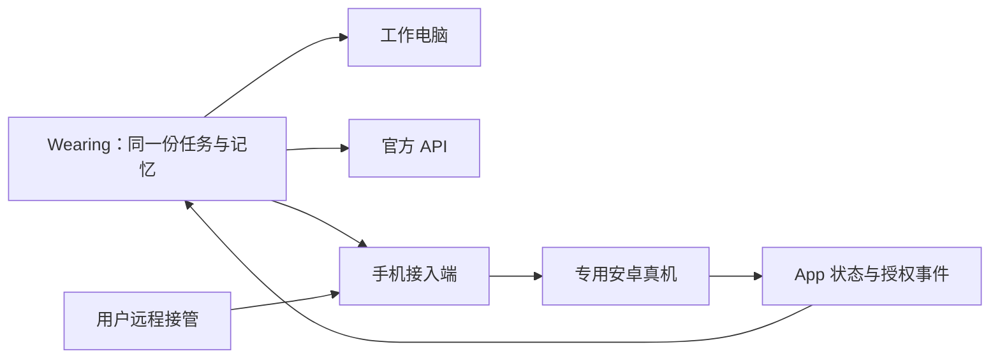

> 工程研究归档。此处保留当时的候选方案与验收细节，当前产品方向和优先级以[整合落地总方案](implementation-blueprint.md)为准。

# Wearing 的专用手机：可行性与接入方案

核查：2026-09-30。用户提出专用手机，并进一步考虑本地 PC + 手机。当前建议优先验证“本地专用 Windows 11 PC + USB 连接安卓真机”：PC 同时运行主 Agent 和手机接入端。尚未确定采购、安装、插卡或开通服务，本项目没有手机实测结果。

## 产品中的位置

Wearing 可以同时使用电脑、手机和 API。它们共享同一份目标、任务、记忆与预算。手机承接移动 App、移动端登录、通知和适用的通信工作；电脑承接浏览器后台、文件和多窗口操作。用户自己的手机仍可只是与 Wearing 对话的入口。

“Wearing 的专用手机”指一台长期归该工作环境使用、保持账号和 App 状态、Agent 与用户均可接管的设备。手机不需要再运行一个独立的主 Agent，模型可以继续在原有服务端调用。

## 三条路线

| 路线 | 能提供什么 | 本项目判断 |
| --- | --- | --- |
| 自有安卓真机 | 持久 App、账号和设备状态；支持的机型可安装 SIM/eSIM | **首轮优先验证**。可从闲置设备开始，需保持供电、联网和可恢复的接入端 |
| 云 Android / 模拟器 | 远程运行 App，便于创建和调试环境 | 适合开发与特定 App 任务；短信、SIM、Google 服务和设备兼容性逐项确认 |
| 远程托管真机 | 由供应商提供真实手机与远程操作 | 后续候选；必须确认独占和持久使用、SIM 支持、重启救援、数据保留与实际地区，不能把短时测试设备当成长期私人手机 |

例如阿里云无影是云端虚拟 Android，FAQ 明确不支持发短信。租到一个 Android 系统，不自动获得可收发短信的手机号码。[无影介绍](https://help.aliyun.com/zh/ecp/)、[FAQ](https://help.aliyun.com/zh/ecp/cloud-phone-faq)

手机、手机号、所处网络及账号资格是四个独立条件。真机能承载符合条件的 SIM，但不会自动解决海外号码首次激活、漫游或服务地区资格。手机放在本地、电脑放在海外时，两端各自使用其实际网络；远程控制链路不会自动改变手机的网络出口。

## 控制能力优先复用

| 组件 | 已核对的作用 | 接入建议 |
| --- | --- | --- |
| ADB | Android 设备连接与调试基础，支持 USB 与配对后的无线方式 | 首轮用 USB 连接常开接入端，减少无线重连变量；调试端口不直接暴露公网 |
| Mobile MCP | 原生界面元素、截图、点击、输入、滑动等工具，文档支持安卓真机 | **首先评估接入 Hermes 的 MCP 工具层**；固定版本并检查依赖和许可，实测机型/系统/目标 App |
| scrcpy | 安卓屏幕显示与键鼠控制，可经 USB/TCP/IP 工作，支持 Windows/macOS/Linux | 作为观察和人工接管候选；与 Agent 共用设备锁，避免同时输入 |
| Appium / UiAutomator2 | 原生、混合及移动网页自动化，支持安卓真机 | 需要稳定的重复流程或 Mobile MCP 不满足要求时使用 |
| Open-AutoGLM | 通过 ADB 和视觉语言模型实现手机任务执行 | 作为复杂视觉任务的专门执行候选；受 Wearing 的任务范围和步数约束，不另建一套用户记忆 |

来源：[Android ADB](https://developer.android.com/tools/adb)、[Mobile MCP](https://github.com/mobile-next/mobile-mcp)、[scrcpy](https://github.com/Genymobile/scrcpy)、[Appium UiAutomator2](https://github.com/appium/appium-uiautomator2-driver)、[Open-AutoGLM](https://github.com/zai-org/Open-AutoGLM)。以上为项目文档能力，尚无本项目稳定性或成本对比。

iPhone 也有现成自动化路径，Mobile MCP 列出了真机支持；Appium XCUITest 则有其主机、开发工具和真机配置要求。首轮选择 Android 是为先验证 ADB 路线，iPhone 在出现必须依赖 iOS 的具体任务时再验证。[Appium XCUITest](https://appium.github.io/appium-xcuitest-driver/latest/overview/)

OpenClaw 的 Android 节点可作为设备事件接入的参考。其当前 README 明确 SMS 仅在支持电话能力设备的第三方构建中提供，且受实际系统授权和设备策略限制；不能认为安装商店版就自动拥有短信读写能力。它与 Hermes 的直接互通也未验证。[OpenClaw Android](https://github.com/openclaw/openclaw/blob/main/apps/android/README.md)

## 第一版怎么接

1. 在一台专用安卓机上启用并授权所需调试连接，接入常开的本地电脑或专用小主机。
2. 手机接入端运行受限的移动工具服务，通过经过身份验证的私有连接接受 Wearing 调用。它只提供专用设备能力，不自动开放接入主机的其他文件和桌面。
3. 对外提供设备状态、启动 App、读取界面、截图、点击、输入、滑动和停止等最小工具。设备用稳定 ID 绑定，每次动作检查当前执行权。
4. 先用无资金动作的 App 任务验证。公开信息和已授权的 App 操作通过后，再按需要加入账号及号码。
5. 通知/短信作为单独的事件接入能力验证权限和交付，不用全天截图轮询来代替事件系统。截图控制与短信接入不能当成同一项已完成能力。
6. 用户接管时撤销自动操作权；交还后重新读取手机画面及业务状态。同一设备仅允许一个交互写入者。

当前首选同机部署：本地 PC 同时运行 Wearing/Hermes 和手机工具，USB 连接安卓真机，云端只承担模型 API 等按需服务。这样可减少跨公网的设备连接依赖；本地 PC 离线时，其上的 Agent、电脑和手机控制均不可用。需要设备离线告警时另设独立监测点。

后续若将主 Agent 迁到云端，仍需保留本地接入端或另行实现手机端受限桥接。云 Windows 不能直接控制一个未连入其可达接入链路的 USB 手机。该拆分架构下，接入端离线时手机任务等待，云端可独立执行的任务才可继续。

## 具体能补上哪些场景

- **App 独有操作：** 打开移动端服务、查找内容、填写表单，执行已有范围内的动作。
- **移动登录与验证衔接：** 把待处理的手机步骤关联到原任务；需要本人操作时保留现场，完成后回到电脑继续。
- **号码承载：** 符合条件的 SIM/eSIM 可放在专用真机中；号码购买、激活和验证码到达率仍单独验收。
- **业务变化输入：** 允许访问的通知可以成为继续任务的触发信号，优先用服务官方事件/API 获取完整业务信息。
- **真实移动端检查：** 查看店铺页面、落地页和表单在手机上的实际效果。

Android 的受保护页面可禁止截图或投屏，生物识别等本人步骤也不能预设自动完成；遇到此类环节进入等待用户状态。短信和验证码访问受系统版本、权限和 App 限制。[Android 受保护界面](https://developer.android.com/security/fraud-prevention/activities)

## 验收与成本

新增独立工作包 M1，不阻塞电脑与研究任务开发：

| 验收项 | 通过条件 |
| --- | --- |
| 日常操作 | 启动指定 App、读取界面、中文输入、滑动、返回及结果核对 |
| 稳定性 | 网络断开、USB 重连、系统重启、锁屏后能识别状态并恢复或明确等待 |
| 长期在线 | 供电、充电温度、系统更新、后台限制与接入端掉线有处理方案 |
| 跨设备任务 | 电脑等待手机步骤，手机完成后原任务继续；无重复提交 |
| 接管 | 人与 Agent 不争抢输入；交还后使用最新画面 |
| 权限与事件 | 未授权 App/通知不读取；重复事件去重；验证码不写入长期记忆 |
| 成本 | 记录每件成功任务的模型费、耗时和人工介入，比较结构化工具与视觉路线 |

成本分别核算设备购置或租金、常开电费、SIM 套餐/通信费和模型调用费。本地 PC 兼任接入端，无需预设再购一台网关。原先 $54–84/月为海外租机路线预算，不能当作当前本地组合报价。本轮没有核实采购价格；优先利用可用设备验证，有明确使用价值后再决定新购或托管。
