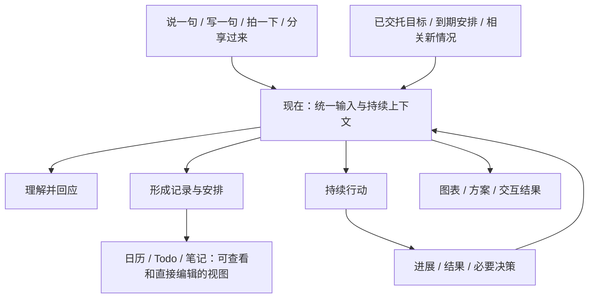

# 「现在」与统一意图入口

2026-10-06。本文保留最初讨论与设计依据。后续用户已授权实施，并明确 App 默认语音、日历/Todo/笔记用于次级回看、命名必须清晰无歧义。统一导航与语音输入准备链路现已实现，状态见 [验收记录](../evidence/now-voice-2026-10-06.md)；下文的现状检查属于改造前。

## 用户已经明确的方向

- 主场叫「现在」，不用房屋图标。
- 用户表达意图，不应先选日历、Todo或笔记再填写。
- 一个入口可以产生多种结果；主动推进与生活上下文仍是 Wearing 的核心。
- App 优先，保持既定 Wearing 品牌、3D 角色、圆润克制的视觉与可中断动效。

## 现状检查

范围：QA 8789 网页的「今天」和「和 Wearing 聊」两个入口；只读观察页面，未提交内容。另查网页与 mobile 源码核对结构，未做本轮真机验证。

1. **今天页：能记事，但缺少统一承接。** 首屏是「随手记」输入和「记下」，下方并列日程、待办、笔记。默认记录类型是笔记，扩展区提供其他类型，并非每次强制先分类。但用户希望被处理的一句话在这里默认进入保存流程，和对话入口含义不同。多个空区分别邀请用户补内容，首页价值依赖用户先做维护。

   

2. **和 Wearing 聊：有回应与结果，但与生活入口割裂。** 同一组导航下出现第二个表达入口。对话已有可操作的结果卡片、目标关联与草稿，可作为统一主场的基础；当前仍主要展示历史消息。问题是输入的语义由所在页面决定，而不是从用户原话和上下文判断。

   

这两页目前有明确文字标签与选中态，不能据此推断完整读屏或键盘合规。本轮未验证屏幕阅读器、原生键盘、返回手势或减弱动态。未来统一入口时，非文字图标需可读名称、动态进展不能抢焦点，输入器位置与草稿应稳定。

## 推荐结构

「现在」是用户与 Wearing 共同处理当下事情的唯一主场。用户表达、Wearing 主动带回进展、当下需要决策，使用同一套上下文。

表达入口统一，不限制为文字聊天。日历、Todo、笔记仍有直接操作价值，但从一级功能导航移到按需展开的视图和次级回看入口。用户想拖动日程或快速改一个字时，应能直接做；不能每次都必须等模型回应。回看入口保留最近事情、搜索及日历等快捷方式，位置稳定。

界面的组织单位建议是「正在处理的一件事」，而非单条消息或文件类型。一件出行事情可以同时包含对话、日期、Todo、调研、地图和待确认选择。普通闲聊不强制建项目；相关性明确时自然接续，换话题可开始另一件事，分错了也能移回，避免所有生活内容进入一条无限长聊天。

## 「现在」的画面与状态

固定输入区，文字、语音、相机及附件服务同一个意图；不在发送前选择记录类型。角色只承担陪伴和真实状态反馈。

| 情况 | 主画面焦点 | 主要动作 |
| --- | --- | --- |
| 没有需关注的进展 | 克制的角色与轻量邀请，留出呼吸空间 | 表达想法 |
| 正在讨论事情 | 当前讨论及合适的结果视图 | 继续补充或直接操作结果 |
| Wearing 在后台推进 | 简洁的当前进展，展开看依据；不持续刷中间步骤 | 用户可以继续说别的 |
| 有值得关注的结果 | 一份结果与为什么现在值得看 | 查看或作出当前决定 |
| 多件事同时有进展 | 一件最相关事项；其余折叠为简短数量入口 | 处理当前一件或切换 |

优先级要可解释：临近且需要决定的事、直接回应用户当前意图的结果、其他进展。不能靠新鲜度不停洗牌，也不能抢走用户正在输入的内容。没有上下文时保持安静，不制造假主动性。

导航无需给唯一主场再造一个「主页」标签。若需要显示「现在」的图标，建议细环与中心点的静态符号；用文字标明实际运行状态，不让装饰性脉冲冒充活动。具体资产在视觉稿阶段选择，不在本稿绘制。

## 意图如何落成真实结果

以下是用于检验泛化能力的输入示例，不是业务专用流程：

| 原话 | 期望承接 |
| --- | --- |
| 明天下午三点提醒我给妈妈打电话 | 理解时间及提醒意图，保存到对应对象；若通知通道未接通，明确说明实际能提供的提醒方式。展示简短回执，可改时间或撤销 |
| 随手拍菜单，说「这家下次想来，记一下」 | 保留原图与原话，整理可检索记录；不自动订位或编造到访日期 |
| 假期想找个人少的地方，预算三千，你先研究看看 | 进入带预算条件的研究事情，复用长期目标、资料与结果能力；相关日程、清单按进展形成，不要求先选模块 |
| 刚才那件事先放一放，下周再看 | 结合当前事情解析暂停和后续跟进；真实保存后反馈，避免只是口头答应 |

意图理解不只把文本分类为 note/task/event。还要识别想达到什么、已有上下文、是否修改原事情、需要哪些对象、现在可以做什么、还差哪项关键信息。一句话可能对应多个对象，也可能只是倾诉，不需生成任务。

明确且可恢复的个人记录操作，应直接完成并允许改/撤销。模糊只影响细节时保留原意，按已知偏好推进；涉及结果方向的关键缺项才简短追问。随口愿望不自动变成日程承诺，真实付款等按既有授权处理。重点是让猜错易纠正，而不是每一步都弹确认。

## 复用与新增

已存在：同一身份下的生活记录 MCP、定时/事件安排、长期目标、上下文对话、结果文件及交互预览。无需再做一套记录数据库或为生活场景另造工作流。

需补齐：

1. 多模态与文本进入同一承接过程，保留原话、原件和稳定请求标识；离线时准确区分已存本机与已处理。
2. 从自然表达接续/修订长期事情，关联一个或多个真实记录；当前目标启动和补充仍依赖显式界面动作，不能只隐藏表单就宣称自然交互完成。
3. 统一的动作回执：区分理解、处理中、已保存、实际完成、待决定；重试不重复写入，多对象部分失败可核对和恢复。
4. 主动进展的聚合、相关性与优先级，以及系统通知回到正确事情。动态内容不改变当前输入上下文。
5. App 内原生输入、结果展开、返回、打断和恢复；网页使用同一产品结构，不能只改网页名称留下另一套手机导航。

## 建议下一步

先围绕同一个「现在」画三种状态：空闲、讨论/行动中、带结果回来。这是同一方向的状态推演，不是三个竞争方案。对齐后再合并入口、迁移草稿与旧链接，并用多种自然表达验证是否真的减少分类、找入口和重复确认。

验收以用户能否完成事情衡量：一句话开始；不要先选模块；可看到真实处理结果；能直接修改与撤销；离开后回到同一件事；需要看日历时一两步可达。尚未设定或测量成功率指标。
