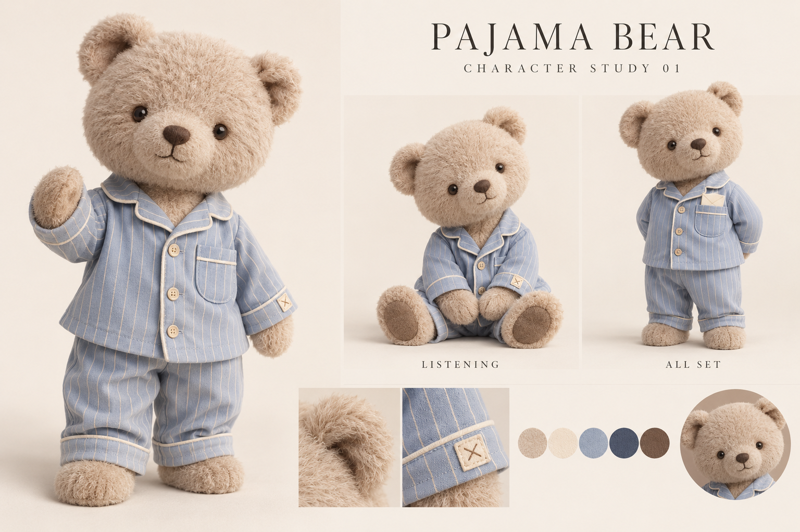

# Pajio · 睡衣小熊品牌方向

2026-10-07。用户已确认名称 **Pajio**，采用此前选定的睡衣小熊方案。中文与英文界面统一使用 Pajio。本文是当前品牌方向入口，角色、UI 与后续端侧对齐以此为准；完整数字品牌资产见 [Pajio 品牌文件](../../design/brand/pajio/README.md)。原 `wearing` 技术标识保留以兼容既有安装、配对与数据。

## 角色基准

使用用户选定的原版比例：圆润头身、短而自然的四肢、奶茶色毛绒、小圆耳、深色眼睛与鼻子、小型刺绣嘴。表情自然，材质柔软。睡衣小熊承担主要角色识别，默认穿雾蓝条纹。

八套衣橱：雾蓝条纹、奶油月牙、杏桃方格、燕麦针织、热可可、黄油云朵、鼠尾草格纹、玫瑰奶点。脸和比例保持一致，以面料、版型、滚边和小刺绣形成区别。已有独立透明 PNG 与 App 衣橱，可预览后保存。

参考资产：[衣橱板](../../design/character/pajama-bear-20261007/approved-base-wardrobe-07.png) · [形态板](../../design/character/pajama-bear-20261007/approved-base-poses-08.png) · [App 资产](../../clients/mobile/assets/bear/)。形态板中的聆听、捧信封、坐姿和休息姿态仍是设计参考；当前 App 使用八套招手立姿及其头像视图。

## 品牌与界面

- 品牌语义：**你先休息，这件事我来。** 日常交互沿用“你说，我来做”。夜间展示可以作为品牌主视觉，实际功能覆盖全天。
- 小熊用于助手头像、欢迎及衣橱等身份触点；单颗四角星作为紧凑辅助标记。功能图标继续表达具体操作。
- 日间和夜间阅读层使用稳定底色、清晰文字与有层次的内容面。温暖感来自毛绒、布料、雾蓝与奶油等局部色彩。当前颜色来源为 `clients/mobile/src/appearance.ts`，品牌确认不自动回滚此前的可读性调整。
- 首次外观跟随系统，保留用户保存的明暗模式。新身份默认显示睡衣小熊；已明确保存的形象选择保持有效，用户仍可选择简洁标记。
- 服装选择表达个性，不改变能力。形象保持安静；进展和完成由真实执行状态说明。蜷睡姿态用于休息展示。

## 产品标准

语音或文字交代 → 清楚接收 → 离开后可回看 → 可使用的结果。保留任务、记忆、来源和需要决定事项的明确入口。是否可在用户离开后持续执行，以实际运行和回执为依据；夜间文案不替代后台能力验收。

## 本轮落地与边界

App 恢复新身份默认小熊，使用现有八套生产资产；外观选择中“睡衣小熊”排在首位。已有明确选择、身份隔离、保存失败和草稿恢复逻辑保持有效。

App 由 Codex 负责；网页与桌面由 ZCode 读取 App 已验收代码对齐。名称和角色方向已确认，数字品牌文件已制作；构建、模拟器、实体设备与商店发布分别记录。
