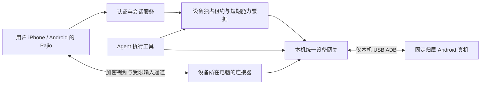

# Pajio 物理真机远程接入与私密登录合同

日期：2026-10-09。本文保留首轮**代码只读审计与建议技术合同**。后续已实现并接线所有权控制基础，当前进展见[接管核心验收](../evidence/pajio-context-20261009/device-handoff-check.md)；下方“已有实现”表描述的是审计时快照，不是最新源码清单。远程人工画面、触控和完整私密登录仍未实现。没有操作真实账号、读取凭据或屏幕、重启生产服务或接入新设备；早期验收记录仅代表当时的设备与版本。

## 1. 产品路径与推荐范围

用户用自己的 iPhone 或 Android 打开 Pajio；Pajio 展示与该用户绑定的执行手机；用户远程接管这部手机并亲自登录第三方 App；登录后明确选择允许读取的内容；Agent 在同一部物理手机的真实 App 中读取这些内容并提交可核对的上下文候选。

**控制端与执行端分开。** 用户主要用 iPhone，不要求执行手机也是 iPhone。首轮建议执行端采用固定机型、原厂系统的 Android 真机，电脑连接器通过 USB 接入。现有 Android 9 小米 6X 可用于兼容性回归；新用户路线应另验收一台仍受支持的 Android 12+ 设备，不能把旧设备结果直接外推。

允许同一账号拥有多个执行设备，但单个设备同一时刻只能被一个用户会话或一个 Agent 任务控制。失联时不悄悄切换另一台手机，也不将该账号的登录状态复制到另一设备。

| 执行资源 | 应呈现的产品承诺 | 上线前额外条件 |
|---|---|---|
| 用户自有设备（BYO） | 手机仍在用户自己手里，Pajio 只在授权范围内使用 | 电脑在线、USB/电源与系统调试授权；本机直接触碰屏幕会干扰任务；向导、暂停及维护路径 |
| 用户独占的托管真机 | 为一个用户固定分配整部执行手机，保留其 App 登录状态 | 资产归属、租户绑定、主机隔离、管理员权限、远程可用性、账号找回、退出清除与交付证明 |

首轮托管不能共用同一 Android 主用户并轮流登录不同人的账号。Android 多用户/工作资料隔离也不能未经验证就等同于整机独占。托管应说明运营方与物理设备的信任关系；“模型看不到密码”不代表设备操作系统或托管方无法接触密码。

## 2. 已有实现与真实缺口

| 现状 | 本次源码依据 | 能据此确认的范围 |
|---|---|---|
| 云端资源类型仅 Android 与 computer | `src/wearing/cloud/relay.py:55-59` | 没有通用 iPhone 执行设备类型 |
| 连接器枚举已登记的 Android，执行时路由到固定 resource_id | `src/wearing/connectors/remote/adapter.py:83-94,116-135` | 已有 Agent 到真机的动作执行适配 |
| 手机工具包含界面元素、截图、启动、点击、滑动、按键及文本 | `src/wearing/mobile.py:10-15`；`src/wearing/phone_proxy.py:158-165` | 是离散 Agent 工具，不是用户的视频遥控桌面 |
| Android 跨数据目录的本机动作锁 | `src/wearing/phone_proxy.py:30-61,261-274` | 同一 OS 用户下 Pajio 调用互斥；不约束外部 scrcpy、其他 OS 用户或物理触碰 |
| 云端事务租约、暂停代次和执行前重检 | `src/wearing/cloud/relay.py:276-299,326-387` | 暂停阻止新操作，旧已准入动作可能仍完成；尚无人工会话所有权 |
| 持久账本、相同动作不重放、异常进入 unknown | `src/wearing/connectors/remote/client.py:218-262` | 可复用动作恢复机制，不是连续视频传输能力 |
| App 有设备清单、配对文件、权限、暂停/恢复和核对 | `clients/mobile/src/NativeDevicePanel.tsx:137-221`；`src/wearing/app.py:498-600` | 没有“打开手机”实时画面、点击、输入、旋转或私密登录页面 |
| Native 日历/提醒等使用前台能力会话 | `clients/mobile/src/NativeActionSession.tsx:23-33`；`src/wearing/native_actions.py:92-98` | 当前会话仅 iOS，前台限定；不是操作其他 App 的通用接口 |
| 原生文本输入拒绝 password 字段，元素读取遮蔽其文字 | `src/wearing/android_text.py:14-24,82-84` | 仅保护该原生文本路径；不能据此宣称截图、通知、剪贴板或模型旁路均安全 |
| 本机手机动作日志不记录输入内容、截图或账号数据 | `src/wearing/phone_proxy.py:87-94` | 仅此日志的范围；云端 commands 仍保存命令参数与结果，见 `src/wearing/cloud/relay.py:365-366,394-402` |

历史证据：`docs/evidence/remote-device-2026-10-03.md:7-15` 记录过单租户云端到 Mac + 小米 6X 的真实 HOME、设置启动、界面元素、截图、暂停与恢复。它没有验证用户从 iPhone 遥控该 Android、私密登录、跨用户隔离或社交账号的收藏读取。本次没有重复真机验收。

已有文档也把 scrcpy 与人工接管列作待接入：`docs/getting-started.md:91`；`docs/phone-node-plan.md:18-28`。本次搜索产品源码未找到 WebRTC/scrcpy 的画面传输与人工触控实现，只有诊断工具发现项。

## 3. 建议端到端架构（未实现）

控制服务处理登录态、设备归属、租约、临时票据和会话状态；媒体不进入模型上下文。连接器主动向认证服务建立出站连接；首轮用 USB ADB，ADB 端口和原始设备控制协议不暴露到公网。

scrcpy 可作为 Android 采集/控制底层候选，但其桌面窗口不能直接当 Pajio 的手机遥控页面。需要适配视频编码、移动端解码、输入协议、身份认证及租约。建议评估 WebRTC（DTLS-SRTP 媒体及加密 DataChannel）与受控 TURN；信令走 TLS。控制端与设备网关必须认证彼此并绑定当前设备会话；媒体/人工输入的加密只在这两个端点终止，中间转发服务仅转发密文。若采用 HTTPS/WSS 代理，除短期会话绑定、流量限额与断连行为外，还须保留这层端点间加密，不能只用在代理处终止的 TLS 代替。若未来改用服务端解密媒体的架构，必须将该服务加入可信处理方并修改私密模式的产品承诺，不能沿用当前两端限定。具体库、版本及播放路径需阶段 0 试验后确定。

WebRTC 不是自动具备用户隔离的产品；TURN/relay 也不能只凭设备编号允许订阅。会话票据绑定租户、用户、身份、设备、控制会话、epoch、用途与过期时间。服务、连接器、媒体订阅和输入网关均复核，不只在页面入口检查。

## 4. 统一所有权与 epoch 合同（建议）

状态建议为 `agent_ready → handoff_pending → human_private → awaiting_scope → agent_ready`，任意断连或无法确认的切换进入 `paused`；终止/撤销进入 `revoked`。状态名为工程提案，尚未存在。

1. 点击“我来登录”先原子增加设备 epoch，阻止 Agent 的**所有**读取与输入（包括观察与截图），清除排队操作并等待已准入的本机动作结束。没收到设备网关确认前，不能显示“已私密接管”。
2. 同一个网关控制云端 relay、本地 MCP、UiAutomator2、原生截图/录屏、人工输入以及后续的媒体采集；每次动作都携带当前所有者和 epoch。设备本机网关是最后检查点。旧epoch、旧连接、旧任务、旧帧一律拒绝。
3. 人工接管会话持有长期于单动作的独占租约；会话中的每个输入仍有短时有效期、递增序号及去重键。不能用另一条无限制 ADB/scrcpy 通道绕过租约。电脑主机上的其他自动化入口也要纳入进程/权限隔离；现有 Python 文件锁单独不足以做到这一点。
4. 接管期间所有后台采集任务都停止。已执行的点击无法撤回；动作状态不明时保留 unknown，先观察核对，不能自动重放。
5. 用户断网、App 退到后台、锁屏、会话超时、连接器重启或媒体状态异常，网关使人工输入失效并保持设备 paused。**不能超时自动交回 Agent。** 用户重新认证后可恢复接管；只有明确“完成登录并允许继续”才能开启下一代 Agent 租约。
6. 同一设备第二个控制端请求默认只提示已被占用。用户明确接管新会话则增加epoch，旧端在下一帧/操作前立即失效；不得两个端同时打字。
7. 多设备可分别调度，但每台设备独占。现有连接器主循环 `client.py:297-311` 顺序等待一次执行；并发扩展需要按设备隔离工作队列、取消和心跳，不能只增加协程数量。

## 5. 私密登录模式（建议，现有代码不足）

私密模式下用户的屏幕和输入只在授权控制端与设备网关之间传输。Agent 仅能得知“等待本人登录 / 本人完成 / 取消 / 设备离线”等结构化状态。

- 禁止 Agent 获取截图、视频帧、UI 节点、OCR、通知内容、剪贴板、键盘文本、验证码和登录页面 URL 参数；包括并行任务、其他工具、MCP、诊断、模型追踪和屏幕缓存路径。
- 输入内容不能进入当前云端命令账本、工具参数日志、遥测、错误堆栈、录屏、崩溃附件或重试日志。审计只保存会话、设备、操作者、epoch、开始/结束、动作类型与状态。输入通过专用人工通道，不借用会持久化 params 的 Agent enqueue。
- 不能通过登录通知、另一个已授权设备、系统消息、浏览器调试、文件读取、账号数据库或其他观察工具旁路获取密码/验证码。主机权限和工具可达范围需要实际测试，而不是仅加入模型提示词。
- 关闭自动剪贴板同步、自动录屏/音频、媒体截图缓存；明确防止前一帧登录画面在交还时作为 Agent 第一帧。清缓存和新epoch都不证明当前画面安全：交还前保持 Agent 观察禁用，让用户在私密画面里关闭验证码/密码管理器等界面与通知，退回选定 App 的非认证页面，再确认交还。无法确认或登录未成功时保持paused；只有完成此交还步骤才清空流水线，并允许新epoch开始观察。不能让 Agent 先截图来判断登录页是否安全。
- App/系统标为安全内容、黑屏、验证码、人脸/生物识别、需实体手机确认或不支持远程输入时，正常显示需本人完成；不绕过防护，不自动失败重试刷登录。
- 用户点击“登录完成”不等于授权读取所有数据。先关闭私密会话，再展示目标 App 与可选数据范围；确认后才创建采集任务。
- 本合同旨在将秘密排除在 Agent 与服务日志之外。设备操作系统及处理输入的可信网关仍可能接触明文；需在威胁模型和托管说明中写清楚，不承诺端到端的“任何人都无法看到”。

## 6. 帧、坐标与交互合同（建议）

视频帧元数据至少包括 `session_id、device_id、epoch、frame_id、captured_at、width、height、rotation、content_rect、display_id`。输入包含其依据的 frame_id、epoch、序号及坐标；坐标明确属于旋转后的实际内容区域，不含手机壳/黑边/客户端缩放。

- 连接器验证帧属于当前会话、当前方向和显示器；旋转、分辨率或内容区域变化后，先发新几何信息，旧帧动作拒绝。
- 限定帧龄；阶段 0 建议起始拒绝阈值为 1 秒，实际根据端到端测量调整。阈值是待验证配置，不是已达到的时延保证。
- 客户端显示断流/过期画面时禁用触控。输入不是离线队列，重连后不补发旧点击、旧滑动或旧文字。
- 滑动绑定一个起始帧与当前epoch，限制距离/时长；切换所有权即中断后续序列。键盘/输入法/横竖屏、中文输入和系统返回需单独验收。
- 手机卡顿与网络抖动显示真实状态；不要把本地按钮动画当已执行回执。安全屏幕黑屏也不能误报断流后无限重试。

## 7. 登录后的读取授权与上下文

授权示例：“允许 Pajio 从这部设备的小红书读取我选择的收藏与公开作品，用来整理兴趣线索。” 具体平台的数据项目必须以当时 App 可见内容与实际可用接口为准。登录成功不代表该平台所有历史、点赞、收藏或私信均可读取。

每次授权绑定平台包名/账号可核对标识、设备、数据类别、范围/数量/时间上限、用途、是否周期刷新与撤销入口。默认不包含私信、通讯录、账号设置、购物/支付或自动关注/点赞/发布。用户换号后旧授权失效，不能继承上一账号的范围。

在 UI 里“只看”也可能产生已读、播放/浏览历史、推荐信号、定位或在线状态。文案应说明该类实际影响，采集流程尽量避免进入私信及不相关内容；不能承诺“完全无副作用”。

输出保留来源、采集时间、原内容与推断的区别，供用户删除/修正。不把一次点赞直接视为长期偏好，也不把推荐流当用户认可的兴趣。目标是可服务的上下文，不是尽量复制全部账号数据。

## 8. Android 与 iPhone 执行宿主区别

Android 的 ADB USB 路线需要用户打开调试并在设备确认电脑 RSA 连接；scrcpy 官方支持 USB/TCP/IP 画面与键鼠操作，不需要 Root。该能力足以支撑方案候选，但不证明所有 App、验证码或硬件认证都能远程完成。[Android ADB 文档](https://developer.android.com/tools/adb) · [scrcpy 官方仓库](https://github.com/Genymobile/scrcpy)

Apple 的 iPhone Mirroring 是附近 Mac 操作同 Apple 账号 iPhone 的功能，要求 Wi-Fi/蓝牙、设备靠近且 iPhone 锁定；摄像头/麦克风以及 Face ID 等不在镜像可用范围。它不是 Pajio 已接入的通用远程控制 API。可作为后续 BYO Mac+iPhone 限定试验，不能承诺任意托管 iPhone 或无人值守第三方 App 自动化。[Apple iPhone Mirroring](https://support.apple.com/en-us/120421) · [Apple 当前 iPhone 使用指南](https://support.apple.com/en-lamr/guide/iphone/iph505911a40/27/ios/27)

现有 iOS 本机日历、提醒、位置等公开能力继续走原生授权；与远程控制 Android 的能力并列。连接手机也不要求把所有云服务都强制降级为屏幕点击：飞书等有适用 OAuth/API 时，结构化接口更便于范围约束、增量同步和审计，登录真机可作为具体 App/人工确认路径。

## 9. 分阶段交付与退出条件

### 阶段 0：封装单机 QA（下一步建议）

在隔离测试目录与合成登录界面上实现统一设备网关、独占状态机和可替换采集/输入适配器。用一台 Android 本地画面做试验，不接真实社交账号，不连接生产 8765，不把临时 scrcpy 窗口宣布为产品接管完成。

必须通过：

- 云/本地两条 Agent 路径与人工会话争抢同一设备，只有当前epoch成功；本机原生调用也拒绝旧epoch。
- 私密登录中截图、节点、录屏、通知、剪贴板和并行任务都被拒绝；合成密码标记不出现在日志、模型请求、数据库、缓存或崩溃附件。
- 验证实际加密终止点与对端绑定；媒体/输入中继的内存和日志中不得出现合成密码明文或可直接解码的画面。不能只检查数据库没落盘就声称中继无法读取。
- 登录未成功、明文密码仍可见、验证码通知未关闭、系统密码管理器尚在前台时，点完成也不能直接触发 Agent 首帧；须继续私密人工交还步骤，取消或无法确认时保持paused。
- 断线、超时、退出、连接器崩溃与重启都保持paused；无自动交还、无旧输入重放。
- 旋转、黑边、缩放、过期帧、错误设备和错误会话输入被拒绝或正确映射。
- 形成具体库版本、CPU/内存、帧率、带宽、首帧时间、触控往返时间的测量报告，再选择媒体方案。阶段 0不等同于完整真机远程登录。

### 阶段 1：完整真实端到端接管

用户 iPhone Pajio → 认证服务 → 公网/局域网两种网络 → 出站连接器 → USB Android 真机。完成真实视频查看、触摸/滑动、中文输入、系统返回、私密登录、完成/取消、授权范围、交回Agent、断连恢复。可先用自有 QA App 的测试账号验证密码通道；第三方账号由用户本人完成。

必须通过：

- 在实际 iPhone 控制端登录执行手机上的 QA App；Agent 与全部日志均拿不到合成秘密，而执行手机登录状态确实保存。
- 2 用户 × 2 设备的身份、媒体订阅、信令、输入、刷新与撤销交叉测试，跨用户尝试全部拒绝。
- Wi-Fi↔蜂窝/掉线、App前后台、USB拔插、旋转、连接器重启、两端同时打开、旧票据重放的实机矩阵；断连后无幽灵点击且无自动交给Agent。
- 显示当前设备/账号/所有者；本人接管后Agent不能继续读取；本人确认范围并交回后从新状态继续，无登录页面缓存泄漏。
- 固定一台机型与系统发布支持矩阵。至少第二套实际设备复现后才扩展兼容宣称；Windows/iPhone执行宿主分别验收。

### 阶段 2：平台范围读取与初始上下文

先逐个平台验证可见数据、分页/采样上限、验证码/风控停止条件、账号切换、内容缺失及来源回执。用户先看到采集到的摘要和可删除候选，再写入其上下文。每个平台分别标明已验证的数据类别与限制，不能“某 App 登录成功”就将其所有个人数据项目标成已接通。

阶段顺序是 **单机 QA → 真正的跨端接管与隐私验收 → 平台读取**。在阶段 1 未通过前，新手引导不能显示一键连接社交账号成功或暗示可以读取全部历史。

## 10. 本文验收口径

已完成的是源码与历史证据审计、官方技术边界核对和建议合同；未完成的是上述新远程会话、视频通道、私密输入、平台账号采集及实机矩阵。技术合同不替代实现测试、平台当期规则或真实用户使用验证。
