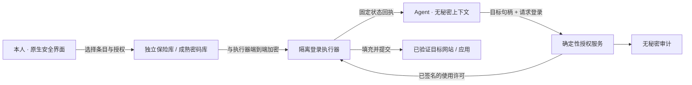

# Pajio 私密凭据与代理登录设计

日期：2026-10-08。状态：产品与安全架构提案，尚未实现保险库或真实自动填充。此文不授权读取、导入或迁移用户现有密码。

## 产品决定

在「我的 → 隐私与安全」提供「密码与登录」。用户保存、选择和撤销登录权限；Agent 只能请求使用某个账号完成登录，不能读取密码、验证码种子、恢复码或会话令牌。聊天、记忆、普通文件、诊断与模型工具结果都不是密码保存位置。

产品承诺应写成：**“密码由保险库保管，Pajio 只在你授权的范围内使用。”** 不宣传“任何情况下永不泄露”。目标网站必须收到传统密码；被攻陷的操作系统、目标网站或可信执行组件仍可能泄露它。授权 Agent 使用已登录会话，也意味着它具有该会话中的操作能力，不能与“看不到密码”混为一谈。

默认走官方 OAuth 或系统通行密钥；不能走这些方式时，再使用受控的密码填充。OAuth token、cookie 和 TOTP 同样是秘密，不因不是密码就可以交给模型。

## 用户体验

保险库列表展示站点、账号别名、连接状态、最后使用与有效授权。完整用户名默认仅在本人管理界面显示；模型只看到已授权条目的随机句柄和用户可理解别名，不获得全库目录。保险库锁定时，不向模型泄露是否保存了某个账号。

首次配置由用户在原生安全界面录入或选择成熟密码管理器。密码字段留在原生组件，不能经过 React Native JS、WebView bridge、剪贴板、截图或遥测。用户可编辑、删除、查看使用历史；显示密码和导出属于仅本人界面，Agent 无入口。第三方密码库以官方支持的集成为前提，不能靠 CLI 的明文输出冒充私密填充。

任务遇到登录时，可信 App 显示：

> Pajio 需要登录「示例文档」
> 工作账号 · docs.example.com · Mac 上的专用浏览器
> 用于：整理今天的会议材料
> [仅这次任务] [设置有效期] [拒绝]

实际域名、设备和账号来自执行端与保险库，不采用模型提供的品牌名或网页自报信息。模型提供的用途明确标为任务说明，并按纯文本处理。批准控件处于 Agent 不能观察、点击或通过无障碍操纵的可信界面，需要本人认证；无法隔离时用另一台可信手机确认。

| 授权方式 | 使用范围 | 结束条件 |
|---|---|---|
| 仅这次任务（默认） | 指定身份、任务、账号、站点、设备 | 任务结束、退出、撤销或短期限到达 |
| 限时托管 | 用户逐项选择账号、精确目标和设备；预览实际到期时间、最大登录尝试次数 | 到期自动失效；新站点/新设备/新增账号必须重新授权 |
| 仅本人操作 | 银行、系统主密码、密码库本身、恢复码、账号安全设置等 | Agent 停在交接处 |

“限时托管”满足夜间继续工作的需求，但不能假装锁屏 iPhone 可以任意后台解锁秘密。首版手机锁定或离线时，新密码登录进入等待；已授权、未过期的安全会话可在隔离执行端继续使用。更长期的无人值守账号必须另设托管风险等级和密钥策略，不能静默放宽设备密钥的解锁要求。

登录进展只有“等待允许 / 正在登录 / 已登录 / 需要你完成验证 / 登录失败 / 结果待核对”。密码不得短暂闪现在截图、回放或错误详情中。二次验证不能自动批准推送、绕过验证码或移除安全设置。TOTP 仅在单独批准条目和已验证站点下由执行器生成、立即填充，不向模型返回数字。

## 信任边界与执行过程

1. Agent 只提交可信浏览器/设备已发行的 `target_handle`，不能提交任意 selector、JavaScript、HTTP 目的地址或密码字段值。
2. 授权服务验证真实 owner、tenant、identity、task、运行代次、目标及设备身份。网页文字与 Agent 参数均不构成授权。
3. 执行器获取独占登录租约。宿主暂停该任务的所有观察和操作通道，在有界时间内等待已有调用结束，并切断截图、AX、DOM、CDP、控制台、网络录制、剪贴板、录屏及并行子 Agent 的访问。观察通道使用代次 fencing；迟到的截图、AX、网络和输入回执在返回模型前再次核验代次，旧代次一律丢弃。等待超时则不填充。只暂停模型采样不足以构成隔离。
4. 执行器重新核验目标。浏览器绑定 HTTPS 精确 origin、tab、frame、document/navigation ID、目标表单与提交接收方；SSO 的多域跳转逐一登记。拒绝 HTTP、证书错误、相似域、意外跨源 frame、任意通配后缀及未登记跳转。原生应用绑定包标识和签名身份，不依赖可伪造窗口标题。
5. 保险库向通过身份验证的执行器释放一次性加密材料。许可绑定使用次数、短期限、单次 nonce、凭据条目版本、密钥代次与撤销代次；重放只查回执，不再填充。用户修改密码或删除条目时，旧许可和待执行材料立即失效。租约过期、身份变更、域名变化或撤销时立即拒绝。
6. 可信登录组件自行完成填充和提交。填充前必须是干净文档，防止 Agent 预先注入监听器；执行环境不可让 Agent 修改浏览器配置、扩展、站点脚本或附加调试器。站点自身脚本仍是密码登录无法消除的信任方。
7. 区分“已填充”“已提交”“确证登录”。失败时先清空字段和受控缓存；无法确认清理完成，就销毁该浏览器上下文并要求本人继续。不得在含秘密的半完成页面上恢复 Agent。
8. 成功后返回已确认登录或需要二次验证等固定状态。保留登录会话的执行环境继续阻止 cookie/token、请求头及浏览器资料目录被模型工具读取。不能把已登录浏览器转交给同 UID 任意 shell/CDP 后仍声称会话秘密不可见。

登录授权不授权付款、发消息、修改安全信息或安装应用；这些仍由产品的动作授权控制。对整站拥有宽泛操作能力时，要如实告知无法靠密码隐藏限制所有网站行为。MVP 的强保证限定支持的站点流程；未知站点交给本人，不能用任意 UI 自动化兜底强保证。

## 数据与密码学策略

- 优先复用成熟保险库和操作系统密钥机制；不自创密码算法或密钥交换协议。第三方 Agent 集成有发布者/合作方门槛，不能假定安装 1Password CLI 就取得其 Agentic Autofill 接口。
- 自有保险库采用逐条随机数据密钥、成熟 AEAD 和设备包装密钥；账户/身份/条目/版本作为认证附加数据，防止密文跨账户替换。设备密钥由 iOS Keychain/Secure Enclave 的可用能力或 Android Keystore 管理。Secure Enclave/Keystore 保护的是密钥，传统密码在可信填充组件内仍有短暂明文，不能说“密码始终在安全芯片内”。
- iPhone 首版以设备有密码、本人解锁后的可用性为基准。是否用 `WhenPasscodeSetThisDeviceOnly`、生物识别或设备密码认证，按本地/同步方案明确选择；“仅本设备”的密钥不自动随备份迁移，需提供恢复方案。不能一边宣称永不离机，一边提供无人值守云端解密。
- 云端只保存密文和最少的路由元数据；私密域名/账号元数据也应加密。同步采用成熟协议和明确的设备加入、撤销及冲突流程。重置 Pajio 登录密码不应自动解开旧保险库；恢复必须依赖可信设备或用户单独保存的恢复材料。丢失全部恢复材料时要明确不可恢复。
- 凭据材料不落普通 SQLite、AsyncStorage、Hermes 工作目录、`.env`、shell 参数、环境变量或调试日志。崩溃转储、系统备份、抓包与内存转储纳入审计，且不能承诺通用运行时字符串已被可靠清零。
- 审计只记录账号句柄、目标规范名、任务、设备、许可代次、时间与固定结果码。固定结果码避免目标页错误将秘密反射到日志。限制失败次数，连续失败停止，避免锁号。
- 撤销分三层展示：“停止今后使用”“结束 Pajio 受控会话”“目标网站会话已退出”。没有网站端验证就不能声称远端 cookie 全部撤销。删除密码记录不等于撤销已经建立的第三方会话。

## 平台落地与范围

| 平台 | 实现路径 | 首版边界 |
|---|---|---|
| iPhone | 原生保险库管理/本人批准；独立 Credential Provider Extension 供系统 AutoFill；第三方登录用系统认证会话 | 用户需要在系统里启用；不读取 Apple Passwords 全库，不从普通 Expo JS 提供明文 getter，不承诺通用跨 App 后台自动填充 |
| Android | 原生安全管理页 + Keystore + AutofillService；较新系统 Credential Provider 能力另验 | 应用签名/关联域核验；拒权、锁屏和系统回收均需回归。已有广泛 ADB/UI 权限的模式不能直接得到强保密评级 |
| Web / Desktop | ZCode 按统一契约实现管理界面；签名 broker + 官方密码库适配器或自有专用扩展 | 普通网页不解密密码；浏览器扩展 isolated world 不隔离共享 DOM。必须先打通宿主与执行环境的安全隔离 |
| 云 Agent | 只接凭据使用请求、固定状态和审计；密码不经过模型服务 | 云浏览器若要接收密码，必须是独立可信登录执行域，不能与 Agent 任意代码在同一安全域；手机离线时不能偷偷改用云明文副本 |

## 接口草案（非已上线 API）

面向 Agent 仅提供 `request_login(target_handle, account_alias?, reason)`、`get_login_status(request_handle)`、`cancel_login(request_handle)`。`account_alias` 只允许当前任务已批准范围内的别名。没有 `get_password`、`decrypt`、`copy_secret`、`export_cookie`、`run_with_secret` 等接口。

面向本人管理面独立鉴权，具有创建/编辑/移除条目、批准/拒绝、查看和撤销许可的操作；明文录入终止于原生保险库。Agent 的 MCP token、普通聊天 WebView token 和设备控制凭据均不能调用管理面。需要原生签名/OS 身份与真实本人认证，不能仅依赖请求体里的 `approved:true`。

请求状态机：`requested → awaiting_user → authorized → isolated → filling → submitted → authenticated`，允许转入 `denied / expired / needs_user / failed / outcome_unknown / cancelled`。所有状态转换带 CAS 和固定请求 ID；`submitted` 不是成功；`outcome_unknown` 不自动重试。撤销会递增代次并使在途许可失效，锁租约并等待执行器确认安全释放。

取消和撤销不是回滚。一旦进入填充或提交阶段，不能仅因用户点击取消就显示“未登录”或确定的 `cancelled`；先保持隔离，由执行器核验实际结果及清理。无法确定时进入 `outcome_unknown`，已经建立的目标网站会话另行处理。

## 接入现有代码的顺序

### 已核对的现有边界

| 现有位置 | 可以复用的部分 | 必须新增或隔离的部分 |
|---|---|---|
| `src/wearing/native_actions.py` | 可信任务主体、设备归属、版本、租约与持久回执 | 凭据专用、由可信执行端签发的目标与使用许可；密码不能进入普通命令参数 |
| `src/wearing/desktop_input.py` | 输入对应帧、独占执行与审批边界 | 禁止把密码放入普通 `text/value`；私密执行器独立完成整段登录 |
| `src/wearing/desktop_capture.py`、`mobile.py` | 常规截图、AX、原生设备操作 | 整个认证资源的跨通道隔离及迟到响应 fencing；不能只隐藏 App 里的图片 |
| `src/wearing/runtime.py`、`profile.py` | 默认工具范围、引擎启动与工作目录 | 进程目前运行于当前用户；默认未开放 terminal/browser 不等于 OS 沙箱，必须阻断同用户设备控制旁路 |
| `src/wearing/cloud/commands.py` | 租户和身份路由 | 凭据许可额外绑定真实 owner、任务代次、设备与条目版本，不能只靠 tenant/identity |

独立只读审查已确认以上边界；未读取实际密码或操作真实登录。首个实现里程碑是以合成秘密通过隔离验收，再接保险库，不能反过来把真实密码用作调试输入。

1. **P0：划定执行隔离。** 现有设备 computer_use 能操纵同用户桌面，runtime 也在同用户下运行；当前默认 toolsets 不含 terminal/browser，并不等于具备 OS 隔离。先完成可信 target、执行租约、所有旁路阻断、撤销与失败清理的攻击测试。未满足时能力状态必须是需本人登录，不能仅新增密码表单后宣布可用。
2. **P1：App 保险库管理与确认。** Codex 负责原生 Swift/Kotlin 边界、密钥存储、授权页和回执；先用合成凭据、两账户和自有测试站验证。增加系统扩展需要新的原生构建、签名和权限，当前无 Apple Developer 的事实仍有效。
3. **P1：网页登录闭环。** ZCode 只读 App/协议，实现 Web/Desktop 管理与签名 broker/浏览器适配；明确哪些源文件属于其所有权。首批支持几个自有或明确授权测试站，不用真实用户密码调试。
4. **P2：限时托管、更多站点、TOTP、端到端同步。** 独立安全评审通过后开放。通行密钥和官方 OAuth 优先；不为覆盖率降低隔离要求。

## 发布前必须通过的对抗验收

使用唯一合成密码作为 canary，检查模型输入、工具返回、聊天、搜索、记忆、文件、截图、录屏、日志、崩溃报告和备份均不含原文或常见编码。另验：

- 伪造站点名、IDN 相似域、子域后缀、跳转、跨源 iframe、表单替换及目标变化后批准失效。
- 填充前预置 keylogger/事件监听器、JS密码读取、截图/AX/CDP/网络监听、剪贴板读取、并行任务与终端旁路全部被执行边界拒绝。
- 越租户/越身份/换设备/旧nonce/旧代次/过期许可均拒绝，模型与网页无法自行批准。
- 填充中撤销、关浏览器、断网、宿主崩溃、二次启动没有重复登录；未知结果进入人工核对；清理不能确认时不恢复观察。
- 登录表单提交但失败、密码反射到页面、页面缓存/跳转保留密码不能泄露给下一帧。
- 登录成功不解除支付、外发、账号安全设置和密码库管理的控制；权限扩展需独立授权。
- 本人修改/删密码、撤销设备、注销 Pajio、备份恢复、换手机以及不具有生物识别的设备都有明确结果；普通注销导出不包含保险库秘密。

## 研究依据

- [1Password for Claude 安全模型](https://support.1password.com/1password-claude-security/)：已经存在专用的批准与私密填充实现，并公开了同用户代码执行、目标网站和登录后行为的信任边界。它是架构参考，不证明 Pajio 已有接入资格。
- [1Password 浏览器 Agent 风险公告](https://1password.com/blog/security-advisory-for-ai-assisted-browsing-with-the-1password-browser)：已解锁密码库的普通交互入口也可能被代理利用，不能只保护密码读取 API。
- [Apple Credential Provider 安全说明](https://support.apple.com/en-ca/guide/security/sec6319ac7b9/web)、[Apple Keychain 访问限制](https://developer.apple.com/documentation/security/restricting-keychain-item-accessibility)：系统支持第三方凭据提供器与设备密钥访问限制。
- [Android AutofillService](https://developer.android.com/identity/autofill/autofill-services)、[Android Keystore](https://developer.android.com/privacy-and-security/keystore)：原生填充服务、密钥用途限制与不可导出密钥能力。
- [Chrome content scripts](https://developer.chrome.com/docs/extensions/develop/concepts/content-scripts)：isolated world 是脚本环境机制，不能将其当作对已填入 DOM 的密码的独立安全边界。
