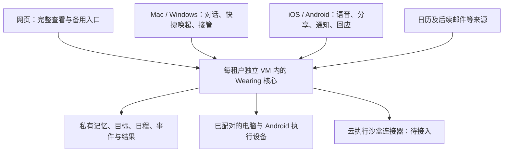

# Wearing 下一阶段：个人日常、主动推进与多端

2026-10-04 · 按用户续议更新：内置日历从首版支持创建与编辑，同时建设清单、备忘、随手拍/说与多端同步。行为细节见 [生活工具与原生输入](life-tools-and-native-capture-2026-10-04.md)。尚未实现的新能力均按待开发处理。依据 [Today 研究](../research/today-ai-2026-10-04.md)、[个人 Agent 定义](../research/personal-agent-definition-2026-10-03.md) 和 [当前工程进度](../progress.md)。

## 1. 本轮收束

**Wearing 是属于用户、持续了解其生活与目标，并能进入真实应用推进事情的个人行动者。** 让用户少操心、少重复交代，同时能看到行动结果。

下一版优先完成一个每天可用的循环：随手拍/说/写 → 整理成可编辑的记录与安排 → 根据时间和新情况推进 → 在合适的时候反馈。内置日历、清单、笔记从零可用；用户没有外部账号和记录习惯也能开始。长期目标承接没有明确路径的愿望，电脑、手机和沙盒提供执行能力。

保留已确定的名字、卷袖 IP、独立租户 VM、Hermes 执行底座和连接器结构。这轮新增的是产品重心和多端规划，不重写 Agent 核心，不更换现有记忆引擎。Today 的公开材料适合借鉴行为与体验，不能据此假定它的内部实现可直接复用。

腾讯云试验机已按用户要求暂停。其 CPU、内存停止计费，两块磁盘保留收费。正常 SaaS 服务仍需要常驻云端；暂停试验机是当前研发阶段的成本安排。恢复条件见 [停机记录](../evidence/cloud-pause-2026-10-04.md)。

## 2. 日常界面

建议桌面侧栏直接给出 **今天 / 日历 / 清单 / 笔记**，对话作为随时展开的面板，与当前选中的记录关联。手机优先露出今天、日历、笔记和“记一下”，清单从今天直接可达；具体导航由多端原型验证。账户、身份和连接设备放在设置与身份入口。所有入口引用同一条记录。

| 入口 | 第一眼看到什么 | 主要动作 |
| --- | --- | --- |
| 今天 | 最近变化、当前日程与清单、Wearing 已经推进的事情 | 查看成果、完成事项、回应一个关键问题、继续执行 |
| 日历 | 可直接操作的议程、日/周/月视图 | 创建、改期、取消、设置重复与提醒；也可交给 Wearing 处理 |
| 清单 | 购物、准备、待办及与目标关联的下一步 | 添加、勾选、排序、交托 Agent 可执行的部分 |
| 笔记 | 文字、照片、语音、链接及整理后的资料 | 编辑、找回、归类、转成关联事项 |
| 对话与记忆入口 | 当前记录的上下文；Wearing 记得的偏好与约定 | 继续讨论、明确交托、纠正与忘记 |

日历、清单与笔记都能由用户直接使用。Wearing 使用同一套读写接口，产生用户看得见、可以接着编辑的结果。用户直接修改也会成为 Agent 的新上下文。个人原始笔记与 Agent 的推断记忆分别管理。

“今天”的首屏优先显示最多三条值得关注的内容，这是初版设计上限，不是对信息总量的限制。没有新情况时保持简短，不编造建议填满页面。主动反馈与用户自己安排的日程要能一眼分辨。

日历中的三种时间分开显示：外部真实日程、用户自己的待办/截止日期、Wearing 准备执行的工作。Agent 研究的运行时间不能自动变成用户的日历占用。未确定时间的长期目标保持开放，不强制塞满日历。

可编辑的动作卡写清“准备/进行中/已完成/等你决定”，完成必须关联结果。继续保留清晰的 Wearing 主体：为什么现在处理、做了什么、结果在哪里。复杂过程按需展开，状态不由动画伪造。

IP 沿用现有六种状态。待命、倾听、思考、动手和等待跟真实状态一致；成果到达时可轻微回应，不持续抢占视线。延续无播放按钮、无白闪、自然循环、减少动态效果等要求。本轮不重新生成资产。

## 3. 第一套内置工具与日历接入

先完成 Wearing 自有日历、清单和笔记的创建/编辑/撤销及跨端同步，用户一句话即可记住一件小事。同步验证 Mac / iOS 系统日历的实际读写，再扩展提供商。所有数据接口由界面与 Agent 共用；明确显示来源、最后同步时间和是否只是导入副本。

| 路线 | 用途与顺序 | 必须验收的限制 |
| --- | --- | --- |
| Wearing 自有日历 | 首版即可创建、编辑、重复安排、取消、提醒，无需外部账号 | 多端同一条记录；离线保存、冲突、去重与提醒撤销；原始语音/文字可追溯 |
| Mac / iOS 系统日历及提醒事项 / EventKit | 首个原生读写来源；按需申请权限 | 选定同步范围；权限撤销、空日历、重复事件、时区；设备离线时外部更新有延迟 |
| Google Calendar | 首个直接云端来源候选，用户已有账户时再授权 | 增量同步、取消事件、通知渠道续期、重复通知去重；不依赖电脑常开 |
| iOS / Android 系统日历 | 手机 App 阶段接入已有系统日历 | 原生权限、来源归属、系统后台限制；不能假定后台立即同步 |
| Outlook / 飞书等 | 按实际用户来源接入同一接口 | 实际 OAuth、地区可用性、写入边界和恢复，不只展示品牌 Logo |
| ICS | 无账户情况下的兼容输入 | 导入不等于实时同步；保留 UID、版本、时区及取消语义，重复导入不重复建项 |

成熟系统接口可用时直接整合；缺少接口的应用继续通过电脑或手机操作。持续捕获日程变化优先使用稳定的数据接口，避免每几分钟让模型截图翻日历。手机控制和 Computer Use 仍是 Wearing 拓展真实行动的关键路径。

日历规范化至少保存：来源账户、原事件 ID、系列/例外 ID、版本、开始/结束/时区、全天标记、取消状态、来源更新时间、抓取时间、所属身份。首次读取、增量修订、重复事件例外、夏令时、跨设备重复、断线后重新核对都进入验收。

明确的记录指令直接创建自有日程，卡片显示具体时间并可撤销；模糊意向保留候选，不强行排期。原生日历授权后读写用户选定范围，已有任务范围内授权的安排可连续执行。区分自有记录已保存、外部已写入和外部已核对；具备读权限时读回核对。

EventKit 的只写事件权限不能读取事件；读取事件或提醒事项需系统完整权限。产品内选择只读某个范围不等于系统提供只读授权。所有端共享同一内容与版本，离线时说明同步状态；用户修改、迟到 AI 结果、外部日程更新使用统一的冲突规则。

依据：[Apple EventKit](https://developer.apple.com/documentation/eventkit/accessing-the-event-store)、[Google Calendar 推送](https://developers.google.com/workspace/calendar/api/guides/push)。Google 的变化通知不包含变更正文，收到后需拉取详情；通知渠道也需续期，不能将 Webhook 当作可靠完整事件流。

## 4. 主动性：先有原因，再有推进

首批触发来源限定为：用户主动发来的文字/语音/分享、实际日程变更、已经约定的到期时间、目标执行结果、设备重新可用。邮件到达在邮箱真实接入后再加入。没有来源的背景猜测不能自动成为新任务。

执行链路：**新情况持久保存 → 判断关联哪件事 → 检查授权/预算/时效 → 推进下一步 → 记录证据 → 决定现在通知还是汇入简报。**

| 情况 | Wearing 的行为 |
| --- | --- |
| 用户随口提出有价值的想法 | 在已约定的小额研究预算内做初查，留下来源与下一步，不自动升级成长期经营 |
| 已交托的长期目标有条件继续 | 根据新信息调整下一步，执行范围内工作；不重复请求同一授权 |
| 只差用户的一项选择 | 先把可完成的准备做好，再给一个具体问题和可选结果 |
| 只是普通重复信息 | 合并或记录，不打扰 |
| 设备离线、内容过期、结果不明 | 清楚记录缺口；恢复时先重新观察，不直接重放旧操作 |

授权不是对全部未来行为的一次许可。以“这个目标可用哪些资源、可做哪些动作、限额和期限”为单位保存，撤销及时生效。已经授权的普通多步操作一路执行；新增承诺、超出范围或明确要求用户决策的环节再停在具体结果前。

通知与执行分开：可以安静地完成研究，也可以不执行但及时报告冲突。初版允许选择安静时段和一个每日简报时段，默认合并非紧急反馈；不强制早晚各推一次。每条主动信息可展开“为什么现在告诉我”，并可反馈“以后少提这类事”。

技术上扩展现有持久目标与反馈记录，新增事件收件箱、关联判断记录、简报和通知发件箱。去重键包含来源、事件版本和目标修订；一个目标同时只运行一轮。通知有独立投递 ID，区分已排队、服务商接收、设备收到和已读。重试通知不重跑动作。

先使用现有数据库和轮询调度扩展，不为此再造一个 Agent 编排框架。模型仅判断值得处理的候选；重复事件过滤、时间判断、授权和预算检查由确定性代码完成。复杂长流程或吞吐超过现有方案时，再针对瓶颈选用成熟持久工作流系统。

## 5. 记忆与长期目标

已有 Hermes memory / session_search 继续工作。新增产品层对象与来源索引，不把同一事实再复制进第二套竞争性的记忆系统。

- 个人理解：稳定偏好、节奏、重要人物；标记原话或推断、来源和最近确认时间。
- 共同决定：哪天答应了什么、对谁、后来如何调整；能定位原始证据。
- 长期目标：希望达到的变化、尚未验证的假设、下一次小试验、等待条件、预算与复盘点。
- 经验：执行结果、失败原因和适用条件；工具成功返回不等于业务事实成立。

模糊目标不要求一开始拆出完整计划。先保留未确定的问题，做最便宜且有信息增量的验证，再决定是否继续、换路径或等待。跨天回来看的是目标变化与新证据，不是积累了多少子任务。

纠正要影响未来检索；用户主动忘记的内容应从记忆、检索索引和衍生摘要中退出，并避免从旧对话自动重新生成。保留何时遗忘的必要标记而不保留被删正文。先用小样本验收这一流程，再讨论更复杂的向量库与图谱。

每个租户仍是一个用户独立的 Wearing。日常/出海等身份按当前隔离原则保存账户、任务和私有记忆；通用偏好只有在用户明确设为共享时才能跨身份使用。“今天”的跨身份汇总需主动开启，时间占用可以汇总，凭据与外部操作身份不能自动混用。

## 6. 桌面与手机的分工

### 桌面端

第一版覆盖 Mac / Windows 设计与接口，先在现有 Mac 验收，再在 Windows 真机通过同样清单。主窗口内置日历、清单与笔记，并提供菜单栏/托盘、全局快捷输入、文件拖入、设备状态、立即接管与暂停。身份变化、文件传输和权限申请都使用已有产品对象。

按需引导：开始对话即可使用；只有要读日历、选文件或控制电脑时才解释并申请相应权限。提供可以直接打开目标系统设置的入口，显示实际检测结果。用户无需先理解 VM、ADB、Hermes 或复制配对令牌。

桌面窗口与连接器服务分开管理。关闭窗口后，已选择常驻的连接器继续工作；用户退出/暂停连接器时停止领取新动作，原动作回执保留。安装包负责依赖、服务注册、升级和回滚，保留当前配对与数据。

**桌面技术验证已采用 Tauri 2**，复用现有网页和 Python 连接器，并使用成熟的托盘、快捷键、更新机制。先验证 Python 打包、Cua Driver、ADB、原生权限、休眠恢复、签名与跨架构更新；如果成本或兼容性明显不合适，再比较 Electron。当前已完成当前 Mac 的独立客户端构建、连接恢复、菜单/前台快记与原件输入；正式跨端安装与依赖打包仍待验收，不把网页整体迁成另一套前端。见 [当前原生实现](../native-clients.md)。

依据：[Tauri sidecar](https://v2.tauri.app/develop/sidecar/)、[系统托盘](https://v2.tauri.app/learn/system-tray/)。官方支持包装外部二进制，不代表现有 Wearing 依赖已经能够正确打包。

### 手机 App

第一版 iOS / Android 与桌面共享记录、日历、清单、笔记及目标模型；原生拍照、语音、系统分享进入“记一下”，云端整理。日历和笔记可以直接编辑，也可以对话修改。提供成果查看、通知中回应、转到原任务；离线先可靠保存，重打开时补齐持久记录。

用户日常使用的手机是 Wearing 的入口；被接管的安卓手机是执行资源，两者可以是不同设备。iPhone 客户端的首版验收聚焦这些入口功能，不把安装客户端当作可控制所有其他 App 的证明。

**技术首选候选为 React Native + Expo 开发构建**，使用已有日历、相机、语音、通知能力及必要的原生扩展。桌面与 App 共享协议、数据类型、设计令牌和资源；不强求同一份页面组件覆盖全部端。语音先可靠保存，再后台整理；明确指令直接建项，只有关键歧义需澄清，不增加逐条转写确认。环境录音和会议纪要后置。

iOS 使用原生推送与系统允许的后台策略；Android 将 FCM 与国内厂商推送作为可替换适配器。需实际评估目标手机、分发渠道和回执能力，不能把 Expo/FCM 成功作为国内推送通过。小米 6X / Android 9 单列旧设备测试：控制执行、App 安装、推送分别验证，必要时可继续只作为 ADB 执行手机。

依据：[Expo Calendar](https://docs.expo.dev/versions/latest/sdk/calendar/)、[Expo 通知](https://docs.expo.dev/push-notifications/what-you-need-to-know/)、[Apple 后台策略](https://developer.apple.com/documentation/backgroundtasks/choosing-background-strategies-for-your-app)、[FCM Android 要求](https://firebase.google.com/docs/cloud-messaging/android/get-started)。原生集成使用开发构建验收；后台任务启动时机由系统控制，不能在手机端承担云 Agent 的准确常驻调度。

## 7. 开发顺序与通过条件

按可验收的版本推进；以下不是已完成状态，也不承诺未经评估的工期。

| 阶段 | 交付 | 通过后才进入下一步 |
| --- | --- | --- |
| P0：体验定稿与接口 | 从零记录、多端日历/清单/笔记、拍照配语音与 Agent 协作流程；对象/同步协议 | 用户没有外部日历也能从一句话开始；各端使用同一组内容。新视觉原型先审阅再实现 |
| P1：每天可用的内置工具 | 自有日历创建/编辑、清单、笔记、原件、文字/语音整理与同步；今天聚合；Mac 原生读写与手机捕获验证包 | 全新账户可建日程；重复输入不重复建项；电脑修改同步到手机；原生端往返单独验收 |
| P2：主动工作闭环 | 事件关联、有限研究、记忆纠正、简报、授权延续、费用计量与硬上限 | 三个跨天场景通过；输入重复不重复执行；超限停止；已有授权不逐点击询问 |
| P3：桌面可安装版本 | Mac 安装/升级/恢复；Windows 同流程真机；内置工具、文件拖入、托盘、快捷键和接管 | 新电脑装完能记录和推进第一件事；不要求自己装 Python/ADB；退出与常驻行为符合选择 |
| P4：手机可用版本 | iOS / Android 拍照配语音、系统分享、日历/提醒事项读写、通知、快捷指令与跨端续聊 | 前后台、杀进程、离线原件、并发编辑、重复推送、国内 Android 真机；记录不丢、各端一致 |
| P5：邀请制 SaaS | 真实登录、独立租户 VM、证书、备份重建、限流计费和支持流程 | 第二真实租户独立环境、网络与数据隔离、恢复数据与不重放动作通过 |

P0 就确定多端结构；P1 同时做有限的桌面技术验证；P2 时可用小型手机验证包提前验证推送难点。不要等所有网页功能结束后才检查原生限制，也不要先做四个只有聊天的安装壳。

邮箱排在日历之后，优先“新邮件 → 关联原目标 → 推进/反馈”的完整链路。号码、支付、收款继续做实际资源调研与积累，分别验收，页面仍标记规划接入。云沙盒仍需要，等任务遇到可明确交给云端的代码/浏览器工作时接入既有候选，不把租户 VM 与执行沙盒混称为一个东西。

当前本地研发可完成原型、模型与事件协议、模拟时间、数据库恢复、桌面打包和本地日历验证。P2 的跨天常驻、远端设备断线恢复、真实通知与公开回调需要重新启用原云机；P5 才需要追加独立租户资源。重新产生运行费用前告知用户，不自动开机或创建资源。

## 8. 首批端到端场景

1. **随手灵感**：用户说“研究三个海外网店方向，本周给初步判断”。在约定范围内留下假设、完成有限研究；新会话不再问背景；提供来源与一个可作出的决定。没有注册、买服务或经营资格就不能声称开店完成。
2. **时间变化**：用户日历的一项安排延后，与原安排冲突。只关联相关事项；已知偏好参与判断，形成合适建议或执行已授权调整；同一变更多次到达只处理一次。未授权改别人会议时做好准备供用户决定。
3. **跨设备等待与恢复**：云端需要安卓 App，手机离线。记录等待，先做独立研究；恢复后重新看当前页面再接着做；在手机 App 收到一次实际结果，历史记录可查。收到推送不等于行动成功。

每个场景保留原指令、授权、事件时间、记忆引用、动作回执和最终结果。至少跨 24 小时，在新会话、服务重启及设备离线后重测；这些是拟定的验收条件，尚未完成。

衡量：不重新解释仍能推进的比例、任务中不必要的用户介入次数、主动信息是否有帮助、用户被打扰次数、结果延迟、费用与实际完成率。先记录原始样本及分母，再制定目标值；不把测试通过数量或厂商自拟评分当成用户价值。

P0 的生活工具和媒体输入已完成首个本地增量，Mac 独立客户端技术验证也已通过。后续继续做 P1：把“手机随手拍/说 → 内置日历或笔记 → 桌面直接编辑 → Wearing 根据变化继续推进”画成可点击流程，同时验证 Mac 原生日历读写、手机原生输入和桌面包装依赖。长期目标继续沿用同一组记录与行动闭环。
