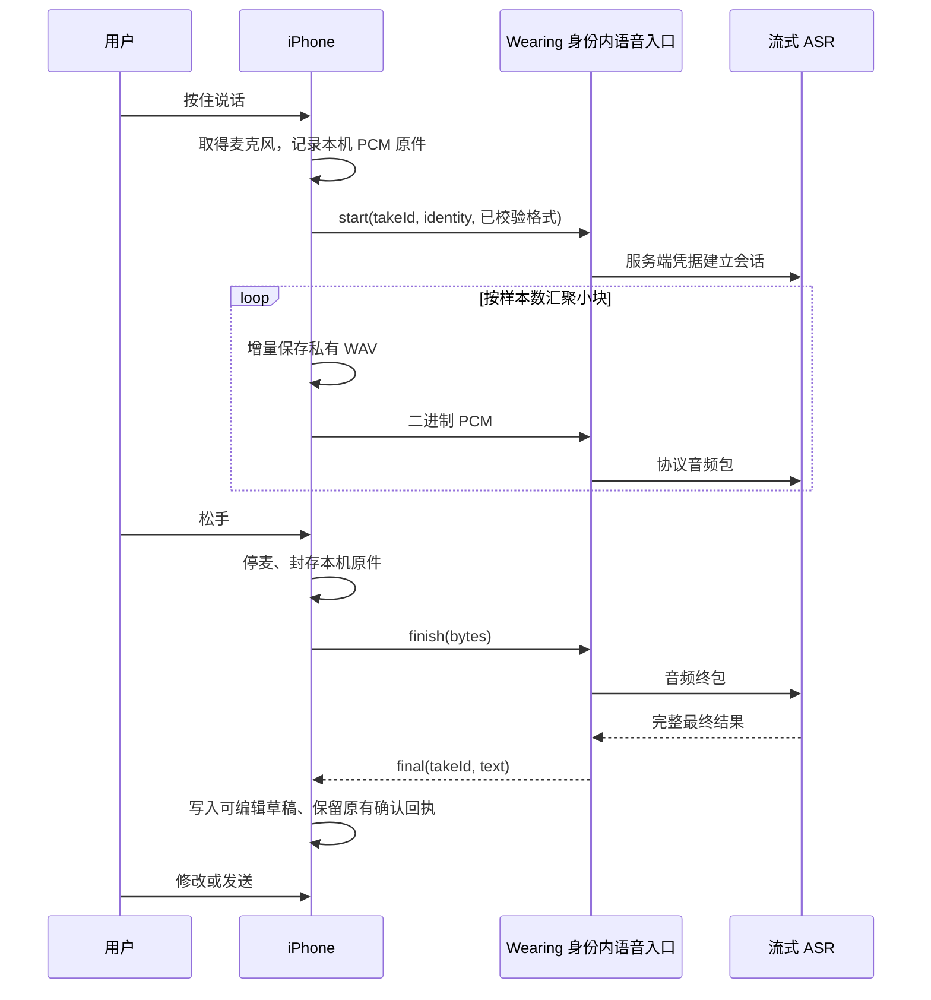

# Wearing 真正流式语音输入

2026-10-07 · 手机流式输入的实现与后续计划。已接通 iOS 开发配对的 PCM 中继及边录边传，使用豆包 Seed-ASR 2.0 一句话接口；Whisper Small 已卸载。用户确认真机识别正常，阶段日志显示本次松手到草稿 944 ms；随后发送阶段的 HTTP WebView UUID 兼容报错也已修复，等待手机发送回执。最新状态见 [云端语音证据](../evidence/voice-cloud-asr-2026-10-07.md)。

## 结论与现状

**现有 Expo SDK 已能采集实时 PCM，本轮已用于 iPhone 边录边传。** 当前流式输入、整句输出，无实时字幕；普通云连接、Android 和网页保留文件识别路径。

| 层级 | 已核对的事实 | 尚未完成 |
| --- | --- | --- |
| App 采音 | iOS 已用 AudioStream 单路 float32 PCM，校验实际格式并转为 16 kHz int16，同时保存私有 WAV；真机识别已成功 | 首尾词、路由切换、来电和连续录制仍待扩大验收 |
| Expo Go | SDK 57 官方文档注明该库 Included in Expo Go；本地 SDK 的 bundledNativeModules 包含 `~57.0.5`；已装模拟器 Expo Go 57.0.9 二进制含 AudioStream 及两个事件符号 | 二进制符号不是实际采音验收；用户手机的具体二进制能力仍需运行时探测 |
| Web | 本机 `AudioStream.web.ts` 返回 `stream: null` | 不能把原生流式实现直接用于网页；暂保留现有文件录音回退 |
| 当前链路 | iOS 开发配对边录边传，终包返回完整文字到可编辑草稿；失败保留原件，显式重试文件识别 | 无 partial 字幕；不自动发送给 Agent |
| 服务端 | `speech_api.py` 校验身份、take、格式及终包字节数，经 `recognize_stream` 调用豆包；密钥仅留服务端 | 正式多用户网关 WSS 与规模化用量监控 |
| 开发连接 | `dev_mobile.py` 已新增精确路径 WebSocket 转发，验证身份、凭据和四小时到期；有界队列 | 可信局域网开发用，不能当作公网/TestFlight 交付 |

Expo 57 的 `useAudioStream` 提供 `start/stop`、`ArrayBuffer`、实际采样率、声道数及时间戳；可选 `int16/float32`。采音开始前仍需麦克风许可。[Expo 57 Audio 文档](https://docs.expo.dev/versions/v57.0.0/sdk/audio/)

## 本机源码透露的接入边界

- `node_modules/expo-audio/src/AudioStream.ts` 用 `useReleasingSharedObject` 管理资源，`onBuffer` 经 ref 接收数据。原生回调到 JS 后仍需主动限制队列，不能每帧 setState 或写 SQLite。
- iOS `AudioStream.swift` 使用 AVAudioEngine tap + AVAudioConverter，请求约 100 ms 缓冲，但这不是固定回调频率保证。`start()` 配置独立 `.record / .measurement` 会话；不能与原来的 AudioRecorder 同时抢麦克风。
- Android `AudioStream.kt` 使用 AudioRecord，默认读取约 100 ms，硬件不支持时可降为其他采样率；以实际返回格式为准。
- **格式风险必须先验收：** iOS 转换器创建失败时走硬件格式回退；缓冲对象没有 encoding 字段，源码可能在请求 int16 后仍发出 float32 数据。禁止只改元数据把 48 kHz/float32 冒充 16 kHz/int16。首次能力探测、样本数/时长一致性校验及格式异常回退是上线门槛。
- iOS 当前时间戳实现直接使用 hostTime 差值换算；组包时按累计样本数计音频时长，UI 延迟用客户端单调时钟，不依赖未经验证的流时间戳精度。
- `stop()` 释放音频资源，但当前源码未给 Wearing 承诺“所有末尾缓冲已经交付”的 fence。松手尾音测试必须覆盖；若存在末尾回调竞态，需要应用侧有界 drain 或原生修正，并届时采用 development build，不能虚称 JS 调用返回即代表原件完整。

## 已实现的输入与输出

1. **保持现在的入口。** 长按成立后才采音；准备阶段不伪装为已经在听。麦克风权限、开始失败、指针取消沿用现有手势语义。采音与建立网络连接并行，用有界缓冲接住首字；按本地上限结束整段，不通过提前丢帧维持“流畅”。
2. **单路采音，两份用途。** 同一份 PCM 一路串行写应用私有文件，一路发流式网络；不能额外启动 M4A recorder。原件最终封成正确 WAV，保留格式、样本数、takeId，接入原有恢复/重试逻辑。文件增量写入先验证现有 Expo FileSystem 能力与帧预算；SQLite 只保存指针和最终状态。
3. **最小二进制中继。** 新增受当前租户/身份约束的 Wearing WebSocket 端点；本机开发桥也单独实现同样的鉴权、过期和断开规则。起始按约 100–200 ms 音频组包试验，使用二进制而非逐帧 base64；按真实格式重采样。生产必须 WSS，供应商密钥不出服务端，不进 JS bundle/二维码/URL。
4. **整句输出，保留字幕扩展空间。** 当前收到完整 final 才带入可编辑草稿，沿用 voiceId 与回执去重。后续若采用双向接口，partial 仅供显示，不送给 Agent、建任务或写正式消息；分句定稿也不等于整段完成。
5. **输入框稳定。** 保持 58 pt 输入栏和现有五入口；临时字幕在固定的紧凑字幕层展示，不触发键盘或撑高底栏。松手后仅在仍等待 final 时显示原位识别状态；final 后进入可编辑文字，仍需用户发送。
6. **拥塞可恢复。** 每个 take 限制队列时长、总字节、最长录音和终包等待时间；网络掉线只关闭远端会话，本机原件继续封存。不能无提示地丢中间音频。重试为新远端会话，保留同一本地 takeId，绝不把重复 partial 拼成重复文本。

## 供应商适配与准确率

拟评估豆包 ASR 2.0 的优化双向接口 `wss://openspeech.bytedance.com/api/v3/sauc/bigmodel_async`，资源 `volc.seedasr.sauc.duration`。官方支持实时修正与二遍识别 `enable_nonstream`；`X-Api-Key / X-Api-Resource-Id / X-Api-Request-Id` 在服务端添加。首字加速可能降低首字准确率，暂不以牺牲准确率换动画速度。协议封装、序号、终包必须按官方 ASR 示例实现，不能拿 TTS 的事件定义套用。[豆包实时 ASR](https://docs.volcengine.com/docs/DoubaoVoice/bidirectional-streaming-automatic-speech-recognition-websocket?lang=zh)

Wearing 的选择：先评估二遍结果是否改善人名、地点、金额和中英混说；默认不开会改变原意的“语义润色”。热词只取当前身份明确保存的人名/产品名和当前任务必要词，限制体积与生命周期；不能把整段聊天、全部记忆或其他身份内容发送给 ASR。供应商热词、上下文、二遍支持组合以实际评测确认。句末静音阈值用于分句，**不能代替用户松手**。

当前已采用流式输入、整句输出：用户说话时上传音频，缩短松手后的串行工作，没有边说边显示文字。[豆包一句话识别](https://docs.volcengine.com/docs/DoubaoVoice/unidirectional-streaming-automatic-speech-recognition-websocket?lang=zh)

## 取消、后台与隐私

- 进入上滑取消区时暂停新增网络发送，仅本机短暂缓冲；移回后可顺序续传。松手取消立即停止采音、关闭流、清理取消 take 的缓冲和临时文件，丢弃所有迟到结果，不进入草稿或 agent。
- 流式已经发出的音频无法由 App“撤回”。首次启用云端识别时说明边说边处理；取消表示停止后续处理与丢弃本地结果，不能承诺第三方已删除此前所有数据。数据留存以实际服务配置与协议核实。
- 锁屏、进后台、来电、切换身份、断开配对都立即停麦；中断 take 只保留本机可恢复原件，不自动重连上传。显式取消则清理，不与中断恢复混为一谈。
- 所有 late partial/final 同时校验 tenant/identity/takeId/epoch；切页和重新录制不能被旧请求覆盖。遥测仅记录时长、字节数、阶段耗时、错误码；不记录录音或识别正文。

## 推进与验收

| 次序 | 产物 | 通过标准 |
| --- | --- | --- |
| 1 | 原生 PCM 能力探针，仅本机 | 真实 iPhone Air + 当前 Expo Go 可开始/停止；格式与样本数验证；权限拒绝、快速松手、后台不漏录；不用用户私密音频 |
| 2 | 本地 WebSocket 回声与假供应商协议测试 | 序号、格式、取消、过期、身份隔离、背压、final 去重；这是协议测试，不作为真实识别证明 |
| 3 | 私有 WAV 原件及现有批量回退 | 断网/进后台/应用重开仍可恢复；连续录制无文件损坏或数据库锁；取样率异常能明确回退 |
| 4 | 供应商资源与小额试验 | 单独核实语音服务凭据/地区/计费，不默认 Ark 模型 Key 可用；资源确认和费用授权后才开启 |
| 5 | 真机语料与体验比较 | 经用户同意的普通测试句、日期金额、名称、中英混说、噪声场景；人工逐字参考，分别统计正确率及修改次数 |

目标而非当前结果：暖启动首个真实 partial 的 p50 < 800 ms，松手到可编辑 final 的 p50 < 1 s / p95 < 2 s；同时报告网络条件与失败率。若首字很快但 final 错误率、关键数字错误或用户修改次数变高，就不能认定优化成功。录屏验收按压、上滑取消、识别交叉淡出、final 进入草稿与发送全过程，确认 58 pt 栏高稳定。

本轮已确认：服务开通、真实 iPhone 单次识别成功、流式路由、原件增量保存及显式文件重试实现。8.003 秒合成音频经完整桥接链路，结束上传后 691 ms 返回最终文字；真机一次松手到草稿 944 ms。它们不是准确率或 p50/p95；UUID 发送兼容修复待真机重试回执。实时字幕、正式 WSS 网关、多场景准确率及原生打断仍需后续验收。
