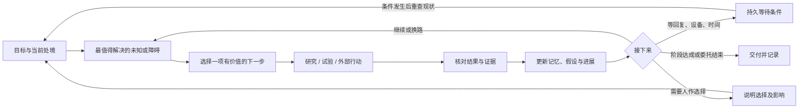

# Wearing：持续理解、持续负责的个人 Agent

2026-10-03 · 产品研究与讨论稿。用户要求重新审视长期目标、常驻、自主推进、外部 App 和记忆。本稿区分已确认的方向、上游事实与建议设计；不表示以下能力已经实现，也不自动启动任何长期任务。

## 1. 建议的产品定义

**Wearing 是长期属于一个人的 AI 行动者：持续理解这个人及其处境，记住受托的目标和承诺，在获准的资源与范围内自主选择下一步，进入真实应用推进事情，并根据结果和人的反馈修正自己的理解与做法。**

“属于我的行动者，也是延伸出去的另一个我”可以保留。它对应几件具体的产品责任：我不必每次重新介绍自己；离开聊天后交代的事仍有下文；环境变了它会重新判断；换模型、换设备、换会话不丢掉已经积累的关系和经验。

之前的资源整合方向仍成立。邮箱、号码、电脑、手机、支付渠道让 Wearing 能进入现实生活；长期目标、记忆和自主选择决定这些能力如何持续服务于一个人。此前方案对第二部分展开不足，尤其不应把“个人持续性”推迟到基础设施之后才补。

办公 Agent 也可以跨 App、持续运行。因此，“有没有自己的 workspace”不宜作为产品类别的分界。Wearing 的组织中心应当是一个人的长期处境、委托和关系，而一次项目或聊天是这段关系中的一部分。它可以有内部文件空间；用户关注的是自己的事情有没有推进。

## 2. 这轮研究看到了什么

OpenClaw 固定在 `87af5763bbc0bd1febc08d78eedc7fafd9eb5225`，Hermes 固定在 `4e3fcd5cd7e40c37cb6f9a21a76fc57a7361957a`。本轮补取 14 个官方源码/文档文件并核对 Git blob 与 SHA-256，见 [源码清单](personal-agent-source-manifest-2026-10-03.json)。这是定向静态检查，未运行这些新功能。当前 Wearing 的 Hermes 仍是先前固定版本，不能把上游主干功能当成本地已接通。

| 研究对象 | 核实到的机制与范围 | 对 Wearing 的启发 |
| --- | --- | --- |
| Hermes Persistent Goals | 同一会话内自动续跑；有完成条件、确定性质量检查、轮次上限、等待屏障。核心 judge 接收目标、截取的最后答复和背景进程等上下文 | 可复用阶段执行；长期目标还要有跨会话事实、外部证据、依赖和复盘。不能只依据执行模型的自述宣布业务成功 |
| OpenClaw Goal / Standing intents / Standing orders | 分别处理会话目标、事件条件记忆、长期操作委托。事件意图有范围、到期、冷却、次数和取消状态 | 把“想达到什么”“什么时候再行动”“被允许做什么”分别保存、共同使用 |
| OpenClaw User model / Dreaming | 偏好有日期与替代关系；后台将候选记忆整理入持久记忆，保留来源与改写前版本 | 用户纠正要替换当前理解；后台整理应可追溯，避免把反复召回的旧话误当新证据 |
| Hermes Memory Provider / Honcho | Hermes 有回合、会话切换、压缩等记忆接口；Honcho 提供跨交互的用户表示与按来源组织的上下文 | 先通过已有接口评估记忆增强，不必更换整套运行核心；推断出的用户特征仍须可纠正 |
| Letta sleep-time / memory models | 将部分记忆整理放到用户不等待的时候；其后续文章也承认通用模型会形成有损、泛化不当的记忆 | 学习后台整理机制，同时测试整理是否真的改善后续行动；不承诺“运行越久必然越聪明” |
| Anthropic 长任务 harness | 在编码实验中用持久进展、分阶段执行、交接和真实端到端验证减少跨上下文失误 | 每次恢复先重建事实状态、再选下一步。实验以开发任务为主，迁移到个人生活场景需要实测 |
| Poke | 在用户已有的消息入口中提供个人助理和服务连接 | 对话入口、及时反馈与低负担交互值得学；产品介绍不能证明它已经解决开放式长期目标 |

来源与证据入口：

- Hermes：[目标说明](https://github.com/NousResearch/hermes-agent/blob/4e3fcd5cd7e40c37cb6f9a21a76fc57a7361957a/website/docs/user-guide/features/goals.md)、[`judge_goal` 源码](https://github.com/NousResearch/hermes-agent/blob/4e3fcd5cd7e40c37cb6f9a21a76fc57a7361957a/hermes_cli/goals.py#L893)、[记忆接口](https://github.com/NousResearch/hermes-agent/blob/4e3fcd5cd7e40c37cb6f9a21a76fc57a7361957a/agent/memory_provider.py)、[Honcho 接入说明](https://github.com/NousResearch/hermes-agent/blob/4e3fcd5cd7e40c37cb6f9a21a76fc57a7361957a/website/docs/user-guide/features/honcho.md)。
- OpenClaw：[会话目标](https://github.com/openclaw/openclaw/blob/87af5763bbc0bd1febc08d78eedc7fafd9eb5225/docs/tools/goal.md)、[事件意图](https://github.com/openclaw/openclaw/blob/87af5763bbc0bd1febc08d78eedc7fafd9eb5225/docs/concepts/standing-intents.md)、[匹配与生命周期源码](https://github.com/openclaw/openclaw/blob/87af5763bbc0bd1febc08d78eedc7fafd9eb5225/extensions/memory-core/src/standing-intents-kernel.ts)、[长期委托](https://github.com/openclaw/openclaw/blob/87af5763bbc0bd1febc08d78eedc7fafd9eb5225/docs/automation/standing-orders.md)、[用户模型](https://github.com/openclaw/openclaw/blob/87af5763bbc0bd1febc08d78eedc7fafd9eb5225/docs/concepts/user-model.md)、[后台记忆整理](https://github.com/openclaw/openclaw/blob/87af5763bbc0bd1febc08d78eedc7fafd9eb5225/docs/concepts/dreaming.md)。
- 官方研究与产品：[Letta sleep-time](https://www.letta.com/blog/sleep-time-compute/)、[Letta memory models，2026-06-25](https://www.letta.com/blog/towards-agents-that-learn/)、[Honcho 使用模式，2026-07-22](https://honcho.dev/blog/blog/common-patterns-for-building-with-honcho)、[Anthropic 长任务研究](https://www.anthropic.com/engineering/effective-harnesses-for-long-running-agents)、[Poke 文档](https://poke.com/docs)。

两个容易高估的细节：OpenClaw 当前 standing-intent 匹配发生在符合条件的交互回合，用关键词预筛与确定性检查，不能直接当成持续监控所有手机 App 的语义系统。Hermes 的 goal 有明确的单会话边界，持久保存一个目标与拥有一套跨天个人目标管理机制也有区别。

## 3. 长期目标怎样在路径未知时推进

建议让 Wearing 区分四类事情；用户可以自然说话，内部再归类：

| 类型 | 例子 | 正确的持续方式 |
| --- | --- | --- |
| 临时任务 | 整理这份资料 | 交付并核对后结束 |
| 探索目标 | 找到适合我的海外小生意方向 | 验证关键未知，逐步形成可执行路径，必要时改变方向 |
| 长期经营 | 在约定策略和预算下照看一家店 | 周期复盘、事件处理、异常升级；阶段完成后仍保留长期委托 |
| 随口想法 | 这个点子好像有意思 | 按既有授权做有限初研；是否长期投入单独确定 |

长期目标保存“想改变的现实状况、为什么值得做、已知限制、阶段验收、当前未知、预算、授权范围、下一次复盘或触发条件”。路径尚不清楚时，可以先约定探索阶段的验收，例如“拿到足以比较两个方向的证据”，不强编一个最终结果和日期。

每轮只把近期行动展开到足够具体，远期保留假设与选项：

例：用户说“帮我探索一条适合我的海外小生意方向”。下面是提议的验收脚本，不代表真实市场判断：

1. 从已知情况出发：用户没有境外居留和海外支付工具，时间与投入仍有约束；过往已经明确的资料不重复问。
2. 建立少量候选方向，识别决定可行性的未知，例如实际开户资格、交付方式、需求证据。优先验证能淘汰错误路线的问题。
3. 在研究授权和预算内核查官方条件、比较真实资料，保存证据和日期。无法从公开资料确定的资格保持未知。
4. 若证据表明一条路线不适合，记录被排除的原因并转换方向。若需要问第三方、注册或消费，沿用户已经授予的范围执行；超出范围时呈现具体待决事项。
5. 用户补充“不想碰实体商品”，更新目标约束，撤掉相关候选与尚未执行的工作，沿新方向继续。
6. 等待某个资格结果或关键回复时，将等待条件落账；其他独立研究可以继续，缺少可推进事项时安静等待。
7. 阶段交付应说明：新证据改变了什么判断、哪条路线被排除、还差什么、下一步为何值得做。只有进入经营阶段后，才评价真实业务结果。

进展可表现为现实状态改变、关键未知得到验证、障碍解除或用户做出了更有依据的选择。篇数、点击数和思考时长只是成本与活动指标。Wearing 不能保证任意开放目标一定实现；它应能发现无效路线、说明局限，并提出有依据的调整。

多个目标共存时，还需选择“现在推进哪一个”：先处理已经承诺的时限与依赖，再结合用户优先级、机会窗口、预期收益、成本和可用资源安排工作。探索不能长期挤掉日常责任。第一版可以先用清晰的规则与模型判断，不急于发明一套复杂打分算法。

## 4. 常驻与自主性如何具体化

常驻至少包含三件事：目标和记忆跨重启保留；事件/时间到来时能唤醒；用户随时可以联系、纠正和接管。它允许计算进程休眠，但有未完委托时必须留有可靠的后续触发。

有效上下文可来自用户对话、明确的长期委托、到期承诺、已连接资源中的新事件、一次行动的结果。已经确认的长期目标本身也是持续上下文；用户没有再次发消息，不代表没有理由推进。

一次唤醒要依次回答：发生了什么变化？影响哪些目标或承诺？现在有无值得做的事？是否在现有授权和预算内？做、等、问或结束，哪一种最合理？没有新增价值的检查应退避或合并，避免同一阻塞反复烧模型费用。

默认沿用用户之前明确的偏好：随口灵感可有限初研；长期经营在约定范围内日常推进；投资只按用户确定的策略处理。任务授权具有范围与版本，不由“我猜你会喜欢”扩大。用户说“先别做这件事”应持久取消/暂停相关后续触发，明确对象时不反复确认。

研究也提醒我们，主动性包括判断何时保持安静。ProEvent 在模拟即时聊天事件中发现过度行动和取消处理困难；TriggerBench 将“被问到时想起来”和“该用时主动想起来”分开评价。它们提供测试方向，不能直接推出 Wearing 在真实场景中的成功率。[ProEvent](https://arxiv.org/abs/2607.17701)、[TriggerBench](https://arxiv.org/abs/2606.23459)

交互上应支持用户委托整段责任、查看结果并随时干预。Anthropic 对实际使用的研究观察到熟练用户更常放行，也更常主动中断；这是有用的产品线索，研究样本主要来自 Claude Code 和 API 行为，不能视为所有个人场景的授权习惯。[原研究](https://www.anthropic.com/news/measuring-agent-autonomy)

## 5. 记忆是整个闭环的基础

以下是信息职责的划分，不意味着要安装六套数据库：

| 需要记住的东西 | Wearing 应如何使用它 |
| --- | --- |
| 用户与偏好 | 中文交流、投入取舍、偏好的工作方式；显式偏好与模型推断分开，纠正后更新当前版本 |
| 目标与承诺 | 为什么在做、答应什么时候回来、遇到什么要行动；通过结构化记录触发，不能全靠检索碰巧找回 |
| 共同经历与证据 | 用户原话、操作结果、截图/回执引用、来源和时间；复盘可以回到原始依据 |
| 当前处境 | 设备是否在线、哪个 App 登录哪个账号、事项进行到哪；这是随时间变化的状态，重要动作前重新观察 |
| 方法与经验 | 某设备/App 版本下可靠的做法、失败原因、适用条件；经验升级为 Skill 前有复现记录，失效可退回 |
| 决策历史 | 为什么选这条路、排除过什么、哪个假设被推翻；恢复工作时不重复做已被证伪的探索 |

LongMemEval-V2 已把环境记忆单独拿出来评测：静态界面、动态状态、流程、易错点与前提判断。这与进入第三方 App 的需求高度相关。该论文当前标注为进行中的研究，评估是从历史轨迹收集证据回答问题，并不直接证明无人值守手机控制可靠。[论文](https://arxiv.org/abs/2605.12493)

建议的记忆生命周期：**带来源的观察 → 提取候选 → 核查冲突与适用范围 → 当前有效记忆 → 按需召回 → 行动结果反馈 → 更新、失效或删除。**

具体例子：“上次该小米手机需要额外打开安全调试权限”属于设备经验；“当前已允许”属于需要探测的状态；“用户总是允许任何手机权限”不能从前两件事推出。长期使用中，这些区分比检索出更多聊天记录更重要。

记忆记录需带来源、观察时间、有效范围、事实/推断类别、替代关系和必要的再核查条件。后台反思只生成候选，不把自己写的总结重复当成事实来源。用户说“忘掉这件事”后，检索索引、派生摘要、后台提取和恢复流程要共同遵守，避免旧对话再次提取让已删除记忆复活。

日常与出海身份可以共享用户明确愿意共用的偏好，同时保留各自账号、业务和关系语境。一个跨身份目标关联各自执行步骤，不直接把全部身份记忆混成一份。凭据值不进入语义记忆；权限由授权记录决定，记忆只提供理解。

## 6. 进入他人的 App，需要持续维护对环境的认识

第三方 App 的界面、登录态、收件人、消息和订单都可能在两次动作间变化。它们还包含其他人的行为和异步回复。Wearing 的每轮行动应保留“当时看到什么、原本想改变什么、实际改变什么、还不确定什么”。

例如，发送动作返回成功不能单独证明对方收到；上次打开过订单页也不能证明当前订单已支付。动作结果不确定时先观察和核对，避免重复执行。旧界面经验用于指路，当下观察用于决定是否还能照做。

手机 App 不一定提供可靠事件接口。能力地图要分别标明：可直接订阅、可读取通知、需定期打开检查、只能人工提供上下文。选择实际可用方式并记录检查间隔、最近观察时间和盲区。不能宣传“接上手机就持续感知所有 App”；也不需要为了常驻而始终录屏。

外部消息或页面内容作为观察证据进入系统；它们不能自行改变用户的委托、身份或长期指令。资源断开、账号失效、需要验证码/人工操作时持久等待；恢复后先核对当前现场，再继续原目标。

这部分直接复用现有手机与电脑驱动、资源归属、租约及结果核对设计。产品差异来自跨天仍然记得上下文、知道何时再来、能延续责任。

## 7. 技术整合建议：明确谁拥有哪份状态

维持已确认的每租户独立 VM/microVM、用户设备连接器、独立执行沙盒。以下是建议，需在产品讨论后细化接口：

- **Hermes** 保留推理、工具调用、短程计划、会话压缩、记忆接口与 Skills。评估其 goal/完成条件机制用于一次有边界的阶段执行。
- **Wearing 的租户私有服务** 拥有跨会话的目标、承诺、依赖、授权、预算、任务与证据。`goal_id` 高于 `task_id`，一个目标可经历多个 task/run/session；目标不随关闭或删除单次会话而静默消失。
- **记忆适配层** 复用 Hermes 的持久化与 provider 生命周期。先明确事实来源和当前版本，再测是否需要 Honcho。不能让两个后台系统同时无协调地改写同一份权威记忆。
- **持久工作流系统** 按上一版方案负责时间、等待、恢复与投递；它负责可靠调度，下一步的价值判断仍交给 Agent。云端同一目标只有一个调度拥有者，避免 Hermes 内部续跑与外部调度同时派发。
- **连接器与沙盒** 接受有范围的行动请求并回传观察和证据。设备执行生命周期、阶段任务、长期目标继续分别保存。

OpenClaw 主要借鉴委托、事件记忆、失效与整理机制；Letta 先借鉴后台记忆处理的方法。现阶段没有理由同时堆上 Hermes、OpenClaw、Letta 三个运行核心。

Honcho 虽有现成 Hermes 接口，是否接入仍看实测增益、延迟、成本、删除语义与隔离。默认隔离原则要求私有状态留在租户边界内；不能为省事把各租户记忆自动转发到一个共享服务。外部模型推理、托管记忆服务的数据流要分别说明，独立 VM 本身不消除这些外部处理。

预算分为模型/算力、实际业务消费和用户注意力。累计限额跨回合、重启和恢复保留；“再继续一次”不能清零长期任务账单。系统先持久记录下一步及等待条件，再发起执行，崩溃恢复时对账，避免重复做不可撤销的动作。

## 8. 当前 Wearing 的真实缺口

本轮检查 `src/wearing/profile.py` 与 `src/wearing/engine_runner.py`：当前 profile 主要开放文件、手机、电脑工具，关闭 background review、curator 和项目 Skill 发现；运行入口不启动完整 GatewayRunner 或 cron，能力声明也明确 scheduler=false。会话保存与身份 Home 已有，但这不能证明长期目标、自主唤醒、经验整理已经接通。

因此，下一步不能仅靠修改人设提示词。需要补齐：目标与承诺持久状态、有来源的触发、可恢复的阶段行动、带证据的进展、可纠正的记忆，以及用户可干预的连续体验。此前精简工具是验证动作链路的阶段选择；应按新验收场景逐项接回有价值的上游能力。

## 9. 建议的新实施顺序与验收

把原 S4 中的核心能力前移到 **P0 个人持续性实验**，与 S1 云端隔离基础并行。下面是建议实验，并未开始创建后台目标或定时任务：

1. 固定一个路径未知但范围有限的真实探索目标；写明研究授权、资源、累计预算与阶段证据。先使用现有本地 Wearing，验证行为再迁移同一状态模型到租户 VM。
2. 跑通完整一轮：接住委托 → 选下一步 → 调用现有能力 → 核对证据 → 更新目标和记忆 → 安排有理由的下一次行动。用户仍从对话进入。
3. 进行跨数天的试用与故障演练：网页关闭、进程重启、手机离线后恢复、用户改变约束、重复事件、已取消事项、过期界面状态、记忆纠正与删除。
4. 用相同任务/模型/预算比较基础记忆、接回后的 Hermes 记忆与可选增强方案。衡量后续行动是否更好，避免单凭“能搜到过去一句话”选供应商。
5. 将同一故事迁移到两套独立租户 VM，验收连续性与数据/设备隔离，再扩大用户和资源种类。

第一轮至少应证明：

| 验收问题 | 可检查的证据 |
| --- | --- |
| 用户不催时是否有实际推进？ | 阶段事实改变或关键未知被验证，关联来源与下一步 |
| 新信息能否改变路径？ | 新约束生效，失效工作被撤回，后续任务使用新计划 |
| 为什么再次醒来、为什么现在不行动？ | 持久的触发来源/等待条件；无意义检查有退避 |
| 是否会正确结束与取消？ | 达成有外部证据；取消后旧事件不能重启工作 |
| 能否跨会话、重启恢复？ | 恢复原目标、承诺、累计预算，先核对未确认动作 |
| 记忆是否真正改善行为？ | 同类任务少犯已知错误；纠正后的偏好覆盖旧偏好；忘记的内容不再被自动写回 |
| 是否减少人的负担？ | 无需重复说明的比例、必要接管次数、通知有用性与总成本 |
| 进入外部 App 是否可靠？ | 当前账号/页面/动作结果被核实，离线与结果不明明确区分 |

停止条件同样重要：持续无新证据、资源不可得、超预算、用户改变优先级时，能说明为什么停止或等待。它们不应被伪装成目标已实现。实验通过前不宣称能经营数月无人接管。

## 10. 用户最终应感受到什么

主界面仍以人与 Wearing 的连续对话为中心。日常只需要自然回答三件事：“我在帮你惦记什么”“这次有什么实质变化”“有什么需要你决定”。目标、记忆和过程可以展开查看、改正或暂停，不要求每个用户先维护任务看板。

示例反馈：“你之前提的方向，我核查后排除了一个需要境外资质的选项。现在剩下两条可比较的路线，我下一步会验证交付成本。今天已经用完约定的研究额度，明天按计划继续。”这里只展示交互语气，内容不是本轮已经查证的业务结论。

IP 的动作继续对应真实状态：听你说、正在处理、等外部结果、需要接手；后台没有工作时自然待命。视觉上的亲近感与实际连续性相互支持。

建议这轮先对齐的中心：**Wearing 持续照看的是人的目标、承诺和处境；每次行动结束后，都应更新理解，并留下合理的下一步或结束理由。** 其余技术选择围绕这件事逐项验收。
