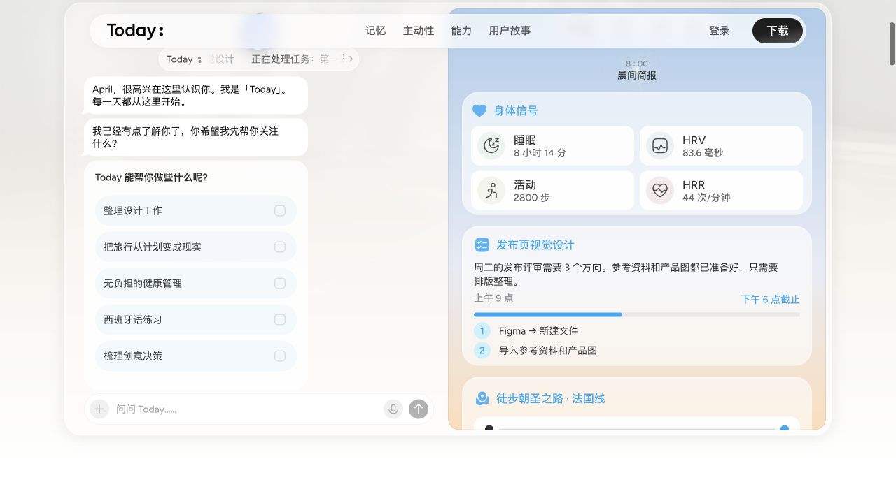

# Today AI：可借鉴的产品设计

研究日期：2026-10-04。对象为 [today.ai](https://today.ai/)，服务个人用户。目标是为 Wearing 下一版确定体验重点、主动工作流程和多端分工。

## 结论

Today 的启发在于：它把个人上下文放进用户每天都会回来的地方，把记忆用在下一次行动上。Wearing 已经投入不少工程去打通执行，现在应补上“每天为什么打开、回来能看到什么、哪些事不必再交代”。日历适合作为第一条稳定的上下文来源，长期目标仍然负责那些尚未排进日程的事情。

这是设计建议，不是 Today 全部功能的实测结论。本轮查看了公开演示的 Today 与记忆视图、登录入口、下载页面和官方产品文章；登录入口没有已登录会话，未新建账号、接入私人数据或测试其后台任务。用户本人的试用评价是本轮方向依据；公开评测只提供个案，不能推断用户总体满意度。

## 证据与推论

| 证据 | 实际看到或读到什么 | 对 Wearing 的启发 |
| --- | --- | --- |
| [官网公开演示](https://today.ai/)；本轮实际切换 Today / 记忆标签 | 对话与主题卡片并列；今日卡片包含时间、事项与准备内容；记忆按生活主题组织，显示更新时间。演示会自动切换，部分输入按钮禁用 | 为“今天”和“记着的”提供独立视图；保持从事项回到对话的路径。公开演示交互不能证明真实任务成功 |
| [What Is Today](https://today.ai/articles/blog/what-is-today)；官方描述 | 日程、可查看和纠正的长期记忆、晨晚简报；外部发送和改日程需明确确认 | 学习连续性与时机。Wearing 的任务授权仍遵循用户已确定的连续执行意图 |
| [Meet Today](https://today.ai/articles/blog/meet-today)；创始人阐述 | 强调跨天的理解与推进，以及有价值时才出现 | 产品成功标准应跨天观察，不能只看一次回答或动画 |
| [Today Recording](https://today.ai/articles/blog/introducing-today-recording)；官方功能描述 | 把日历、用户启动的录音、已有上下文、总结和后续动作串起来 | 语音输入应承接承诺、人物与目标，不止生成转写文件。录音可后置，先做好主动发来的语音/文字 |
| [下载页](https://today.ai/downloads)；本轮核对 | 列有 Mac、Windows、Linux 下载和 iOS / Android 入口 | 多端是产品分发的重要部分。下载入口存在不代表我们验证了安装和功能一致性 |
| [Denkisan 的个人试用记录](https://denkisan.me/articles/personal-ai-assistant-hermes-today-muse/)；作者的一手体验 | 由维护 Hermes 转向尝试 Today，特别认可集中授权、多端、主题记忆及简报；文中也提到记忆更新体验问题 | Wearing 的整合价值要体现为更少配置、更少重复解释。不能把一位作者的体验当作普遍故障或总体口碑 |
| [Today Assistant Benchmark](https://today.ai/articles/blog/today-assistant-benchmark)；厂商自拟方法 | 把实际完成、主动性与克制、记忆、权限等作为验证维度；文中明确 v0.1 尚无测量分数 | 借鉴可记录的测试方法，不引用为 Today 领先的排名证据 |

下图为本轮官网公开演示截图，示例人物与内容由 Today 提供，不是用户账户中的真实数据：

我的视觉判断：舒适感来自清楚的分区、较少的强按钮、留白、柔和的材质以及有实际内容的卡片。Wearing 可继承这些组织原则，同时使用已有近白底、钴蓝、圆润控件和卷袖 IP。首要变化应是内容与动作层次，颜色和角色不必重做。

## Wearing 目前最该补的体验

以下排序依据 Wearing 当前工程记录与用户反馈，不是对 Today 缺陷的排行。影响范围尚未做用户样本统计。

| 优先级 | 用户要做什么 | 当前缺口及证据 | 下一步 |
| --- | --- | --- | --- |
| P0 | 打开就知道今天该留意什么 | 现有产品以连续对话和目标反馈为主，没有真实日历、变化摘要和今日节奏；见 [当前进度](../progress.md) | 今天视图 + 一条真实日历读取链路 |
| P0 | 事情等待时也有人继续盯着 | 已有目标定时唤醒与持久反馈，外部事件唤醒、系统推送未接 | 将日程变更关联原目标，产生一次有证据的推进或提示 |
| P0 | 交代一次后持续生效 | 有原生记忆读取与纠正验证；完整遗忘、来源、跨天质量仍缺 | 可查看的个人记忆、来源与纠正闭环，24 小时后的真实验收 |
| P1 | 安装后就能使用自己的设备 | 当前仍需 CLI、系统权限和私人隧道；Windows 未真机验收 | 桌面安装包、按需权限引导、断线恢复与更新 |
| P1 | 出门后随手说、及时看到结果 | 目前只有网页内反馈，尚无正式手机 App | 手机采集入口、持久通知收件箱与跨端续聊 |

## 研究范围与不足

检索覆盖官方产品/功能文章、公开产品演示、下载入口，以及站外试用文章。选用一个作者明确陈述个人试用的一手记录辅助理解维护成本；未找到足够可重复的跨用户数据来判断 Today 的主动准确率、提醒频率、任务成功率或实际运行成本。本轮不判断其内部记忆实现、模型路由、沙盒隔离类型或源码结构。

后续最有价值的体验核查是：在用户已经使用的 Today 里，记录一次“日程变化后主动发现并跟进”的完整过程，包括输入、时间、变化和结果。本轮规划不依赖新增账号或授予额外权限。

落地顺序见 [Wearing 下一阶段规划](../plans/personal-experience-2026-10-04.md)。
