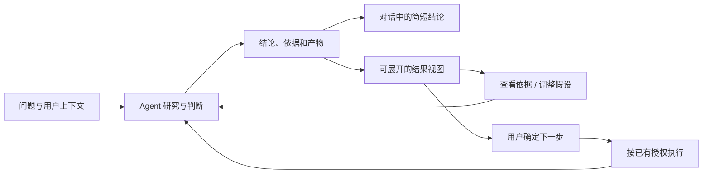

# Wearing 的结果交付

确认日期：2026-10-06。来自用户对输出形式的明确要求。第一阶段已在本地网页实现并验收，后续能力按下文标注。实际结果见 [验收记录](evidence/result-delivery-2026-10-06.md)。

## 完成标准

做完事情后，还要让人看懂结果、核对依据、做出决定。交付质量同时取决于内容正确性、表达方式和查看成本。用户不需要先读一份长报告，才能发现重要结论。

对话保留简短结论、当前状态和一个主要下一步；可展开的产物承接细节。表达形式由 Agent 按问题决定，不要求用户每次指定“帮我做个 dashboard”。简单事实和短确认不额外生成网页。

| 用户要做什么 | 优先形式 | 必须能核对或操作的内容 |
| --- | --- | --- |
| 看趋势、异常、结构、差异 | Dashboard / 图表 | 时间、单位、统计口径、来源；按需筛选和下钻明细 |
| 理解系统、关系、依赖与因果假设 | Diagram | 节点、连线含义、边界与图例；已知和推测分开 |
| 比较选项、改变条件、权衡后果 | 交互网页 | 可调整假设、实际重算、方案差异、保留选择 |
| 理解过程、空间变化或逐步演化 | Explainer video | 字幕、章节或时间点、静态摘要；随时暂停和回看 |

形式可以组合。Dashboard 是数据分析的默认方向，但一个数字不需要堆成控制台；视频是有条件的选择，不能替代可检索、可审查的证据。是否采用某种形式，最终看它有没有降低用户的理解和决策成本。

## 统一交付，不穷举业务流程

Agent 自主研究和行动，harness 提供通用的产物创建、存储、验证、展示、修订与受控执行入口。不要给旅游、账单或外卖分别写死一套界面和工作流。

表达规划也要考虑现有工具、生成耗时和预算。先呈现有用的阶段结论；视频等昂贵产物可稍后补齐，但只有真实运行已建立时才能承诺继续交付。

## 用户看到的体验

1. **先看到结果。** 对话呈现一句结论和主要产物卡片，卡片有自然标题、简短摘要、更新时间与真实状态。首屏只有一个主要查看入口。
2. **展开即可理解。** 电脑在可扩展结果区查看，手机使用全屏结果页；保留返回对话的位置。关键结论不依赖悬停、声音或动画才能读取。
3. **按需核对。** 来源、观察时间、覆盖范围、缺失数据和试算假设逐层展开，保留原始明细或下载入口；不能用“信息仅供参考”替代具体缺口。
4. **继续聊同一个结果。** “换成三天”“预算调低”延续原产物与选择，产生新版本；旧版本可回看，避免每条回复都从零生成。
5. **清楚下一步的影响。** 改参数属于探索；真正保存、预订或发送由 Wearing 的实际能力执行，并展示真实回执。不能因为结果页里有一个按钮就自动扩大授权。

定时任务和目标推进沿用同一产物机制。新反馈优先说明变化，更新同一结果；不在每次唤醒时重发整张巨大 dashboard。耗时制作失败时保留已有结论、依据与可用版本。

## 工程边界与实现顺序

### 当前已存在

- `identity.md` 已写入表达形式选择、结论优先、证据和能力边界；`profile.py` 为 v17，启动时通过原有受管迁移应用。
- 官方 Filesystem MCP 可在当前身份的独立文件目录读写文本；已有文件列表与附件下载。
- App / 网页观察有按身份、任务与运行保存的依据，可在回复下展开。
- `web/app.js` 的 `turnMarkup()` 将正文转义成纯文字，同时展示服务端返回的真实产物；“文件”也可打开已登记结果。普通 `/api/workspace/file` 仍返回附件，不执行 HTML。
- `artifact_design_guide / artifact_publish / artifact_list / artifact_read` 通过已有身份绑定 MCP 接入，服务端绑定真实运行，保存带哈希的不可变 HTML 快照；预览端使用 iframe 和 CSP sandbox，仅运行页内交互。来源与假设随版本保存。

真实模型已生成自包含 HTML 并交付到对话，浏览器已操作和核对。每份新产物仍需分别检查呈现与内容，登记成功不能自动当作效果验收；视频制作尚未接入。

### 第一阶段：通用结果视图（本地网页已实现）

优先接通一条链路：**生成自包含 HTML → 服务端登记真实文件 → 对话显示产物卡片 → 隔离预览 → 保留文件和依据**。HTML 能承载 dashboard、SVG diagram 和交互比较，不需要先造三套专用引擎。复用成熟渲染/隔离组件，先验收共享网页，再验证 Tauri 与移动端承载。

产物登记由服务端校验，不扫描回复里的路径或 HTML 后直接执行，模型不能指定身份与任务归属。当前记录以服务端私有 SQLite 保存快照；以下为记录契约，身份、运行、内容和摘要均已保存，来源目前是说明文字，尚未与观察回执逐条关联：

| 字段 | 归属与作用 |
| --- | --- |
| `id / identity_id / task_id / run_id` | 服务端绑定真实身份和执行上下文 |
| `title / summary / presentation` | Agent 提供自然标题、摘要和展示类型；类型指导呈现，不绑定业务流程 |
| `html / size / sha256` | 服务端检查实际文件，将 HTML 字节快照、大小与内容哈希一起保存；第一版固定 HTML 类型 |
| `revision / previous_id / created_at` | 版本不可静默覆盖，后续追问能指向原结果 |
| `sources / assumptions / limitations` | 来源关联、假设和具体缺口，随版本保存 |
| `state / checks` | 分别记录文件生成、呈现验证、内容核对；不自动冒充用户验收 |

HTML 预览必须与主应用、登录凭据和设备工具隔离。第一版只支持内联数据与本地试算，不注入 Agent 凭据，不直接调用主应用 API，不自动外发数据。预览里的真实业务动作等未来接入经校验的明确协议；第一版不显示无法执行的按钮。

渲染前校验类型、大小、归属、版本和文件哈希；错误、超时或不支持时显示真实原因并保留下载。预览端处理内容溢出、移动端触摸、键盘、减少动态、加载和失效状态。身份切换后旧预览立即关闭，撤销访问后旧链接不可继续读取。

### 第二阶段：围绕结果继续工作（版本保留已实现，其余待实现）

支持修订、差异与回退，保存用户的筛选和选择；将选中的方案带回对话继续行动。可视化使用同一份结构化数据，避免聊天、图表和明细数字不一致。金额、单位、日期与口径不能只存在于模型文案。

### 第三阶段：需要时补充解释视频（待实现）

复用已有或成熟的视频生成/合成工具。将分镜、素材、音轨、字幕、成本、实际文件与章节纳入产物记录；验收画面、语义、音画和可读性。没有可用视频工具或预算时给出已能查看的图解，不假装已发起制作。视频不自动播放有声内容，保留文字摘要和证据入口。

## 验收以用户能否完成判断为准

- **理解：** 首屏能找到结论、关键变化和下一步；图示的布局真实表达关系，不只是装饰。
- **审查：** 关键数字能追到同版本明细与来源；缺失值、估算、过期数据明确可见。
- **决策：** 修改条件会得到一致的变化；没有假控件，试算不会触发真实交易。
- **延续：** 追问修改同一结果并保留旧版本；重载不丢用户选择，身份隔离仍成立。
- **呈现：** 在桌面和窄屏真机/浏览器实际打开检查；源码生成成功不等于可用。
- **失败：** 文件未写入、越界、预览失败、引用缺失和制作中断时准确降级，不留下虚假的完成状态。

第一阶段的登记、对话卡片、隔离预览、依据展开、下载和版本回看已完成。下一步补明确选中结果继续聊、差异与选择状态保存，再独立验收原生客户端。

验证：v15 规则阶段通过原有配置测试；v16 实现阶段增加产物与访问边界测试，并在独立环境完成真实模型生成和浏览器操作。本机主服务已更新，主身份引擎保持 `idle`，下次启动应用 v17；云端未操作。测试范围和证据以本轮验收记录为准。

## 2026-10-06 设计质量补充

新增按媒介读取的设计指引，包含视觉基础、信息层级、真实交互和针对性验收；已人工重做预算样板，详见 [结果设计质量](result-design-quality.md)。profile v17 下次启动引擎时应用。指引不会自动将每份结果标记为设计合格；实际模型的稳定设计质量还需要后续多场景生成验证。
