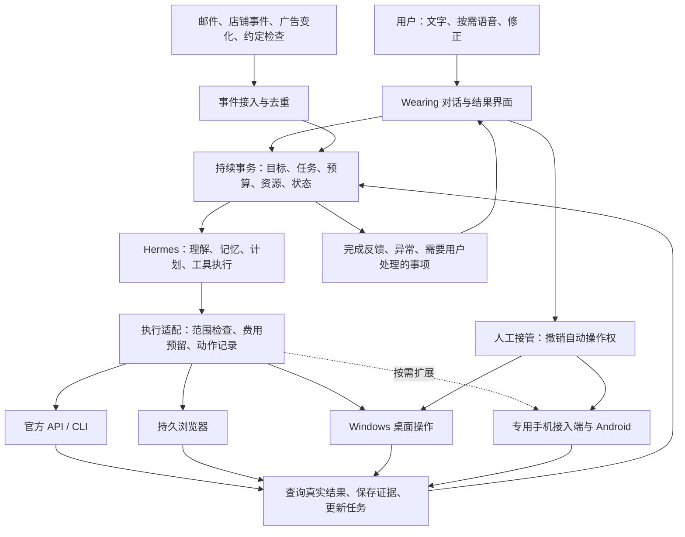

> 工程研究归档。此处保留当时的候选方案与验收细节，当前产品方向和优先级以[整合落地总方案](implementation-blueprint.md)为准。

# Wearing：Personal Agent 落地总方案 v0.1

更新：2026-09-30。名称与第 1 个视觉方向已由用户确定。用户进一步提出本地 PC 配手机；当前建议优先验证这一部署方式，海外租机保留为按需扩展。本文件是当前实施主线；尚未采购设备、安装底座、租机、开户或完成运行测试。下文明确区分文档能力、工程设计和待验证条件。

## 1. 产品已经确定的部分

**Wearing 是属于我的行动者，也是延伸出去的另一个我。** 它持续理解我的目标，使用自己的工作环境和我授权的账号推进事务，带回有依据的结果；我负责方向、策略和重要取舍，日常推进交给它。

名称统一为 **Wearing**，中文说明为“你的个人 Agent”。视觉采用第 1 个方案的钴蓝外套、奶油色头部和卷袖动作。完整角色用于表达状态；独立小标志简化为头部与折领。品牌资产状态见 [VI 工作区](../design/vi/README.md)。

用户已明确：随口灵感先做有限预算的研究；长期经营在既定方向下推进；投资按用户确定的策略执行；保留远程接管；主动性来自上下文和外部变化。第一版围绕这些约定组织，不再重新讨论产品关系。

## 2. 本轮建议拍定的工程路线

| 决策 | 具体落地 | 依据与改选条件 |
| --- | --- | --- |
| 一个主 Agent 底座 | **先接 Hermes**，固定版本，经适配层接到 Wearing | 官方已有程序化接口、浏览器和 Windows 原生路径。若会话、工具事件或接管无法满足验收，再测 OpenClaw；初期不同时维护两个核心 |
| 一套持续事务状态 | Wearing 保存任务、资源绑定、授权范围、消费与结果；Hermes 保存自身会话、记忆与执行上下文 | 对话结束、程序重启、等待几天，都不能丢掉用户交付的事情 |
| 一台持久工作电脑 | **本地专用 Windows 11 x64 PC** 优先，独立用户和浏览器资料目录 | 可兼任 Agent 主机与手机接入端，便于现场维护；海外租机有明确任务需要时再引入 |
| 一台专用手机 | 安卓真机经 USB 连接这台 PC，用现有移动工具接入同一 Agent | 分阶段接入，不阻塞核心开发；号码和设备分别落实；详见[手机接入方案](phone-node-plan.md)，尚未采购或安装 |
| 执行通道 | 官方 API / CLI、Hermes 浏览器、原生桌面与手机工具 | 按任务成功率与总成本选路；已经可能提交的动作不能换通道再盲目提交 |
| 小而完整的产品层 | React + TypeScript 界面、Python 服务、SQLite、普通文件成果目录 | 这是建议技术栈；单用户第一版不需要先建设多租户、复杂微服务或独立向量集群 |
| 先实现一个完整使用过程 | 一句话灵感 → 有限研究 → 结果反馈 → 继续任务 → 电脑操作 → 接管恢复 | 用一个真实长期事务验证，随后接入网店、广告和策略执行 |

Hermes 提供 TUI Gateway 的 JSON-RPC / WebSocket 接口，适合对接会话、事件和控制；本项目优先验证这条接口。文档也明确其持久接收任务仍有边界，因此 Wearing 要先把任务写入自己的台账，再调用底座，不能把 WebSocket 已发送等同于任务可靠保存。[Hermes 程序化集成](https://hermes-agent.nousresearch.com/docs/developer-guide/programmatic-integration/)

Windows 原生文档列出 Windows 10/11；Gateway 的原生自启动涉及用户登录。本地 Windows 11 仍须验证无人登录的完整重启恢复；只有选择云端 Windows Server 时，才新增 Server 兼容验收。[Hermes Windows](https://hermes-agent.nousresearch.com/docs/user-guide/windows-native)、[平台支持](https://hermes-agent.nousresearch.com/docs/getting-started/platform-support)

OpenClaw 保留为备选。其 Windows / Linux 的 `cua-computer` 插件目前标为实验性，这不足以证明 Hermes 实测更好，但支持先集中验证一条路线。[OpenClaw Computer Use](https://docs.openclaw.ai/nodes/computer-use)

## 3. 从输入到行动的完整结构

这是逻辑分工，不要求每个框都是一个服务。当前优先用一台本地专用 PC 同机运行界面服务、事务服务、Hermes、浏览器、桌面驱动与手机接入端，安卓真机通过 USB 连接。模型先使用可用云端 API，设备本地部署不等于大模型也要本地推理。开发阶段优先利用可用设备；具体采购配置尚未确定。

本地组合减少了跨公网控制手机的连接层，现场修复也更直接。运行依赖本地电力和网络，因此需验证禁用自动休眠、来电/重启后的恢复、设备健康与独立远程入口。PC 离线时同机服务也离线，不能承诺仍能主动发送故障通知；如需要离线告警或全天接收消息，再增加独立的小型控制/监测服务。

设备位置、联网条件、服务地区和账号资格分别处理。本地真机不会自动解决海外网站/API 的访问和使用资格；海外租机也不自动解决身份、号码和付款资格。海外执行环境仅在具体业务需要且条件成立时增加。

## 4. 每个环节具体怎样做

| 环节 | 复用什么 | Wearing 要补什么 | 验收结果 |
| --- | --- | --- | --- |
| 日常入口 | 普通网页、系统输入；后续接现有语音识别 | 一个持续对话入口，消息关联当前事务；可上传文件或按需录音 | 手机和电脑能接着同一件事说；一次输入只生成一次任务 |
| 产品界面 | 现成前端组件、已选 VI | 对话、事务、资源三个入口；工作状态、花费、成果、接管入口 | 不进入远程电脑，也知道事情进展到哪里 |
| 意图理解 | Hermes 的模型调用与会话 | 将明确任务、随口灵感、偏好修正和普通闲聊分别处理 | 不把每句闲聊都排成任务；用户修正能影响后续工作 |
| 个人记忆 | Hermes 记忆与会话检索 | 为关键决定记录来源、时间、适用事务、是否用户确认；提供查看与修正 | 能解释为何按这个偏好行动；推测不覆盖明确决定 |
| 持续事务 | 底座会话和工具事件 | 可靠任务台账、事件收件箱、重启对账、等待条件 | 程序退出后仍知道未完成什么；同一事件不会重复付款或创建订单 |
| Agent 核心 | Hermes 原有推理、工具、技能机制 | 一个可替换的运行适配器，不改写核心推理循环 | 启动、事件流、取消、继续、失联恢复都能被产品层控制 |
| 模型 | 底座已支持的模型接口 | 每个任务记录模型、用量、结果；固定一套基线再评测替代模型 | 用本项目任务比较费用和人工介入，避免凭排行榜选型 |
| 执行工具 | Hermes 浏览器、`cua-driver`、官方 API / SDK | 资源绑定、业务适配、动作与结果对应关系 | 网页和桌面操作的是指定工作环境，没有误用用户本机 |
| 电脑运行 | Windows 用户会话、计划任务、已有远程工具 | 健康检查、桌面状态检测、接管互斥、工作目录和日志 | 断开远程仍可工作；接管后停止自动输入 |
| 账号和凭据 | OAuth、平台权限、操作系统凭据存储 | 资源登记、失效提醒、所需资格和权限状态 | Agent 知道哪个账号能做什么；密钥不写入普通记忆 |
| 主动推进 | Webhook、增量读取、现成调度能力 | 输入去重、相关性判断、研究预算、通知合并 | 有新上下文才产生有价值的行动；无变化不反复汇报 |
| 预算与授权 | 平台预算、API 权限、可用工具钩子 | 区分模型费用和业务资金，记录有效范围和版本 | 日常授权内持续工作；范围变化时不沿用旧授权 |
| 反馈与成果 | 工具输出、网页/API 回执、文件 | 统一结果卡：结论、证据、变化、花费、下一步 | “已完成”有可核对结果；部分完成和结果未知明确展示 |
| 长期运营 | 日志、数据库备份、版本固定 | 恢复演练、升级验收、资源到期检查、费用统计 | 能从备份恢复；升级失败可回退；问题可定位到一次动作 |

这些是需要验收的能力，不意味着所有能力都要新增代码。先检查固定版本的现有接口，已具备的直接调用；缺口才由 Wearing 补齐。

### 界面应该让人怎么用

默认进入与 Wearing 的对话。角色保持“在听、思考、行动、等你、完成”五种视觉状态，同时显示具体文字，例如“正在核对三家服务的大陆用户条件”。

事务页回答：目标是什么、上次做到哪里、现在在做什么、成果在哪里、是否需要我处理。资源页回答：电脑是否在线、账号是否可用、余额/预算是否够、哪个依赖仍未落实。用户不需要理解工具名、运行 ID 和模型协议；技术详情放在展开记录中。

首轮接入把已知偏好带入：有限研究、日常推进、投资按策略、保留接管。仅在真正接入一个业务时收集缺少的具体材料与范围，避免重新做一遍抽象问卷。

## 5. 任务怎样跨天继续，并避免重复操作

### 持久化对象

| 对象 | 最少保存的内容 |
| --- | --- |
| 事务 `project` | 目标、成功标准、用户决定、相关资源、长期范围 |
| 任务 `task` | 来源事件、下一步、状态、预算、所需资源、等待条件、结果 |
| 运行 `run` | 底座会话、模型、开始/结束、检查点、取消原因、费用 |
| 动作 `action` | 意图、目标对象、操作类型、去重标识、授权版本、提交与回执状态 |
| 事件 `event` | 来源、来源事件 ID、发生时间、接收时间、已处理标记 |
| 成果 `artifact` | 文件或外部结果引用、时间、来源、验证方式、相关动作 |
| 资源 `resource` | 提供商、用途、账号所有者、状态、权限、到期时间、凭据引用 |
| 范围 `policy` | 哪个事务、可执行动作、金额/频率/时间限制、到期和撤销状态 |

业务平台的订单、余额、持仓仍以平台为准；本地保存引用、必要快照和对账时间。个人记忆不充当账本。

建议任务状态：`queued → running → verifying → done`，中途可进入 `waiting_external`、`waiting_user`、`blocked`、`paused`、`failed`、`cancelled`。用户界面翻译成直白中文。

具体规则：

1. 收到输入先写入台账，再交给 Hermes。事件去重键由来源和来源事件 ID 组成；无来源 ID 的输入生成本地稳定标识。
2. 发送指令与收到执行确认分开记录。连接断开后先查询原会话和外部状态，不能自动再发同一笔业务操作。
3. 有副作用的操作先记录意图和唯一标识，执行后保存外部对象 ID，再独立查询结果。API 支持幂等键就使用；不支持则使用可查询的业务标识并串行提交。
4. “点击后超时”属于结果未知。先检查订单、账单、发布记录或平台状态；无法确定则保留现场等待核对，不能当作失败再点一次。
5. 重启后读取未结束任务，核对活跃会话、过期运行锁和外部回执，再决定继续、等待或重新规划。保存聊天历史本身不等于完成任务恢复。
6. 取消停止新动作，核对在途动作。已经发生的扣款、发布或成交不会因为本地取消而自动撤回。
7. 单个交互桌面同一时刻只有一个写入者。读取任务可以在互不干扰的会话中有限并行；业务对象更新也按对象串行。

第一版用 SQLite 事务、持久事件表和单个调度进程即可。底座负责执行；Wearing 负责尚未完成的事务和唤醒条件。避免两个调度器同时为同一业务排任务。

## 6. 主动性、记忆和长期学习

输入来自用户对话、用户主动录音、授权邮箱、店铺事件、广告变化和已经约定的检查时间。无需持续录音。

处理过程：**关联已有事务 → 判断需要记录还是行动 → 检查已有范围与预算 → 执行一个有终点的小任务 → 反馈有用变化**。

随口灵感的默认产出建议为：一个初步判断、关键证据、尚未解决的条件、是否值得继续。研究停止条件是预算/时间用完、已有足够证据或关键资料无法确认。遇到缺口交付已有结果，不自行把研究扩大成经营项目。

工程初值可先用“单次研究最多 10 分钟、最多 20 次工具动作、最多 0.50 美元模型与工具费用”的配置样例做模拟；这些数字是待使用数据校准的产品默认建议，不代表用户已经授权消费。底座若不支持每次调用前拦截费用，需要补计量适配，不能只写一句提示词。

长期偏好、用户决定、任务进展和观察到的业务事实分开保存。记忆更新带来源；重要冲突优先采用用户最新明确决定。日志中发现的可复用方法可以形成技能候选，经独立测试后再启用；不让一次偶然成功直接改变所有后续任务。

页面、邮件、附件中的文字作为资料处理，不能据此提升权限或接入新的账号。抓取结果在进入记忆前保留来源，防止外部内容被当成用户指令。

通知只在成果完成、关键变化、失败影响目标或确实需要用户输入时发送。普通心跳、无变化检查和小步骤合并到事务记录中。

## 7. 电脑与 Computer Use 的落地

### 首轮组合

**Hermes 原生运行 + Windows 专用用户会话 + 持久浏览器资料 + `cua-driver` + 独立远程接管。** 网站优先走 Hermes 浏览器入口；原生程序和系统弹窗走桌面工具。[Hermes Computer Use](https://hermes-agent.nousresearch.com/docs/user-guide/features/computer-use)

Hermes 当前浏览器文档包含 Browser Use 模式与不同浏览器后端。首轮复用它对本地浏览器的支持并明确选择后端，验证登录态、下载、恢复和费用；不另造一个 Browser Use 调度系统，也不依赖不同版本的默认值。[Hermes 浏览器](https://hermes-agent.nousresearch.com/docs/user-guide/features/browser/)

桌面驱动必须运行在真实交互会话中。Windows SSH 服务会话与 GUI 会话不同；仅仅能远程执行命令，不代表能控制桌面。[CUA Windows 交互会话说明](https://cua.ai/docs/how-to-guides/driver/windows-ssh)

### 五个独立验收场景

| 场景 | 必须检查 |
| --- | --- |
| 初次登录 | 真实桌面、浏览器资料、截图坐标、输入、文件选择器、权限 |
| 断开 RDP | 持续截图和操作、分辨率变化、窗口是否仍可访问 |
| 锁屏或会话被切换 | 能识别不可操作状态并停下，不能把黑屏当正常页面继续点击 |
| 主机重启 | 后端是否恢复、桌面是否存在、浏览器状态是否还在；需要用户登录时主动报告 |
| 人工接管再交还 | 撤销自动输入权、停止已排队动作；交还后重新观察和核对任务 |

首轮不预设重启后自动登录已经解决。若必须长期无人值守，主机供应商的持久交互会话能力是采购条件；登录前也能工作的 API 任务与依赖桌面的任务分别显示可用性。

接管流程：用户点“接管” → 撤销桌面运行锁 → 停止新动作并等待在途动作结束 → 打开远程入口 → 用户交还 → 获取新截图、核对页面和业务状态 → 继续。驱动侧必须检查运行锁；只通知模型“暂停”不够。人工从独立 RDP 直接进入时也要检测会话变化，实测暂停行为。

### 模型与工具怎样省钱

先建立一套强模型基线，记录每件成功任务的费用、耗时、重试和人工介入。结构化重复操作逐步转 API；简单提取/分类再评测低价模型；复杂网页判断和失败恢复保留强模型。以实际任务总成本决定路线，不为了少一次贵调用多重试十次。

OpenAI 有两种不同接入：Responses 的 Computer Use 由集成方提供并执行环境；Agents API 文档另有 OpenAI 托管浏览器。后者不等于一台永久托管 Windows 或 Mac。Wearing 的持久工作电脑先沿既定路线验证；若托管浏览器实测更合适，可作为特定任务工具加入。[自管执行环境](https://developers.openai.com/api/docs/guides/tools-computer-use)、[托管浏览器](https://developers.openai.com/api/docs/guides/agents-api/tools/computer-use)

通用电脑工具获得已登录页面后，动作权限不能仅靠提示词严格保证。需要严格约束的资金动作优先用受控 API、平台角色与资金限额；只开放浏览域名不等于限制了域名内每个操作。未完成这些约束前，付款提交等动作保留人在现场的交接点。日常已授权且可约束的操作按范围持续执行，不要求逐次批准。

## 8. 资源：选什么、怎样接、哪里尚未解决

| 资源 | 当前方案 | 接入方式 | 完成条件 / 当前缺口 |
| --- | --- | --- | --- |
| 工作电脑 | 本地专用 Windows 11 x64 PC 优先；VPS Mart 留作云端对照 | 原生运行、持久浏览器、USB 手机、远程入口 | 具体设备、睡眠/重启恢复、远程接管与目标网络可达性未实测 |
| 模型 | 使用用户实际具备访问资格的模型接口，Hermes 统一调用 | 底座配置及用量记录 | 模型供应商与额度未开通；网页订阅和 API 权益分别确认 |
| 邮箱 | 优先已有、可授权的邮箱；经营需要时再设专用邮箱 | 官方 API 或 IMAP/SMTP，增量读取并保存消息 ID | 能收验证信、重启后不重复处理；对外发送继承对应事务授权 |
| 收发短信/电话 | Telnyx 为 API 通信候选 | Webhook 入站、接口出站、签名校验与去重 | 大陆用户开户和号码要求未确认；API 号码不保证可作各网站验证号 |
| 长期验证号 | 真实运营商 SIM/eSIM；Ultra PayGo 保留研究候选 | 初期必要时人工取码；自动接入另测设备桥接 | 从大陆购买、首次激活、长期保号、目标验证码均未形成可验证完整路径 |
| 消费支付 | UPay Premier 446614 继续作为资格核实候选 | 卡作为商户付款工具，台账只存引用和账单记录 | 大陆常住地址、证件、+86、开卡失败退款与商户支付未确认 |
| 商户收款 | 按真实主体选择支持其资格的收单及结算服务 | 店铺支付插件/API、回款对账 | 具体服务、开户主体与结算账户未确定；独立于消费卡 |
| 业务账号 | 订阅服务、Shopify、Google Ads 分别核实 | 浏览器做必要设置；API 接长期运营 | 身份/地区/业务验证、计费及接口权限分别通过 |
| 投资账户 | 只对用户符合条件的机构做接入 | 官方接口；先模拟和回放 | 真实账户资格、资金和市场数据未确认；不承诺目前能实盘 |
| 文件与备份 | 本地成果目录、SQLite 备份，之后接已有备份目的地 | 带时间与任务关联的文件、定期恢复演练 | 数据备份与凭据恢复分别验证；复制文件不保证密钥可跨机器解密 |

**电脑价格：** 同日先前已在 VPS Mart 页面切换 `1mo`，记录 6 GB / 3 核 / 100 GB 为 $14.99/月，8 GB / 4 核 / 140 GB 为 $18.99/月，包含 Windows Server 授权。当前默认网页展示的长期付款低价不替代这个月付记录。下单前仍需核对地区、税费、库存和完整条款。[报价证据记录](windows-payment-vi-research-2026-09-30.md)、[供应商](https://www.vps-mart.com/Windows-VPS)

**号码价格：** Telnyx 当前号码价格 $1/月起，另有 $0.10/月的 SMS/MMS 能力费用，通信使用量等另计。它只是通信候选，并非已解决的账号验证方案。Ultra 的既有 $3/月及漫游报价保留在旧研究中，本轮没有把它视为已开通路径。[Telnyx 定价](https://telnyx.com/pricing/numbers)

**U 卡资格：** UPay 官方限制页按卡种列出国籍条件，Premier 的名单未列中国；这仍不足以确认大陆常住地址适用。已有完整咨询文本可用于资格核实，未发送。下一步取得准确卡种及居住条件的书面答复，再走申请；不靠先付开卡费来测试资格。[UPay 限制页](https://support.upay.com/hc/en-us/articles/26613460878620-Restricted-Prohibited-Countries-List)、[既有申请与费用研究](windows-payment-vi-research-2026-09-30.md)

凭据保存在既有系统密钥库/凭据服务中，业务库只存引用。Windows 可用系统凭据保护机制，跨机备份单独设计恢复方式。验证码短时使用；不写入长期记忆。保留用户独立的账号找回通道，防止 Agent 或手机一处故障导致全部账号失联。

## 9. 五类业务分别如何跑通

### 9.1 灵感研究：第一个真实使用过程

用户说一个想法 → 关联目标 → 在默认研究范围内创建任务 → 查资料并保存来源 → 得出初步结论 → 主动反馈 → 用户继续或搁置 → 保留可恢复上下文。

交付是可读研究结果及证据、费用和未解决条件。验收包括普通闲聊不触发任务、重复输入不重复花费、预算到达时仍能交付部分成果、隔天能接着推进。这条链不需要先买海外号码和支付卡。

### 9.2 AI 服务订阅

先确认服务是否支持用户实际情况，再确认账号、付款方式和续费。当前 OpenAI 与 Anthropic 的支持地区页面未列中国大陆，因此“海外电脑 + 号码 + U 卡”不能直接视为已取得使用资格。Wearing 自身接入模型与购买某个消费订阅是两条独立工作，不互相阻塞。[ChatGPT 地区](https://help.openai.com/en/articles/7947663-chatgpt-supported-countries)、[Anthropic 地区](https://www.anthropic.com/supported-countries)

资格成立后的流程：比较方案 → 用户确定订阅与预算 → 建立账号与凭据 → 准备付款 → 按有效授权完成必要操作 → 核对账户权益和扣款 → 记录续费时间 → 在既定规则下提醒、继续或停止。需要本人验证时保留现场。验收看实际权益、账单与续费设置，不以“付款页面显示成功”单独结案。

### 9.3 海外网店

首轮以 **Shopify** 作为店铺集成目标，理由是先借成熟平台完成商品、订单、库存和事件接入。通过 Admin GraphQL API 与 Webhook 做日常管理，网页用于配置和接口未覆盖的设置。[Shopify API](https://shopify.dev/docs/api/admin-graphql/latest)、[Webhook](https://shopify.dev/docs/apps/build/webhooks)

步骤：确定经营方向 → 核实主体和收款 → 准备商品资料、域名、物流与售后规则 → 搭建测试店铺/草稿商品 → 模拟订单和通知 → 用户确认上线内容与范围 → 实际经营 → 按规则处理日常事务和回款对账。

首批能力为商品草稿、库存变化、订单异常摘要、客服回复草稿和日常经营报告。发布、改价、回复客户、退款等分别依据已有业务范围开放。Webhook 只作为“有变化”的信号，按签名和事件 ID 校验后查询对象现状，处理乱序与重复事件。

Shopify Payments 要求经营主体位于支持的地区；不满足时需选择适用的第三方支付服务。这不等于不能使用 Shopify 建店，也不等于已有 U 卡就能收取销售款。[Shopify Payments 地区](https://help.shopify.com/en/manual/payments/shopify-payments/supported-countries)

验收：模拟订单能进入事务，库存变化可追溯，重复事件不会重复发货/退款，取消与售后有明确处理规则；真实上线还需收款、结算和物流链路通过。

### 9.4 Google Ads

确定投放目标、预算和可调范围 → 完成广告账号及账单资格 → 设置转化追踪并验证 → 创建暂停状态的广告草稿 → 核对落地页、素材、目标与计费 → 按已确认范围启动 → 定时拉取效果 → 执行允许的日常调整 → 汇报变化与建议。

正式维护优先 Google Ads API。当前访问级别文档涉及 Google Cloud 项目与测试/生产访问权限，实施时按实际申请流程办理，不能把测试权限当成可以服务真实账号。[Google Ads API 访问级别](https://developers.google.com/google-ads/api/docs/api-policy/access-levels)

Google Ads 的付款方式随账单条件变化，官方说明预付卡不适用于自动付款；需核实具体卡类型和实际账户可用方式。[Google Ads 支付方式](https://support.google.com/google-ads/answer/2375433?hl=en)

验收：转化事件确实到达；暂停草稿与实际发布区分；允许调整的字段和幅度可检查；预算监控、暂停失败和数据延迟有反馈。平台费用数据存在更新时差，平台预算与本地监控同时使用，不能承诺本地轮询能保证精确到分的实时总支出上限。

### 9.5 用户策略驱动的投资执行

将用户策略整理为可执行规则 → 历史数据回放 → 本地模拟成交 → 具备资格后接券商/交易平台的模拟接口 → 验证订单、成交和持仓对账 → 另行开通符合条件的实盘执行范围。

语言模型负责研究、解释和异常归因；执行层根据已确认的策略版本、行情时效、仓位与损失限制生成和检查订单。订单使用唯一业务标识，失联后查询真实委托与成交。模拟与实盘使用不同连接配置，实盘不由界面操作兜底下单。

IBKR 文档确认其 Web API/TWS API 可连接其 Paper 账户，但开户、模拟 API 资格与行情权限仍需单独满足。第一步可用本地回放，不能假定免费试用账号就具有 API 权限。[IBKR Paper 说明](https://www.interactivebrokers.com/campus/glossary-terms/paper-trading-account/)、[申请与试用说明](https://www.interactivebrokers.com/campus/trading-lessons/request-paper-trading-account/)

验收：行情过期停止新订单；策略暂停生效；重复信号不重复下单；部分成交、拒单、断线和重启能对账。股票与加密资产的机构资格分别核实；当前未确定可实盘的机构。模拟执行通过也不证明策略盈利或真实成交效果。

## 10. 费用如何控制

费用分成三本账：**Wearing 运行成本、业务经营资金、投资资金**。每个任务同时展示已结算费用和估算中的费用，避免把租金、模型调用和广告花费混成一个数字。

本地 PC + 安卓手机路线的成本按“设备一次性购置或既有设备投入 + 电费 + 模型/工具 + 号码/通信 + 按需网络及备份”核算。PC 同时承担手机接入端，不预设另购网关或 GPU；海外主机月租不再是默认支出。是否比租机便宜取决于是否已有设备、功耗、使用年限与维护成本，当前未做采购报价。

以下保留先前海外租机路线的预算对照：

| 项目 | 用于规划的金额 | 说明 |
| --- | ---: | --- |
| Windows | 约 $19/月 | 采用已记录的 8 GB 月付候选；兼容和订单待核实 |
| 模型与搜索等工具 | $30–60/月的试验额度 | 这是建议分配额度，不是能保证完成全部业务的价格预测 |
| 号码 | 暂预留 $5/月基础费用 | 号码资格、激活、购卡、通信量另算；无需求先不购买 |
| 备份/存储 | 优先现有资源，新增费用单列 | 不默认额外购买云服务 |
| 网店、广告、订阅、投资 | 分别列预算 | 不计入上面的 Agent 运行费用 |

上表约 **$54–84/月仅为先前海外租机路线的试验预算草案**，不是本地 PC + 手机方案报价；不含税费、一次性费用和业务资金，也不是已经批准的支出。

执行前预留该次调用可能的费用，限制输出、步骤、重试和运行时间；执行后结算并释放预留。到达预算后不再启动新调用，记录在途调用的最终费用。对没有价格/用量回执的工具标为估算，不能展示虚假的精确总额。

## 11. 开发工作包与通过标准

按依赖推进，不把外部开户和审核时间承诺成开发工期。第一个开发迭代聚焦 A–C，资源核查 R 与其并行。

| 编号 | 工作包 | 前置条件 | 交付与通过标准 |
| --- | --- | --- | --- |
| A1 | 固定 Hermes 版本和依赖 | 当前方案 | 保存版本/许可/安装清单；可重复启动；核对接口能力 |
| A2 | Wearing—Hermes 适配 | A1 | 提交、事件流、继续、取消、掉线重连；原会话可定位 |
| A3 | 模型与浏览器基线 | A1、可用模型凭据 | 同组研究、表单、文件、系统弹窗任务记录成功率、费用、耗时 |
| B1 | 对话与任务台账 | A2 | 输入可靠落盘；状态与成果能展示；失败不伪装成完成 |
| B2 | 中断、重复与预算控制 | B1 | 重启、重复事件、结果未知、预算耗尽均有确定处理 |
| B3 | 记忆和主动研究 | B1、B2 | 一个随口灵感产出有证据的结果；用户修正和搁置生效 |
| C1 | 本地 Windows 原生桌面验证 | A3、可用专用 PC | 明确 Windows 11 版本；睡眠、锁屏、重启、远程接管与网页/桌面任务逐项验证 |
| C2 | 人工接管与恢复 | C1、B2 | 人和 Agent 不争抢输入；交还后重新观察；失联可独立救援 |
| M1 | 专用安卓手机验证 | A2、B2、可用安卓机与同机接入端 | USB 连接、App 操作、事件权限、重连、手机接管与跨设备任务；分阶段推进，不阻塞 C1 |
| R1 | 号码和消费支付资格 | 官方条件与用户实际情况 | 分别得到资格、激活、完整费用、目标用途的证据；待验证明确标出 |
| R2 | 店铺/广告/投资资格 | R1 按需、对应主体条件 | 消费支付、商户收款和投资账户各自成立，不互相替代 |
| D1 | 店铺首个长期事务 | B3、C2、店铺测试权限 | 商品草稿与模拟订单完整过程；重复事件处理；经营报告 |
| D2 | 广告测试集成 | B2、Google 测试访问 | 暂停草稿、指标读取、范围校验、失败反馈；无真实花费 |
| D3 | 策略回放和模拟 | B2、用户策略与数据 | 信号、委托、成交、持仓对账；不连实盘完成首轮验收 |
| E1 | 连续运行与恢复演练 | 已通过的业务模块 | 至少连续 7 天可追踪运行；备份恢复成功；报告人工介入与成本 |

A–C 的完成标准是“一个会持续做事且能接管的 Wearing”。D 的每项业务独立放行，不等待全部账户解决才让用户开始使用。R 的未决条件由项目清单持续推进，只有必须由用户本人提供或选择的部分才交给用户处理。

## 12. 必测故障与交付证据

| 测试 | 期望结果 |
| --- | --- |
| 同一输入/事件收到两次 | 一次任务或一次业务变化；可追踪去重原因 |
| 提交后连接超时 | 先查外部状态；结果未知时不自动重复提交 |
| 执行中杀进程、重启 | 任务仍在；对账后继续；无重复资金动作 |
| 用户改目标或撤销范围 | 新动作采用最新范围；旧排队动作失效 |
| 模型额度耗尽/工具故障 | 停止新消耗，交付已有成果，说明待继续条件 |
| RDP 断开、锁屏、重启 | 分别记录实际能力；不会以“远程连通”冒充“桌面可执行” |
| 人工接管与交还 | 自动输入停止，恢复使用当前画面和当前业务状态 |
| 登录态过期/验证码/本人验证 | 保留现场，明确需要做什么；完成后可继续 |
| 外部内容要求泄露资料或扩大权限 | 保持当前任务范围，不把网页内容当用户命令 |
| 数据与凭据备份恢复 | 分别验证可恢复范围，报告需要重新登录的资源 |

验收材料保存环境与版本、输入、动作记录、外部结果、费用、耗时和介入原因。研究任务用真实公开资料；业务写入先用测试账号、草稿和模拟环境。生产阶段的每个新业务范围单独建立结果证据。

## 13. 当前真正完成了什么

已确定名称和主视觉方向；已形成主底座、产品层、执行环境、资源、五类业务、成本与验收的实施方案，并核对关键官方文档。

尚未完成：底座安装实测、本地 PC 与安卓手机验证、远程接管验证、任何资源开户、正式 SVG/动画和可运行的产品。现阶段最先做 A1–B3，把研究任务与任务恢复跑通；同时落实 C1/M1 的本地验证环境和 R1 的资格证据。产品建设不以手机号或 U 卡全部解决作为起点。

旧的[整合研究](integration-plan-2026-09-30.md)和[资源核查](windows-payment-vi-research-2026-09-30.md)保留报价与调查过程；实施优先级以本文件为准。
