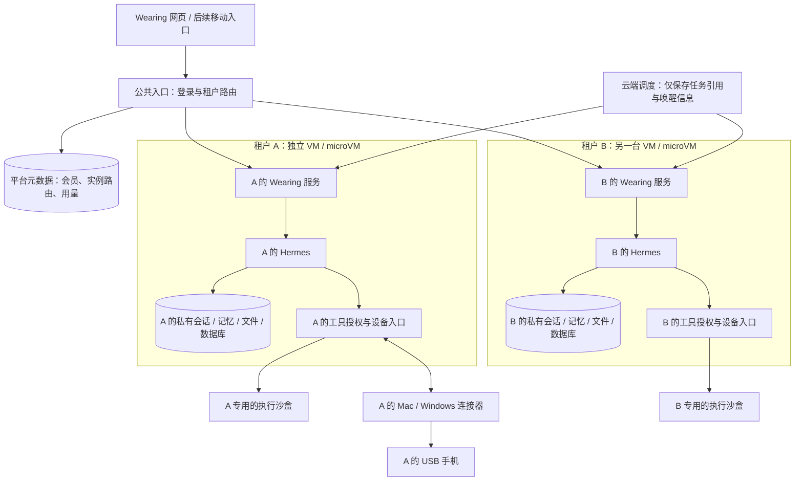

# Wearing SaaS 实施基线

2026-10-03。用户已确认：Agent 核心运行在云端，电脑/手机作为连接器，产品按 SaaS 推进；云厂商尚未选择，先按可替换方案开发。**用户进一步要求租户的 Wearing 完整独立，并尽量靠近物理层隔离。因此默认租户边界收紧为硬件虚拟化支持的独立 VM/microVM，普通容器或共享 Gateway 不满足基线；另保留真正独占物理主机的部署档位。**本文件替代旧总方案的部署假设。当前可用软件仍是 0.2 本地版，云端服务尚未部署。

## 1. 产品与第一版交付

Wearing 是属于用户、持续理解用户并替用户行动的 personal agent。用户注册后，能够直接对话与做云端任务；接上自己的电脑、手机和账号后，能力逐步增加。设备离线不会让整个 Wearing 消失，涉及该设备的步骤等待恢复，适合云端的步骤继续。

主界面保留个人对话、卷袖 IP、实际进展与成果；“身份”“我的设备与账号”“记忆”“主动跟进”“用量”是次级入口。租户、容器和队列留在工程与运营侧。注册不强迫先安装电脑端，也不要求先取得海外号码或银行卡。

第一阶段以邀请制个人用户为目标，按 10–20 人的试运行规模估算容量，这是工程假设，不是开放注册承诺。先证明两位用户的数据、执行和设备互不串用，再扩大人数。

## 2. 用户、租户、身份、设备的关系

| 对象 | 含义 | 首版规则 |
| --- | --- | --- |
| User | 登录的人 | 成熟 OIDC 登录；不自己实现密码系统 |
| Tenant | 数据、授权、资源、预算和计费归属 | 注册默认建立一个个人租户；会员关系独立，给后续多人协作保留空间 |
| Wearing | 用户持续互动的个人 Agent | 一位用户感受到一个连贯的 Wearing |
| Identity | 日常、出海、我的店等执行上下文 | 同一租户内；各自账号、业务记忆、会话与文件可分隔 |
| Resource | 电脑、手机、邮箱、号码、支付渠道、浏览器和沙盒 | 属于租户，显式授权给身份；账号凭据与设备分别记录 |
| Connector | 连接资源的程序或服务 | 一台 Mac 连接器可上报桌面和多台 USB 手机，每台手机有独立 resource_id |
| Task / Run / Command | 用户事务 / 一次引擎运行 / 一个设备动作 | 各有稳定 ID，任务开始后不能因切换身份改归属 |

例如：Archie → 个人租户 → 日常/出海 → 各自获准的号码、邮箱、账号和设备。**增加一位用户产生一个逻辑个人租户；不需要注册时就新建一台全天运行的虚拟机。**同一人的两个身份也不需要购买两份租户基础设施。

## 3. 云端服务、Agent 与执行环境

**平台控制服务**持续在线：登录、会员、实例路由、唤醒、配额和计费。公共数据库只保存所需的运营元数据；完整消息、记忆、截图、业务账号凭据与任务正文默认留在租户实例及其专属存储。入口代理不是共享 Agent Gateway，不维护跨租户 Agent 会话。禁止在公共访问日志中记录消息正文、token 或文件内容。

**租户实例**在云端：里面运行该租户完整的 Wearing 服务、Hermes、工具授权入口与私有数据存储。每个实例有独立 guest kernel、内存地址空间、虚拟磁盘、网络规则和凭据；VM 内可用容器整理进程，但容器不是跨租户边界。初期每租户一个活跃执行槽，用户之间可以并行。身份可使用各自 Home/会话启动独立引擎子进程，不为了闲置身份常驻多个进程。

**执行沙盒**承接代码、文件、临时环境和云端浏览器任务。长期浏览器环境与临时沙盒分开管理。运行 Agent 的隔离环境和工具执行沙盒是不同职责；可以由同一供应商承载，但不能因为有工具沙盒就认为 Agent 进程本身已经隔离。

Wearing/Hermes 可使用 OCI 镜像打包，但运行时适配器必须把它部署进独立 VM/microVM。第一版采用成熟托管 VM/microVM 能力，不自研虚拟机监控器或 Kubernetes 调度器。Firecracker 是可参考的 KVM microVM 实现，不是本项目要从源码自建运维的平台。[Firecracker 官方设计](https://firecracker-microvm.github.io/)

硬件虚拟化并不等于独享物理硬件。默认 VM/microVM 仍可能与其他租户共享宿主机；真正的独占主机档位要求一台物理主机只放一个 Wearing 租户，不能在同一“专属 Wearing 主机”上再次混放多个客户。独立卷/加密密钥也不等于独立物理磁盘。实例、存储和网络的实际供给属性需分别核实。[独占主机的官方定义示例](https://docs.aws.amazon.com/AWSEC2/latest/UserGuide/dedicated-hosts-overview.html)

OpenClaw [Fleet](https://docs.openclaw.ai/gateway/multi-tenant-hosting) 的生命周期与私有状态设计仍有参考价值，但普通 container cell 不满足我们这次提高后的默认隔离标准。VM 也不天然防止有权限的平台/云厂商管理员访问数据；如需连运营方也不能读取，应另评估可信执行环境或用户自有云账户，不能在当前方案中宣传“任何人都无法读取”。

持久在线指服务与状态可持续使用，不要求每个用户始终占用满配计算资源。先在小规模试运行中测 Worker 内存、首次唤醒和恢复时间，再决定保温时长。休眠必须等待运行结束、记忆写入排空、产物保存；不能强杀正在控制设备的 Worker。平台外部调度负责唤醒，不能依赖已睡眠 Worker 内的 cron。

## 4. 已确定的技术边界

| 部分 | 首版选择 | 实施状态 |
| --- | --- | --- |
| Agent | 保留已固定 Hermes；版本升级单独验收 | 本地真实运行已通过；新增租户 Worker 封装，真实 VM 部署待验收 |
| Web/API | 沿用前端与 FastAPI；公共登录/路由与 VM 内租户私有 Wearing 服务分开 | 本地入口与私有 Worker 保留；新增 OIDC 开发入口与会员路由，双用户实际 HTTP 验收通过；生产入口待部署 |
| 身份认证 | OIDC，成熟身份服务可替换；用户信息与 tenant membership 分开 | Authlib 授权码/PKCE/ID Token 与会话撤销已接入并使用合成 IdP 验收；真实提供商待接入 |
| 平台数据 | PostgreSQL 保存会员、实例映射、用量等元数据；应用鉴权 + RLS | SQLAlchemy 会员/路由/会话已接入；真实 PostgreSQL 的版本迁移、独立权限角色与 FORCE RLS 已在本机验收；不保存租户私有聊天与记忆，生产部署待接通 |
| 租户私有数据 | 初期 Wearing/Hermes 的 SQLite 在该租户 VM 的独立持久卷内，单写者与一致性备份 | 复用已有实现；未来确需 PostgreSQL 时仍在租户边界内单独部署 |
| 文件/备份 | 租户独立卷；备份用 S3 兼容存储，独立密钥/授权范围及短时访问链接 | 待接入；加密卷和对象前缀不宣称物理独享 |
| Agent 状态 | 上游拥有的 Home/SQLite/Skills 在租户专属持久卷内，快照备份 | 不把运行中的 SQLite 直接放在对象存储上读写 |
| 持久任务 | Temporal 负责外部唤醒/编排，历史仅含不透明任务引用；私有内容与执行 Worker 在租户 VM | 待验证；异常堆栈、Activity 返回值、重试日志也不能泄漏私有正文 |
| 云端沙盒 | Daytona 官方 SDK 为首接候选；必须确认实际产品是独立 VM，或改用其他托管 VM/microVM | 官方区分 container 和 VM，不能只看到“sandbox”就认为符合要求；真实实例与账单待验收 |
| 设备控制 | Mac 沿用 Cua Driver 路线；Android 沿用 ADB + Mobile MCP / UiAutomator2 | 保留已验收驱动；云端转发与 Windows 真机待完成 |
| 凭据 | 标准云 Secret Manager/KMS 或可替换 Vault；业务数据保存引用 | 平台主密钥不进入用户沙盒、提示词、日志或前端 |
| 观测 | 结构化事件、OpenTelemetry 接口、每租户用量账本 | 当前只有本地运行证据，云端统计待建设 |

Daytona、云厂商、登录服务可以分开选择。预算控制和资源授权必须位于我们的服务端；租户 Worker 只得到当前任务可用的受限凭据或代理能力，不能拿平台级密钥去列出/删除别人的沙盒。

## 5. 设备连接器怎样工作

1. 用户登录 Wearing，选择“连接电脑”；生成短时、一次性配对请求，绑定本人租户。
2. 本地连接器生成设备密钥，用户完成系统权限与配对。凭据存入系统密钥库；macOS 和 Windows 安装/自启动/升级路径分别验收。
3. 连接器主动通过 TLS 出站连接所属租户的云端设备入口，穿过家庭 NAT；共享接入层仅路由，租户实例再次验证设备归属。不暴露 ADB、桌面驱动、远程调试或本地工具端口到公网。
4. 上报系统版本、驱动版本、已授权能力及子资源。连接器在线、手机在线、屏幕解锁、应用登录是不同状态。
5. 云端从任务确定租户、身份和资源，检查权限/预算，获取该资源的独占租约，再发出有截止时间的指令。
6. 连接器在执行前再次检查当前配对代际、能力、租约及本地暂停状态。截图/大文件通过短时产物通道返回；操作结果携带原 command/task/resource/connection 标识。
7. 断线后先核对动作记录，再继续任务。已经派发的点击、发送和付款若结果不明，标为 ambiguous，不能盲目重发。
8. 本地“我来操作”立即阻断新动作并使租约失效；云端随后同步。长命令需要取消确认，云端显示“已请求停止”和设备实际停止分别记录。
9. 解绑、重新配对或授权变更后，旧密钥/旧连接/旧权限版本失效。服务端撤销通知和短期租约共同限制传播窗口；不能声称网络分区中实现瞬时全局撤销。

手机 USB 插在电脑上时，这台电脑必须在线，手机控制才能继续。以后可以增加手机直连 App、云手机或托管真机连接器；它们遵守相同的资源与授权协议，但不保证支持相同动作。Android 当前首条路线不要求 Root。iOS 的可用能力单独实测，不能用“有一个 iOS 节点”推断能控制所有 App。

## 6. 数据、权限与恢复的硬规则

- 用户登录 token 由成熟验证库检查 issuer/audience/签名/期限；tenant membership 从服务端解析。客户端提交的 tenant_id 不能自行取得权限。
- 每个租户实例启动时固定唯一 tenant_id。入口路由即使出错，实例也必须拒绝其他租户的登录声明和设备凭据；这个断言不能由请求参数或模型改写。
- 身份选择只在该实例所属租户内生效。私有数据库不混放其他租户数据；平台元数据表仍带 tenant_id 和同租户关联约束。资源 ID 不因名字相同而合并。
- 平台 PostgreSQL 应用角色非 owner、非 superuser、无 BYPASSRLS；必要表 FORCE RLS。每个事务显式设置作用域，连接池复用不能残留上一个租户。RLS 保护平台元数据，并不替代 VM 隔离。后台任务、下载、SSE、搜索与导出同样鉴权。[PostgreSQL 官方规则](https://www.postgresql.org/docs/current/ddl-rowsecurity.html)
- VM 默认拒绝租户间直连，限制管理网段、宿主/云 metadata 和平台凭据服务访问；设备入口与模型/沙盒代理仅开放所需的带身份认证路径。公网 IP 是否独立与实例隔离分别说明。
- 租户 Worker 不取得平台数据库、对象存储或沙盒管理主密钥；不能挂载宿主目录、Docker socket 或其他租户 Home。技能扩展与任意脚本不进入控制服务进程。
- `task_id` 独立于 Hermes `run_id/session_id`；资源 ID 独立于提供商 ID。引擎返回完成仍是 `completed_unverified`，有相应外部结果证据后才是 verified。
- 所有动作先落账再派发；相同 command_id 的重投由设备持久账本返回原结果或不确定状态。原子租约、代际校验和幂等是三件不同的事。
- Temporal 拥有云端持久调度；同一任务不同时交给 Hermes cron ticker 再触发。模型运行、外部调用放 Activity，工作流只保存控制状态与引用。会产生副作用的 Activity 不采用通用盲重试。[官方任务语义](https://docs.temporal.io/tasks)
- 记忆、会话、任务和最终产物不以临时沙盒为唯一存储。创建/停止请求成功、提供商实际状态、业务结果和账单分别核对；提供商超时先按资源引用查找，避免重复付费创建。
- 沙盒销毁、用户删除和解绑分别定义保留期、快照与凭据撤销。恢复时使用一致性快照，不把旧备份直接覆盖新增对话。

## 7. 把 personal agent 应有的能力补回来

| 能力 | 复用与产品规则 | 验收例子 |
| --- | --- | --- |
| 持续理解用户 | Hermes 记忆；显式共同偏好与身份私有记忆；可查看、纠正、删除 | 切换身份仍知道用户惯用语言，不把店铺客户资料带入日常聊天 |
| Skills 与经验积累 | 上游 Skill 加载和记忆生命周期；Wearing 提供已验收接入包、版本与适用条件 | 第二次同类任务能复用步骤，失效流程可撤回，不把一次碰巧成功当稳定技能 |
| 主动推进 | 有来源的对话/事件/约定进入事件队列；有限预算初步研究 | 随口灵感被整理为一个有依据的小研究，用户看到结果与费用，而非突然开始无限项目 |
| 通知与不打扰 | 复用渠道能力，汇总实质进展；安静时段与频率限制 | 长任务在用户关掉网页后仍能完成，回来可续上；不反复通知“仍在等待” |
| 卡点与接管 | 显示缺少资源、登录失效、设备离线或实际等待原因 | 用户处理后从正确步骤继续，付款结果不明时先对账 |
| 预算 | 预留、硬上限、结算、提供商账单核对；平台计算费和业务消费分账 | 研究到限额停止并交付已有结果；一句提示词不是扣费限制机制 |

profile v5 的精简用于本地工具验证；当前 v6 已接回原生 memory / session_search，跨会话和重启读取已有真实模型验收。后续通过版本化 profile 逐项恢复 Skills/事件能力，不直接把上游所有工具全开；每次恢复都有作用域与成本验收。共同偏好不通过共享可写 Home 或直接复用另一身份的对话实现。

## 8. 号码、邮箱与支付继续怎么推进

这些能力属于租户资源与身份授权，不另造一种“海外用户租户”。身份名称不改变真实资格、号码地区或银行卡条件。

| 资源 | 接入内容 | 第一条可验收路径 |
| --- | --- | --- |
| 国内号码 | SIM/服务商、绑定手机、用途、状态、保号与恢复 | 用户已接受国内 SIM；实际取得号码后验证目标应用所需通信能力，不由 USB 连通推定已完成 |
| 邮箱 | 账号、OAuth/授权引用、收发能力、找回与续期 | 收取一封测试信、回执核对、授权撤销与重连 |
| 支付 | 支付工具、账户所有者、允许用途、商户、币种、单次/周期预算、确认与凭证 | 先连接已有合资格工具，再验证适用交易、失败/重复扣费/退款；外部支付资金与 SaaS 用量额度分开 |
| 海外资源 | 所需地区/证件/居留/主体条件、开通链路与目标商户可用性 | 按用户实际条件核实，再开户实测；当前未取得海外号码或支付工具 |
| 网店/广告等 | 账号及角色、会话环境、经营策略、目标与账单 | 资源接通后逐项验收，不由平台“已连接”代替业务成功 |

每条资源路线交付条件说明、配置程序、检测、任务样例、结果凭证、维护与退出。资源研究与软件开发并行；没有支付工具不妨碍先完成云端和连接器，也不应让支付探索从项目计划里消失。

## 9. 分阶段实施与退出条件

**本日后续产品讨论补充：**用户进一步把长期目标、自主推进与记忆明确为产品核心。下表保留基础设施依赖，但 S4 不应再理解为全部能力都等到 S3 后才开始。建议增加 P0“目标—行动—证据—记忆—再推进”实验，与 S1 并行；方案与跨天验收见 [个人 Agent 研究讨论稿](research/personal-agent-definition-2026-10-03.md)。P0 本地首条流程已实现：明确交托、持久进展、按轮次继续、修订与暂停、人工核对；跨天验收和完整记忆尚未完成，见 [持续目标说明](personal-continuity.md)。租户 VM 隔离基线继续有效。

| 阶段 | 具体交付 | 完成条件 | 当前状态 |
| --- | --- | --- | --- |
| S0 架构收束 | 固定源码复查、租户/身份/资源模型、设备指令契约、迁移清单 | 不同层的权限与生命周期各有唯一负责人 | 本轮完成文档与指令边界代码；见下节 |
| S1 云端核心与两个租户 | OIDC、平台元数据、两套 VM/microVM 内 Wearing + Hermes + 私有卷、受限文件访问与恢复 | 验证提供商隔离类别、两份独立 guest kernel/实例/磁盘及网络；A/B 不能读写对方消息/文件/凭据；故意错路由仍拒绝；重启后会话恢复 | 私有 Worker、OIDC 开发入口与会员路由已实现；本机双用户 HTTP 及 Hermes Home 验收通过；真实 PostgreSQL/RLS 已在本机验收；真实 IdP、生产 TLS 与 VM 待实施 |
| S2 远程设备 | 一次性配对、出站长连接、持久动作账本、租约、撤销、暂停接管、自动恢复 | 云端完成本机 Mac + 小米手机的测试任务；重连不重复动作；另一租户不能用该设备 | 已有驱动可复用；新边界契约通过单元测试，传输未接通 |
| S3 云端执行沙盒 | 符合 VM 隔离要求的提供商 SDK 适配、私有预览、产物导出、休眠/恢复/回收/计量 | 真正创建→执行→保存→停机→恢复；无孤儿实例；对应账单与限额可核对 | Daytona VM 为候选，尚未申请云资源 |
| S4 个人持续性 | 记忆与 Skills 接回、统一事件入口、Temporal 定时/等待/通知、预算 | 网页关闭后完成有来源的任务；记忆可纠正；重复事件不重复行动；安静时段有效 | 本地目标跟进已接入；完整记忆、Skills、云端持久任务、事件与通知待接回 |
| S5 邀请试运行 | 签名安装包与更新/回滚、观测告警、备份恢复、账号资源向导、客服与计费 | 至少另一位用户独立完成接入；Windows 真机验证；故障演练通过后才扩大人数 | 待前述阶段通过 |

S1 的首个验收故事：两个测试账号在各自 VM 内分别对话并生成文件；切换身份仍留在各自租户；A 无法读取 B 的文件或运行，实例重启后 A 能接着聊。必须记录实际虚拟化类别，不能以不同进程号或容器 ID 充当硬件虚拟化证据。S2 再把其中一位的真实设备接到同一云端流程。

## 10. 本轮实际完成与实施接口

已添加 `src/wearing/cloud/commands.py`：设备命令、租户/身份作用域、资源授权、连接权限、资源租约及校验。验证跨租户/跨身份、旧连接、重配对、权限版本、租约版本、能力范围、撤销、过期及消息大小。JSON Schema 见 [device-command.v1.schema.json](contracts/device-command.v1.schema.json)。

这些是 **边界契约与纯授权判断**，尚未连接生产请求链路，不实现 OIDC、签名验证、数据库原子租约、设备去重、网络转发或系统隔离。调用者必须使用可信存储中的当前授权记录，不能把请求中自报的记录当授权；校验和派发之间也必须持有租约并处理撤销竞争。38 项新测试验证了这层规则，不等同于 SaaS 隔离验收。完整 Python 回归 117 项通过，包含现有固定版本 Hermes 适配器契约测试，不调用付费模型或操作用户设备。

后续接口分别由对应模块实现：

- Identity service：解析已登录 user → membership → tenant → identity；任务归属创建后不可变。
- Runtime provider：ensure / inspect / drain / stop；记录 VM/microVM 类别、实例 ID、guest kernel、卷及物理主机是否租户独占的提供商证据，拒绝普通共享内核容器作为租户边界。不接受任意宿主路径。
- Sandbox provider：create / inspect / start / stop / destroy / artifact access；提供商 ID 只在服务端解析。
- Connector relay：pair / authenticate / advertise / dispatch / result / revoke；驱动执行由连接器承担。
- Task workflow：admit / wake / wait / resume / cancel / reconcile；只引用当前获准资源。

云服务商尚未选择。本轮没有创建付费实例、修改已连接设备、替换正在使用的 Hermes，或迁移用户的现有对话。

后续用户确认多云覆盖与用户自有云账户/平台托管两种部署归属。首批适配目标为阿里、腾讯、华为、AWS、Azure、GCP，用户选择腾讯云作为首轮验收；火山、百度和 Oracle 随后加入。部署拟复用 OpenTofu/成熟 Provider，生命周期保留各厂商计费、幂等与恢复差异。目录、离线预览与腾讯云真实查询/询价已实现，香港配置 DryRun 通过；未创建 VM 或新增付费资源；详见[多云选型](cloud-vm-selection-2026-10-03.md)。

## 11. 本地数据迁移与上线前测量

迁移先提供 dry-run 清单：现有日常/出海映射到唯一个人租户；保留原 task/resource/run 标识；复制产品数据、产物和上游状态的清单与校验和。外部密钥通过明确的凭据导入流程处理，设备重新配对，不能把开发机环境变量整体上传。完成影子环境验收后再切换入口；保留原本地数据与可回退路径。

必须实测：每活跃 Worker 内存/CPU、唤醒时间、每任务模型费与沙盒时长、产物/截图流量、空闲费用、恢复时间、需要人工处理的比例。成本按“共享服务 + 活跃租户计算 + 沙盒用量 + 存储流量 + 模型 + 可选资源”计算；不凭注册人数乘一台全天 VM 的价格定价。具体售价、地区和并发上限等实测数据回来再定。

源码取舍和精确证据见 [源码复查](research/saas-source-review-2026-10-03.md)。

## 12. S1 租户 Worker 工程进展

新增 `src/wearing/cloud/instance.py`、`worker.py` 与 `wearing tenant init/status/serve`。一份实例固定一个租户、网页来源、引擎版本和私有卷；入口要求每实例服务凭据及匹配的租户标识。启动前验证卷归属并获取单写者锁，复用现有 TaskService、Store 和 HermesRuntime。云端模式禁用本机电脑/手机工具自动装配，设备等待远程连接器。

两套实际 Wearing CLI 进程分别接上固定版本 Hermes 的两份 Home，通过消息、任务、文件和原生记忆分隔、错误凭据/路由拒绝、重启保留及错误卷拒绝验收。本测试没有 VM、OIDC 用户登录、模型调用或设备动作，不替代 S1 的真实云端退出条件。Linux VM 的 systemd 模板已提供，尚未在 Linux VM 安装验证。

用户最新确定先推进产品工程、资源逐步积累。后续 OIDC 与会员路由的工程进展见下节；可替换 VM 提供商仍待接入。具体入口、剩余边界和证据见 [租户运行说明](tenant-runtime.md)、[验收记录](evidence/tenant-worker-2026-10-03.md)及[当前进度](progress.md)。

## 13. S1 登录与路由工程进展

新增 `cloud/control.py`、`gateway.py` 和 `wearing gateway init/member/route/serve`。Authlib 验证授权码/PKCE/ID Token，平台按 issuer + sub 查会员并选择实例；Cookie 只保留不透明会话编号，实例内部凭据由入口添加。开发平台元数据库独立保存会员、路由、会话散列及短期登录状态，不能采用用户已有数据库；没有存储租户消息、记忆或模型密钥。

本机合成 IdP 的实际 RSA/JWKS/PKCE HTTP 链路已通过：两个测试用户进入自己的 Worker，入口重启后续接、撤销会员和退出拒绝旧会话，故意错路由仍被 Worker 拒绝。后续真实 PostgreSQL 权限/RLS 与迁移已在本机验收，见下节；真实提供商账号、生产 TLS/mTLS 和 VM 尚未验收。下一工程环节是 VM 生命周期适配，设备转发继续保持独立边界。说明与证据见 [入口运行](gateway-runtime.md)及[HTTP 验收](evidence/gateway-2026-10-03.md)。

## 14. S1 平台数据库工程进展

平台元数据已接 PostgreSQL，版本迁移复用 Alembic。网页登录、会员/路由登记、schema 迁移使用分离的角色与凭据；运行角色不能拥有表、绕过 RLS、创建 schema、修改会员/路由或延长会话。六张平台表 FORCE RLS，每个事务重置完整作用域；会话同时受会员组合外键约束。启动检查版本、角色、所有权、表/列权限与策略名单。

本机官方 PostgreSQL 18.6 的真实数据库与双用户 HTTP 链路已通过：无筛选 SQL、连接池复用、一次性状态并发消费、入口重启、会员撤销、错误权限和错路由验证。数据库只存平台元数据，租户内容继续在私有实例。RLS 不替代 VM，也不防御有权设置作用域的被攻破入口或特权管理员。配置允许通过检查的非开发 PostgreSQL/HTTPS 地址；生产 TLS/mTLS、真实 IdP、备份、限流、过期维护和 VM 仍待部署。见[配置](control-postgres.md)与[验收](evidence/control-postgres-2026-10-03.md)。
